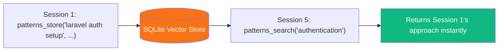
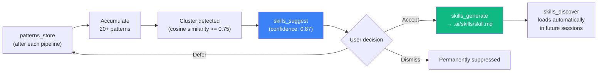
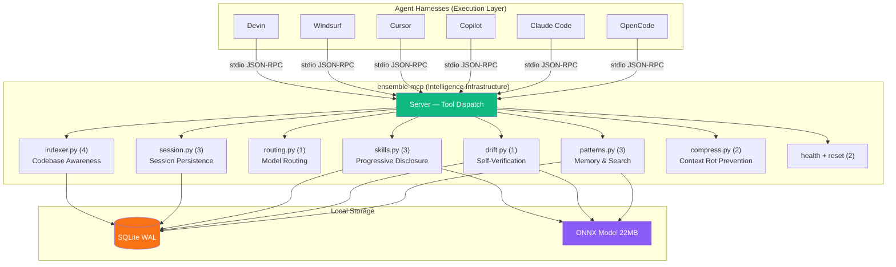

# ensemble-mcp

### The Harness Infrastructure Layer for AI Agents

<div class="pt-12">
  <span class="px-2 py-1 rounded cursor-pointer" hover="bg-white bg-opacity-10">
    A local MCP server that extends any agent harness with <strong>memory</strong>, <strong>skills</strong>, <strong>drift detection</strong>, and <strong>intelligence</strong>
  </span>
</div>

<div class="abs-br m-6 flex gap-2">
  <a href="https://github.com/LynkByte/ensemble" target="_blank" alt="GitHub" title="Open in GitHub"
    class="text-xl slidev-icon-btn opacity-50 !border-none !hover:text-white">
    <carbon-logo-github />
  </a>
</div>

---
transition: fade-out
---

# Agenda

<v-clicks>

1. **The Problem** — Why AI coding tools are wasteful today
2. **What is an Agent Harness?** — The model + harness equation
3. **What is ensemble-mcp?** — The harness infrastructure layer
4. **19 Harness Tools** — Memory, Drift, Routing, Indexing, Skills, Compression
5. **Zero-LLM Architecture** — How it's efficient
6. **Token & Cost Reduction** — Five mechanisms that save money
7. **Live Workflow** — What happens behind the scenes
8. **Technical Architecture** — Under the hood
9. **Dashboard** — Observability & visualization
10. **Installation** — One command to get started
11. **Future Roadmap** — What's next
12. **Key Takeaways** — The harness pillars

</v-clicks>

---
layout: section
---

# The Problem

## AI Coding Tools Today Are Wasteful and Forgetful

---

# Every Session Starts from Zero

<div class="grid grid-cols-2 gap-8">
<div>

### The Developer Experience

```
Session 1: "Use service classes"     ✅ Works!
Session 2: "Use service classes"     😤 Forgot
Session 3: "Use service classes"     😤 Again
Session 4: "Use service classes"     🤬 ...
```

<v-click>

> A team of 10 engineers running 10 pipelines/day wastes an estimated **16.2M tokens/month** on redundant context alone.

</v-click>

</div>
<div>

<v-clicks>

### The Four Core Problems

| Problem | Harness Gap |
|---------|-------------|
| **No Memory** | No continual learning across sessions |
| **Silent Drift** | No self-verification loop |
| **Static Routing** | No intelligent orchestration |
| **Redundant Exploration** | No codebase awareness |

</v-clicks>

</div>
</div>

---
layout: section
---

# What is an Agent Harness?

## The model + harness equation

---

# Agent = Model + Harness

<div class="grid grid-cols-2 gap-8">
<div>

A **harness** is every piece of code, configuration, and execution logic that wraps a model to turn it into a useful agent.

<v-clicks>

- **System Prompts** — shape agent behavior
- **Tools, Skills & MCPs** — capabilities
- **Execution Environment** — filesystem, bash, sandbox
- **Orchestration** — subagent spawning, routing
- **Memory & Context Management** — compaction, persistence
- **Hooks & Middleware** — linting, drift checks

</v-clicks>

<v-click>

> *See [The Anatomy of an Agent Harness](https://www.langchain.com/blog/the-anatomy-of-an-agent-harness) by LangChain*

</v-click>

</div>
<div>

<v-click>

```
┌─────────────────────────────────┐
│            AGENT                │
│                                 │
│  ┌───────────────────────────┐  │
│  │         HARNESS           │  │
│  │                           │  │
│  │  System Prompts           │  │
│  │  Tools, Skills & MCPs     │  │
│  │  Execution Environment    │  │
│  │  Orchestration Logic      │  │
│  │  Memory & Context Mgmt   │  │
│  │  Hooks & Middleware       │  │
│  │                           │  │
│  │       ┌─────────┐         │  │
│  │       │  MODEL  │         │  │
│  │       └─────────┘         │  │
│  └───────────────────────────┘  │
└─────────────────────────────────┘
```

</v-click>

</div>
</div>

---

# The Harness Stack

Agent harnesses have layers. Different providers handle different layers:

<v-click>

```
┌──────────────────────────────────────────────────────────┐
│                  COMPLETE AGENT HARNESS                   │
│                                                          │
│  ┌────────────────────────────────────────────────────┐  │
│  │  Execution Layer (Claude Code / Codex / Cursor)    │  │
│  │  Filesystem · Bash · Sandbox · Browser · Git       │  │
│  └────────────────────────────────────────────────────┘  │
│                          +                               │
│  ┌────────────────────────────────────────────────────┐  │
│  │  Intelligence Infrastructure (ensemble-mcp)  ← US  │  │
│  │  Memory · Skills · Drift · Routing · Compression   │  │
│  │  Sessions · Codebase Indexing · Project Snapshots   │  │
│  └────────────────────────────────────────────────────┘  │
│                          +                               │
│  ┌────────────────────────────────────────────────────┐  │
│  │  Orchestration (Ensemble 7-agent pipeline)         │  │
│  │  Captain · Scope · Craft · Forge · Lens · Signal   │  │
│  └────────────────────────────────────────────────────┘  │
│                                                          │
│                     ┌───────────┐                        │
│                     │   MODEL   │                        │
│                     └───────────┘                        │
└──────────────────────────────────────────────────────────┘
```

</v-click>

---
layout: section
---

# What is ensemble-mcp?

## The harness infrastructure layer

---
layout: two-cols
layoutClass: gap-8
---

# ensemble-mcp

A **harness infrastructure layer** delivered as a local Python MCP server. It extends any agent harness with **memory, skills, drift detection, and intelligence** — without making a single external API call.

<v-click>

> Your AI tool already has a harness (filesystem, bash, sandbox). ensemble-mcp **adds the intelligence layer** that makes it learn, stay on task, and work smarter over time.

</v-click>

<v-click>

The developer **never types an ensemble-mcp command**. The AI agent calls its harness tools automatically in the background.

</v-click>

::right::

<v-click>

### Key Facts

| | |
|---|---|
| **Role** | Harness infrastructure layer |
| **Language** | Python 3.11+ |
| **Protocol** | MCP (Model Context Protocol) |
| **Harness Tools** | 19 tools across 8 categories |
| **LLM Calls** | Zero |
| **Storage** | SQLite (WAL mode) |
| **Embeddings** | ONNX Runtime, ~5ms |
| **Install** | `uvx ensemble-mcp` |
| **Size** | ~90MB |
| **Tests** | 573 passing |
| **License** | MIT |

</v-click>

---
layout: section
---

# 19 Harness Tools

## The Primitives: Memory · Drift · Routing · Indexing · Skills · Compression

---

# Harness Primitives at a Glance

<div class="grid grid-cols-3 gap-6 mt-4">

<div v-click class="p-4 rounded-lg bg-green-500 bg-opacity-10 border border-green-500 border-opacity-30">

### Memory & Search
- `patterns_search`
- `patterns_store`
- `patterns_prune`

### Session Persistence
- `session_save`
- `session_load`
- `session_search`

</div>

<div v-click class="p-4 rounded-lg bg-blue-500 bg-opacity-10 border border-blue-500 border-opacity-30">

### Self-Verification
- `drift_check`

### Model Routing
- `model_recommend`

### Skills (Progressive Disclosure)
- `skills_discover`
- `skills_suggest`
- `skills_generate`

</div>

<div v-click class="p-4 rounded-lg bg-orange-500 bg-opacity-10 border border-orange-500 border-opacity-30">

### Context Rot Prevention
- `context_compress`
- `context_prepare`

### Codebase Awareness
- `project_index`
- `project_query`
- `project_dependencies`
- `project_snapshot`

</div>

</div>

---

# Pattern Memory — Continual Learning Across Sessions

Agents **remember** what worked before — the harness enables continual learning.

<v-clicks>

- Text embedded into **384-dim vectors** using ONNX MiniLM-L6-v2
- Stored in SQLite alongside metadata
- **Semantic search** via cosine similarity — not keyword matching
- **~5ms** per embedding, **<1ms** per search

</v-clicks>

<v-click>



</v-click>

---

# Drift Detection — Self-Verification Loop

A harness primitive that catches agents going **off-task** before damage is done.

<div class="grid grid-cols-2 gap-8 mt-6">
<div>

<v-click>

### Aligned ✅

```
Task:    "Add user authentication"
Changes: auth controllers, login views

→ score: 0.12
→ verdict: "aligned"
```

</v-click>

</div>
<div>

<v-click>

### Significant Drift ⚠️

```
Task:    "Add user authentication"
Changes: blog system, payment gateway

→ score: 0.78
→ verdict: "significant_drift"
→ Agent warned before continuing
```

</v-click>

</div>
</div>

<v-click>

### Verdict Scale

| Score | Verdict | Action |
|-------|---------|--------|
| < 0.25 | `aligned` | Proceed normally |
| 0.25 - 0.59 | `minor_drift` | Log a warning |
| >= 0.60 | `significant_drift` | Intervention required |

</v-click>

---

# Smart Model Routing

**Right model for the right job** — stop paying premium prices for simple tasks.

<v-click>

| Agent | Trivial | Simple | Standard | Complex |
|-------|---------|--------|----------|---------|
| Signal (Git) | cheapest | cheapest | cheapest | cheapest |
| Forge (Test) | cheapest | cheapest | mid | mid |
| Lens (Review) | cheapest | cheapest | mid | mid |
| Craft (Code) | mid | mid | **best** | **best** |
| Scope (Plan) | mid | mid | **best** | **best** |

</v-click>

<v-click>

<div class="mt-6 p-4 rounded-lg bg-yellow-500 bg-opacity-10 border border-yellow-500 border-opacity-30 text-center">

> A typo fix doesn't need the same model as a new microservice architecture.

</div>

</v-click>

---
layout: two-cols
layoutClass: gap-8
---

# Codebase Indexing

**Index once, query instantly.**

<v-clicks>

- **30+ languages** detected by extension
- **12 role categories** (test, migration, config, model, controller, service...)
- **Exported symbols** with signatures and docstrings
- **Import/dependency** graph
- Respects `.gitignore` patterns
- **Incremental** via file mtime

</v-clicks>

::right::

<v-click>

### Tools

| Tool | Purpose |
|------|---------|
| `project_index` | Build/refresh index |
| `project_query` | Query by language, path, text |
| `project_dependencies` | Import/dependency graph |
| `project_snapshot` | Compact project summary |

</v-click>

<v-click>

### Performance

| Operation | Time |
|-----------|------|
| Index 1K files | < 5s |
| Index 10K files | < 30s |
| Incremental (10 files) | < 1s |
| Query response | < 5ms |

</v-click>

---

# Skill Intelligence — Progressive Disclosure

**Patterns graduate into permanent skills** — a harness primitive that prevents context rot by loading only what's needed.

<v-click>



</v-click>

<v-click>

<div class="mt-4 p-3 rounded-lg bg-green-500 bg-opacity-10 border border-green-500 border-opacity-30">

**Result:** Every future project starts with your team's learned knowledge — no re-explaining needed.

</div>

</v-click>

---

# Session Persistence & Context Rot Prevention

<div class="grid grid-cols-2 gap-8">
<div>

### Long Horizon Execution

**Crash-proof pipeline execution** — the harness maintains durable state across context windows.

<v-clicks>

- `session_save` — checkpoint with optimistic versioning
- `session_load` — load latest or specific checkpoint
- `session_search` — find past sessions by semantic similarity

</v-clicks>

</div>
<div>

<v-click>

### Context Rot Prevention

**Reduce tokens without losing information.** Context rot degrades model performance as the context window fills up — these tools fight it:

```
Input:  "I'd be happy to help! So basically,
         in order to make use of the API,
         you'll definitely need to take into
         consideration the auth requirements."

Output: "To use API, consider auth requirements."

→ 23 tokens → 7 tokens (70% reduction)
```

</v-click>

<v-click>

**Preserved:** Code blocks, URLs, paths, tables

**Compressed:** Filler words, pleasantries, hedging, verbose phrases

</v-click>

</div>
</div>

---
layout: section
---

# Zero-LLM Architecture

## How It's Efficient

---

# Everything Runs Locally

<div class="text-center mb-8">

> **ensemble-mcp makes ZERO external API calls.** All intelligence runs locally on your machine.

</div>

<v-click>

| Component | Technology | Speed |
|-----------|-----------|-------|
| Embeddings | ONNX Runtime + MiniLM-L6-v2 | **~5ms** per text |
| Vector Search | numpy cosine similarity | **<1ms** per query |
| Storage | SQLite (WAL mode) | **<5ms** per operation |
| Compression | Rule-based regex engine | **<2ms** per text |

</v-click>

<v-click>

<div class="grid grid-cols-2 gap-8 mt-6">
<div class="p-4 rounded-lg bg-red-500 bg-opacity-10 border border-red-500 border-opacity-30">

### Traditional Approach
- Every operation → **API call**
- Latency: **500ms - 2000ms**
- Cost: **$0.001 - $0.01** each
- Requires internet
- Data **leaves** your machine

</div>
<div class="p-4 rounded-lg bg-green-500 bg-opacity-10 border border-green-500 border-opacity-30">

### ensemble-mcp Approach
- Every operation → **LOCAL**
- Latency: **1ms - 10ms**
- Cost: **$0.00**
- Works **offline**
- Data **stays local**

</div>
</div>

</v-click>

---

# Near-Zero Marginal Cost

<v-click>

| Cost Component | Per User / Month |
|---------------|-----------------|
| Compute (MCP server) | **$0.00** — runs locally |
| LLM API calls | **$0.00** — zero external calls |
| ONNX model serving | **$0.00** — local inference |
| Data storage | **$0.00** — local SQLite |
| **Total COGS** | **$0.00** |

</v-click>

<v-click>

<div class="mt-8 p-4 rounded-lg bg-green-500 bg-opacity-10 border border-green-500 border-opacity-30 text-center text-xl">

**~97% gross margin** on any paid tier — achievable from day one.

</div>

</v-click>

---
layout: section
---

# Token & Cost Reduction

## Five Mechanisms That Save Money

---

# Mechanism 1: Pattern Memory

### ~15-25% savings on pattern context

<div class="grid grid-cols-2 gap-8 mt-4">
<div>

<v-click>

### Without ensemble-mcp

```
Every session:
  Agent reads 30 pattern entries from files
  → ~8,000 tokens consumed
```

</v-click>

</div>
<div>

<v-click>

### With ensemble-mcp

```
Every session:
  Agent queries top-3 relevant patterns
  → ~800 tokens consumed

Savings: ~90% on pattern context
       = ~$8.10/dev/month
```

</v-click>

</div>
</div>

---

# Mechanism 2: Codebase Indexing

### ~20-40% savings on codebase exploration

<div class="grid grid-cols-2 gap-8 mt-4">
<div>

<v-click>

### Without ensemble-mcp

```
Agent explores:
  glob("**/*.php")
  grep("class.*Controller")
  read file by file...

→ ~4,000-6,000 tokens per cycle
```

</v-click>

</div>
<div>

<v-click>

### With ensemble-mcp

```
Agent queries:
  project_query(
    query="TodoController",
    file_types=["php"]
  )

→ ~700 tokens total
→ Savings: ~$4-6/dev/month
```

</v-click>

</div>
</div>

---

# Mechanism 3: Smart Model Routing

### ~30-60% cost savings by using the right tier

<v-click>

<div class="grid grid-cols-2 gap-8 mt-4">
<div>

### Without ensemble-mcp

```
Every task → Claude Opus
  $15/M input, $75/M output

Including:
  ❌ Typo fixes     → Opus
  ❌ Test runs       → Opus
  ❌ Git commits     → Opus
```

</div>
<div>

### With ensemble-mcp

```
Complex tasks → Opus    ($15/M input)
Simple tasks  → Sonnet  ($3/M)  — 80% cheaper
Trivial tasks → Haiku   ($0.25/M) — 98% cheaper
```

</div>
</div>

</v-click>

---

# Mechanisms 4 & 5: Compression + Caching

<div class="grid grid-cols-2 gap-8">
<div>

### Context Compression

<v-click>

**What gets compressed:**
- Filler: "just", "really", "basically"
- Pleasantries: "I'd be happy to help!"
- Verbose: "in order to" → "to"
- Hedging: "I think", "it seems"

**What stays untouched:**
- Code blocks, URLs, file paths
- Headings, tables, technical content

**Result:** ~10-23% fewer tokens

</v-click>

</div>
<div>

### Prompt Cache Optimization

<v-click>

```
┌──────────────────────────┐
│  STATIC (always same)    │ ← Cached
│  System prompt, rules    │
├──────────────────────────┤
│  PROJECT (rarely changes)│ ← Often cached
│  Conventions, structure  │
├──────────────────────────┤
│  TASK (changes each req) │ ← Not cached
│  Current request, diff   │
└──────────────────────────┘
```

`context_prepare` maximizes the stable prefix so LLM providers cache more tokens.

</v-click>

</div>
</div>

---

# Total Cost Savings

<v-click>

| Savings Source | Monthly Savings (per dev) | Mechanism |
|---------------|--------------------------|-----------|
| Pattern memory | ~$8.10 | Top-3 match vs. full dump |
| Codebase indexing | ~$4-6 | Index query vs. manual exploration |
| Model routing | Variable | Right tier per task |
| Context compression | ~10-23% fewer tokens | Rule-based prose reduction |
| Prompt caching | Variable | Optimized section ordering |
| **Total** | **$12-18+/dev/month** | |

</v-click>

<v-click>

### At Scale

| Team Size | Annual Savings (Low) | Annual Savings (High) |
|-----------|--------------------|--------------------|
| 10 developers | $1,440 | $2,160 |
| 50 developers | $7,200 | $10,800 |
| 100 developers | $14,400 | $21,600 |
| 500 developers | $72,000 | $108,000 |

</v-click>

---
layout: section
---

# Live Workflow

## What Happens Behind the Scenes

---

# Session 1 — New Project

```
Developer: "Set up a smart todo app with auth, CRUD, and auto-categorization"
```

<v-clicks>

| Step | Tool Called | What Happens |
|------|-----------|-------------|
| 1 | `model_recommend` | Recommends "mid" tier (Sonnet) — saves cost |
| 2 | `patterns_search` | Searches for similar patterns — empty on first project |
| 3 | `project_index` | Indexes the Laravel scaffold — 200ms |
| 4 | *Agent writes code* | Uses indexed structure to navigate efficiently |
| 5 | `drift_check` | Confirms changes match the task — score: 0.12 ✅ |
| 6 | `patterns_store` | Saves "laravel todo crud setup" for future use |

</v-clicks>

---

# Session 5 — New Project, Similar Task

```
Developer: "Set up a recipe app with auth and CRUD"
```

<v-clicks>

| Step | Tool Called | What Happens |
|------|-----------|-------------|
| 1 | `patterns_search` | **Finds** "laravel todo crud setup" from Session 1 |
| 2 | *Agent applies* | Already knows: Breeze for auth, service classes for logic |
| 3 | *Faster output* | No re-explaining architecture preferences needed |

</v-clicks>

<v-click>

<div class="mt-8 p-4 rounded-lg bg-blue-500 bg-opacity-10 border border-blue-500 border-opacity-30">

### The Flywheel Effect

```
More sessions → More patterns → Better matching → Faster dev → More patterns → ...

After 20+ patterns:
  → Skills auto-detected → Permanent project skills created
  → Every future project starts with learned knowledge
```

</div>

</v-click>

---
layout: section
---

# Technical Architecture

## The Harness Under the Hood

---

# Harness Layer Architecture

<v-click>

| Harness Layer | Provider | Primitives |
|---|---|---|
| **Execution** | Claude Code / Codex / Cursor | Filesystem, Bash, Sandbox, Browser, Git |
| **Intelligence** | **ensemble-mcp** | Memory, Skills, Drift, Routing, Compression, Sessions, Indexing |
| **Orchestration** | Ensemble Pipeline | Captain, Scope, Craft, Forge, Lens, Signal, Trace |
| **Model** | Claude / GPT / Gemini | Raw intelligence (text in → text out) |

</v-click>

<v-click>

<div class="mt-4 p-3 rounded-lg bg-blue-500 bg-opacity-10 border border-blue-500 border-opacity-30">

> ensemble-mcp is **harness-agnostic** — it plugs into any MCP-compatible agent via the standard MCP protocol. Not tied to any specific execution environment.

</div>

</v-click>

---

# System Overview



---

# Response Envelope & Error Taxonomy

<div class="grid grid-cols-2 gap-8">
<div>

### Every Tool Returns This

```json
{
  "ok": true,
  "data": { "...payload..." },
  "error": null,
  "meta": {
    "duration_ms": 12,
    "source": "sqlite",
    "confidence": "exact"
  }
}
```

<v-click>

Confidence: `exact` | `partial` | `estimated`

</v-click>

</div>
<div>

<v-click>

### Structured Error Codes

| Category | Retry? |
|----------|--------|
| `VALIDATION_*` | Never |
| `NOT_FOUND_*` | Never |
| `CONFLICT_*` | After refresh |
| `TIMEOUT_*` | With backoff |
| `IO_*` | With backoff |
| `INTERNAL_*` | If marked |

Every error has a code, retry guidance, and structured details.

</v-click>

</div>
</div>

---

# Security

<v-clicks>

- **Secret Redaction** — 9 regex patterns scan all text before storage

  AWS keys, Bearer tokens, API keys, GitHub tokens, passwords — all replaced with `[REDACTED]`

- **Trust Boundaries** — data classified by source

  `local_state` (trusted) · `client_input` (validated) · `filesystem_scan` (read-only)

- **Local-Only Dashboard** — binds to `127.0.0.1`, never exposed to network

- **DOMPurify Sanitization** — all rendered markdown is XSS-sanitized

- **Destructive Operations** — require explicit `confirm=true`

</v-clicks>

---
layout: section
---

# Dashboard & Observability

## Visualize Everything at localhost:8787

---

# Web Dashboard

```bash
ensemble-mcp web                # Opens browser to localhost:8787
ensemble-mcp web --port 9000    # Custom port
```

<v-click>

| Page | What It Shows |
|------|--------------|
| **Overview** | Summary cards, drift trend chart, recent activity feed |
| **Patterns** | All stored patterns with match counts, search, filtering |
| **Skills** | Pending suggestions with confidence scores, stale detection |
| **Projects** | Indexed projects with language pie charts, role bar charts |
| **Drift** | Drift check history with scores, verdicts, flagged files |
| **Sessions** | Session list with lifecycle status, step-by-step detail |
| **Reports** | Bug Hunter scan results, health trend charts |

</v-click>

<v-click>

<div class="mt-4 text-sm opacity-70">

**Stack:** Alpine.js + Chart.js (zero build step) · Kinetic Architect design system · 11+ JSON API endpoints · Same SQLite DB (WAL — no contention)

</div>

</v-click>

---
layout: section
---

# Installation

## One Command to Get Started

---

# Getting Started

<div class="grid grid-cols-2 gap-8">
<div>

### Install & Register

```bash
# Install the package
pip install ensemble-mcp

# Or run directly (no install needed)
uvx ensemble-mcp

# Auto-detect AI tools and register
ensemble-mcp install

# Launch the dashboard
ensemble-mcp web
```

<v-click>

### Smart Command Detection

| Priority | Detection | Registered |
|----------|-----------|-----------|
| 1st | `ensemble-mcp` on PATH | `ensemble-mcp` |
| 2nd | `uvx` available | `uvx ensemble-mcp` |
| 3rd | Neither | `python -m ensemble_mcp` |

</v-click>

</div>
<div>

<v-click>

### Supported AI Tools

| AI Tool | Auto-Install |
|---------|-------------|
| OpenCode | ✅ |
| Claude Code | ✅ |
| GitHub Copilot (VS Code) | ✅ |
| Cursor | ✅ |
| Windsurf | ✅ |
| Devin CLI | ✅ |

</v-click>

<v-click>

### That's It

The AI agent will call ensemble-mcp tools automatically. No further configuration needed.

</v-click>

</div>
</div>

---
layout: section
---

# Future Roadmap

## What's Done and What's Next

---

# Roadmap

<div class="grid grid-cols-2 gap-8">
<div>

### Completed ✅

<v-clicks>

- 19 MCP tools (memory, drift, routing, skills, sessions, indexer, compress)
- Web Dashboard with Kinetic Architect redesign
- Skill Intelligence (pattern-to-skill auto-graduation)
- Auto-installer for 6 AI tools
- Context compression + prompt caching
- Bug Hunter reports dashboard
- 573 tests passing

</v-clicks>

</div>
<div>

<v-click>

### Coming Next

| Feature | Priority |
|---------|----------|
| Embedding Model Upgrade (512 tokens) | Medium |
| Report Export (CSV/PDF/JSON) | Medium |
| Real-Time Live View (WebSocket) | Medium |
| Dashboard v2 (management UI) | Medium |
| CI/CD Integration | Low |
| Team Analytics | Low |
| Plugin System | Low |
| Advanced Indexing (tree-sitter) | Low |

</v-click>

</div>
</div>

---

# Scaling Path

<v-click>

| Scale | Files | Status |
|-------|-------|--------|
| Small project | < 10K | ✅ Fully supported, optimal |
| Medium project | 10K - 100K | ✅ Supported with minor tuning |
| Large monorepo | 100K - 1M | ⚠️ Needs FAISS, parallel indexing |
| Enterprise | 1M+ | 🔮 Future — PostgreSQL, ANN, workers |

</v-click>

<v-click>

### Intentionally Deferred

<div class="grid grid-cols-2 gap-4 mt-4 text-sm">
<div>

- No FAISS/Qdrant in v1 — numpy is perfect for < 10K vectors
- No PostgreSQL — SQLite is right for local storage

</div>
<div>

- No distributed architecture — local model is correct
- No premature abstraction — interfaces come with 2nd backend

</div>
</div>

> The current design is **not wrong** — it's **correctly scoped**. This documents the upgrade path for when scale demands change.

</v-click>

---
layout: section
---

# Key Takeaways

---

# The Harness Pillars

<div class="grid grid-cols-5 gap-4 mt-8">

<div v-click class="p-4 rounded-lg bg-green-500 bg-opacity-10 border border-green-500 border-opacity-30 text-center">

### Memory

Continual learning across sessions

</div>

<div v-click class="p-4 rounded-lg bg-red-500 bg-opacity-10 border border-red-500 border-opacity-30 text-center">

### Self-Verification

Drift detection keeps agents on task

</div>

<div v-click class="p-4 rounded-lg bg-blue-500 bg-opacity-10 border border-blue-500 border-opacity-30 text-center">

### Orchestration

Right model for the right job

</div>

<div v-click class="p-4 rounded-lg bg-orange-500 bg-opacity-10 border border-orange-500 border-opacity-30 text-center">

### Context Rot Prevention

Fewer tokens, lower cost

</div>

<div v-click class="p-4 rounded-lg bg-purple-500 bg-opacity-10 border border-purple-500 border-opacity-30 text-center">

### Progressive Disclosure

Patterns → Skills → Institutional AI

</div>

</div>

<v-click>

<div class="mt-10">

### Harness Design Principles

1. **Zero-LLM-Call** — The harness infrastructure never calls external APIs
2. **Local-First** — All data stays on the developer's machine
3. **Harness-Agnostic** — Works with any MCP-compatible agent harness
4. **Progressive Disclosure** — Load only task-relevant skills and context
5. **Contract-First** — All tools use `{ok, data, error, meta}` envelope

</div>

</v-click>

---
layout: center
class: text-center
---

# Get Started

```bash
pip install ensemble-mcp && ensemble-mcp install && ensemble-mcp web
```

<div class="mt-8">

[GitHub](https://github.com/LynkByte/ensemble) · [Docs](https://github.com/LynkByte/ensemble/tree/main/docs) · MIT License

</div>

<div class="mt-4 text-sm opacity-60">

Python 3.11+ · ONNX Runtime · SQLite · 573 tests · 19 harness tools · Zero external API calls

</div>
