# Ensemble Design Specification

> Comprehensive system design for improving the Ensemble multi-agent orchestration system and building a companion Python MCP server.

**Status:** Design Complete, Implementation Pending  
**Version:** 1.0  
**Date:** 2026-03-30  
**Authors:** Collaborative design between user and AI assistant

---

## Table of Contents

1. [Executive Summary](#1-executive-summary)
2. [Current System Analysis](#2-current-system-analysis)
3. [Improvement Priorities](#3-improvement-priorities)
4. [Phase 1: Prompt-Level Improvements](#4-phase-1-prompt-level-improvements)
5. [Phase 2-7: MCP Server Design](#5-phase-2-7-mcp-server-design)
6. [Architecture Decisions](#6-architecture-decisions)
7. [Token & Cost Analysis](#7-token--cost-analysis)
8. [Implementation Plan](#8-implementation-plan)
9. [Cross-Tool Compatibility](#9-cross-tool-compatibility)
10. [Schemas & Data Models](#10-schemas--data-models)
11. [Code Examples](#11-code-examples)
12. [Risk Assessment](#12-risk-assessment)

---

## 1. Executive Summary

### Problem

The current 7-agent orchestration system works well but lacks:
- **Memory** — no learning from past pipelines; same mistakes repeat
- **Cost visibility** — no token tracking or cost analysis
- **Drift detection** — agents can silently deviate from the plan
- **Smart routing** — model assignment is static, not task-aware
- **Extensibility** — no skills/hooks system for project-specific behavior
- **Codebase indexing** — Scope re-explores from scratch every run, wasting tokens on repeat visits
- **User configuration** — models and reasoning are hardcoded; users must edit agent files to customize

### Solution

A two-layer approach:

1. **Phase 1 (Prompt-only)** — Improve the agent markdown files with pattern memory protocol, hooks, drift detection, parallel execution (Proof + Lens), and user-configurable models/reasoning via `team-config.json`. Works standalone without any external dependencies.

2. **Phases 2-7 (MCP Server)** — Build `ensemble-mcp`, a Python MCP server providing vector memory, token tracking, drift detection, model routing, codebase indexing, and metrics. Distributed via `uvx` for zero-hassle cross-platform installation. Works with OpenCode, Claude Code, GitHub Copilot, Cursor, Windsurf, and Devin CLI.

### Goals

- Reduce token usage per pipeline by ~15-25% (up to ~40% on repeat visits with indexing)
- Provide per-agent cost visibility with accuracy indicators
- Enable cross-session learning (pattern memory)
- Support any project type (Laravel, Vue, Python, PHP, mobile, etc.)
- Let users customize models, reasoning, and budgets without editing agent files
- Zero-hassle installation: `uvx ensemble-mcp`

### System Overview

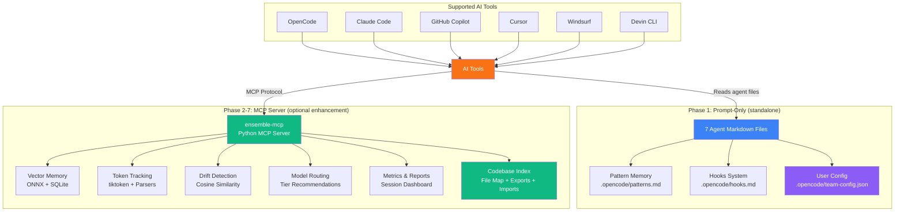

---

## 2. Current System Analysis

### File Inventory

| File | Lines | Role | Model | Temperature |
|------|-------|------|-------|-------------|
| `team-captain.md` | 250 | Primary orchestrator (Ensemble) | Global (Opus) | 0.3 |
| `team-architect.md` | 159 | Read-only planner (Scope) | Global (Opus) | 0.5 |
| `team-engineer.md` | 67 | Code writer (Craft) | Global (Opus) | 0.3 |
| `team-forge.md` | 134 | Format/build/test (Proof) | Sonnet 4.6 | 0.1 |
| `team-hunter.md` | 228 | Bug hunter (isolated, standalone) (Trace) | Global (Opus) | 0.2 |
| `team-inspector.md` | 142 | Code reviewer (Lens) | Sonnet 4.6 | 0.1 |
| `team-shipper.md` | 88 | Git operations (Signal) | GPT-5-mini | 0.1 |

**Total:** 1,068 lines across 7 agents

### Task Classification & Pipeline Shape

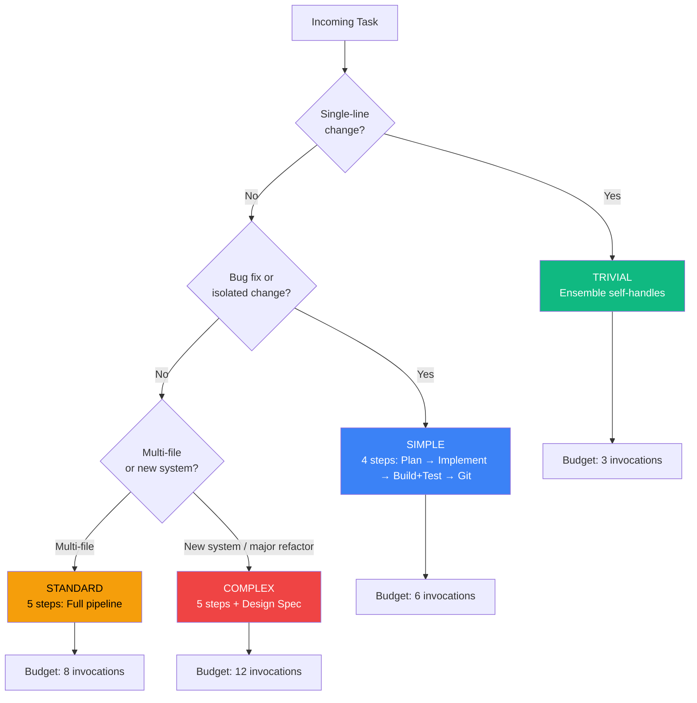

### Strengths

- Clear separation of concerns — each agent has a well-defined role
- Context compression — Ensemble compresses each agent's output to 2-4 bullets
- Task classification — trivial/simple/standard/complex with pipeline shape adaptation
- Session persistence — `.opencode/resume.md` for resuming interrupted work
- Remediation loops — failing tests/reviews route back to Craft
- Pipeline budgets — per-classification invocation limits prevent runaway costs
- Model tiering — Opus for reasoning, Sonnet for execution, GPT-5-mini for Git
- Plan approval gate — user reviews the plan before implementation begins

### Weaknesses Found

1. **No pattern memory** — every pipeline starts from zero knowledge
2. **No token tracking** — no visibility into cost per agent or session
3. **No drift detection** — agents can drift from the plan without warning
4. **Static model routing** — model assignment doesn't adapt to task complexity
5. **No cross-tool skill discovery** — Craft, Proof, and Lens reference "skills" but each AI tool handles skill loading natively from its own locations (`.ai/skills/`, `.claude/skills/`, etc.); there's no unified way to discover skills across tools (MCP Phase 2 solves this with vector-based semantic search)
6. **Trace is isolated** — standalone agent at 228 lines, intentionally not part of the pipeline (invoked manually)
7. **No parallel execution** — Proof and Lens run sequentially but could overlap
8. **No hooks** — no extensibility points for project-specific behavior
9. **No `.gitignore`** — `.opencode/` directory not excluded from version control
10. **No codebase index** — Scope re-explores the project from scratch every pipeline run, wasting tokens on repeat visits
11. **No user configuration** — models, reasoning effort, and temperature are hardcoded in agent YAML frontmatter; users must edit agent files to customize

### Permission Model

| Agent | Edit | Bash | Task | Webfetch |
|-------|------|------|------|----------|
| Ensemble | allow | allow | team-* only | - |
| Scope | deny | deny | - | allow |
| Craft | allow | allow | - | allow |
| Proof | allow | allow | - | allow |
| Trace | allow | allow | - | allow |
| Lens | deny | deny | - | allow |
| Signal | deny | git/gh/ls only | - | deny |

### Current Pipeline Flow

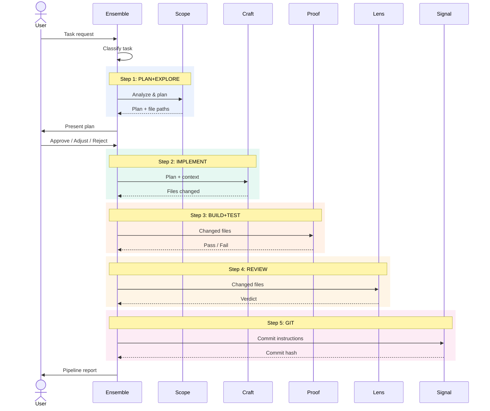

---

## 3. Improvement Priorities

Ordered by impact-to-effort ratio:

| Priority | Feature | Phase | Impact | Effort |
|----------|---------|-------|--------|--------|
| A | Session learning & pattern memory | 1 (prompts) + 2 (MCP) | High | Low → Medium |
| B | Parallel execution (Proof + Lens) | 1 (prompts) | Medium | Low |
| C | Anti-drift mechanisms | 1 (prompts) + 2 (MCP) | High | Low → Medium |
| D | Smarter model routing | 1 (prompts) + 2 (MCP) | Medium | Medium |
| E | Skills/hooks system | 1 (prompts) + 2 (MCP) | Medium | Medium |
| F | User-configurable models & reasoning | 1 (prompts) | High | Low |
| G | Codebase indexing | 2 (MCP) | High | Medium |

---

## 4. Phase 1: Prompt-Level Improvements

All improvements in this phase modify only the 7 markdown files. No external dependencies. Works standalone.

### 4.1 Pattern Memory Protocol (Priority A)

**File-based approach (Phase 1):**

The Ensemble reads/writes a flat file at `.opencode/patterns.md` containing learned patterns from past pipelines. Maximum 30 entries to control token cost.

**Pattern format:**

```markdown
## Patterns

### [pattern-name]
- **Context:** [when this pattern applies]
- **Approach:** [what worked / what to do]
- **Outcome:** [result — success, failure, or caveat]
- **Date:** [YYYY-MM-DD]
```

**Ensemble protocol additions:**

```markdown
## Pattern Memory

Before starting the pipeline, check if `.opencode/patterns.md` exists:
1. If it exists, read it and identify patterns relevant to the current task
2. Pass relevant patterns (max 3) as context to Scope
3. After pipeline completes successfully, extract any new pattern learned
4. Append to `.opencode/patterns.md` (max 30 entries; prune oldest if over limit)

**What qualifies as a pattern:**
- A non-obvious solution that worked (e.g. "Vue 2 projects need X config")
- A pitfall that was encountered and resolved
- A project-specific convention discovered during exploration

**What does NOT qualify:**
- Generic coding standards (these are in the agent prompts)
- One-time fixes unlikely to recur
```

**Token cost:** ~3,500 tokens/pipeline to read the full patterns file. Acceptable for Phase 1; MCP vector search reduces this to ~500 tokens in Phase 2.

### 4.2 Parallel Execution (Priority B)

**Decision:** Proof and Lens run in parallel. Lens reviews the logical changes (diffs), not the formatted output. This is safe because Lens is read-only.

#### Improved Pipeline Flow (with Parallel Execution)

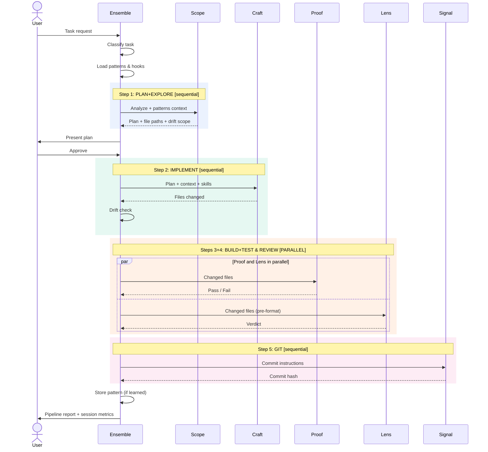

**Ensemble prompt changes:**

```markdown
## Parallel Execution

For standard and complex tasks, steps 3 (BUILD+TEST) and 4 (REVIEW) run in parallel:

1. PLAN+EXPLORE → @team-architect [sequential]
2. IMPLEMENT → @team-engineer [sequential]
3+4. BUILD+TEST + REVIEW → @team-forge + @team-inspector [PARALLEL]
5. GIT → @team-shipper [sequential, after both 3+4 complete]

**Parallel rules:**
- Lens reviews the code BEFORE formatting (reviews logical changes, not style)
- If Proof fails, Lens results are still valid (they reviewed the pre-format code)
- If Lens finds critical issues, remediation loop runs after Proof completes
- Both must complete before proceeding to GIT
```

**Note:** Multi-file Craft parallelism (splitting work across multiple Craft invocations) is deferred to v2 due to complexity of merge conflicts and dependency ordering.

### 4.3 Anti-Drift Detection (Priority C)

**Prompt-based approach (Phase 1):**

Three-point verification added to Ensemble's post-agent checks. These are soft warnings, not hard blocks.

#### Drift Detection Flow

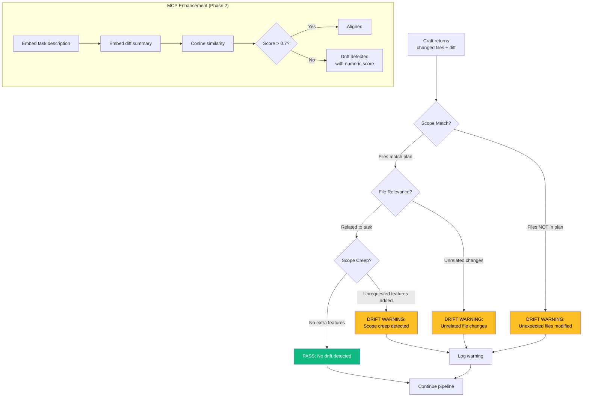

**Ensemble prompt additions:**

```markdown
## Drift Detection

After Craft returns, perform a 3-point drift check before proceeding:

1. **Scope match** — Do the files changed match the files Scope identified?
   - If Craft touched files NOT in Scope's plan, flag: "DRIFT WARNING: Craft modified [files] not in plan"
2. **File relevance** — Are the changes related to the task?
   - If a changed file has no clear connection to the task, flag it
3. **No scope creep** — Did Craft add unrequested features?
   - If new functionality beyond the plan was added, flag it

**On drift detection:**
- Log the warning in the pipeline report
- Continue the pipeline (soft warning, not a hard block)
- Include drift warnings in the final report to the user
```

**MCP version (Phase 2):** Uses cosine similarity between the task description embedding and the diff content embedding. Returns a 0-1 drift score. Ensemble can configure a threshold.

### 4.4 Model Routing (Priority D)

**Current state:** Static model assignment in YAML frontmatter.

**Phase 1 improvement:** Add routing hints to Ensemble that recommend model overrides based on task characteristics.

```markdown
## Model Routing Hints

When invoking agents, consider these routing overrides:

- **Simple tasks with straightforward implementation:** Craft can use a mid-tier model
  - Override: set model to mid-tier equivalent
- **Complex tasks requiring deep reasoning:** Scope should use the best available model
  - Default: already uses Opus (global model)
- **Boilerplate/scaffolding tasks:** Craft can use a cheaper model
  - Override: set model to cheapest tier

**Note:** These are hints. The actual model routing is controlled by OpenCode's model configuration.
In Phase 2, the MCP `model_recommend` tool returns abstract tiers (`best`, `mid`, `cheapest`)
that each AI tool maps to its own available models.
```

### 4.5 Skills & Hooks System (Priority E)

**Skills:** Each AI tool (OpenCode, Claude Code, Cursor, Windsurf, Copilot, Devin) has its own native skill/rules system and manages its own skill locations:

| AI Tool | Skill Location | Format |
|---------|---------------|--------|
| OpenCode | `.opencode/skills/` or global skills | Markdown |
| Claude Code | `.claude/skills/` | Markdown |
| Cursor | `.cursor/rules/` | Markdown |
| Windsurf | `.windsurfrules` | Text |
| GitHub Copilot | `.github/copilot-instructions.md` | Markdown |
| Devin | `.devin/` | Markdown |

**Phase 1 approach:** Agent prompts simply say "load skills when relevant" — the underlying AI tool resolves skill locations natively. We do NOT define a `.opencode/skills/` directory or add skill loading protocols to agent prompts. The existing skill references in Craft, Proof, and Lens are already correct and tool-agnostic.

**Phase 2 enhancement (MCP):** The `skills_discover` tool is enhanced to:
1. Scan all known tool-native skill locations in the project
2. Embed skill content into the vector store for semantic search
3. Return relevant skill snippets when agents ask "what skills apply to this task?"
4. Works across tools — a Claude skill about "Laravel testing" is discoverable even from OpenCode

This gives cross-tool skill discovery without requiring tools to know about each other's formats.

**Hooks:** Extensibility points in the pipeline for project-specific behavior.

#### Hooks Design

Four hook points in the pipeline:

| Hook | When | Use Case |
|------|------|----------|
| `pre-pipeline` | Before Step 1 | Load project config, set environment |
| `pre-step` | Before each agent invocation | Inject step-specific context |
| `post-step` | After each agent returns | Custom validation, logging |
| `post-pipeline` | After final step | Cleanup, notifications, pattern extraction |

#### Hook Lifecycle

```mermaid
flowchart LR
    subgraph Pipeline
        direction TB
        PP[pre-pipeline] --> PS1[pre-step]
        PS1 --> S1[Step 1: Scope]
        S1 --> POS1[post-step]
        POS1 --> PS2[pre-step]
        PS2 --> S2[Step 2: Craft]
        S2 --> POS2[post-step]
        POS2 --> PS3[pre-step]
        PS3 --> S3["Steps 3+4: Proof + Lens"]
        S3 --> POS3[post-step]
        POS3 --> PS4[pre-step]
        PS4 --> S4[Step 5: Signal]
        S4 --> POS4[post-step]
        POS4 --> PPO[post-pipeline]
    end

    HC[".opencode/hooks.md"] -.->|reads| PP
    HC -.->|reads| PS1
    HC -.->|reads| POS1
    HC -.->|reads| PPO

    style PP fill:#8B5CF6,color:#fff
    style PPO fill:#8B5CF6,color:#fff
    style PS1 fill:#A78BFA,color:#fff
    style PS2 fill:#A78BFA,color:#fff
    style PS3 fill:#A78BFA,color:#fff
    style PS4 fill:#A78BFA,color:#fff
    style POS1 fill:#C4B5FD,color:#000
    style POS2 fill:#C4B5FD,color:#000
    style POS3 fill:#C4B5FD,color:#000
    style POS4 fill:#C4B5FD,color:#000
```

**Implementation:** Hooks are defined in `.opencode/hooks.md` as instructions Ensemble follows:

```markdown
# .opencode/hooks.md

## pre-pipeline
- Check if Docker containers are running with `docker ps`
- If not running, start them with `docker compose up -d`

## post-pipeline
- Run `php artisan cache:clear` after any config changes
```

### 4.6 Trace (Isolated Agent)

`team-hunter.md` is a **standalone, isolated agent**. It is NOT part of Ensemble's pipeline and is never invoked automatically during the standard flow. Users invoke it manually when they want a dedicated bug scan or code health audit on demand.

**Rationale:** Trace's broad scope (bug detection, code smells, health scoring, architecture analysis) doesn't fit cleanly into the pipeline's step-by-step flow. Keeping it isolated avoids adding complexity and token cost to every pipeline run. Users who want a health check can invoke `@team-hunter` directly.

#### Remediation Loop (Pipeline Only)

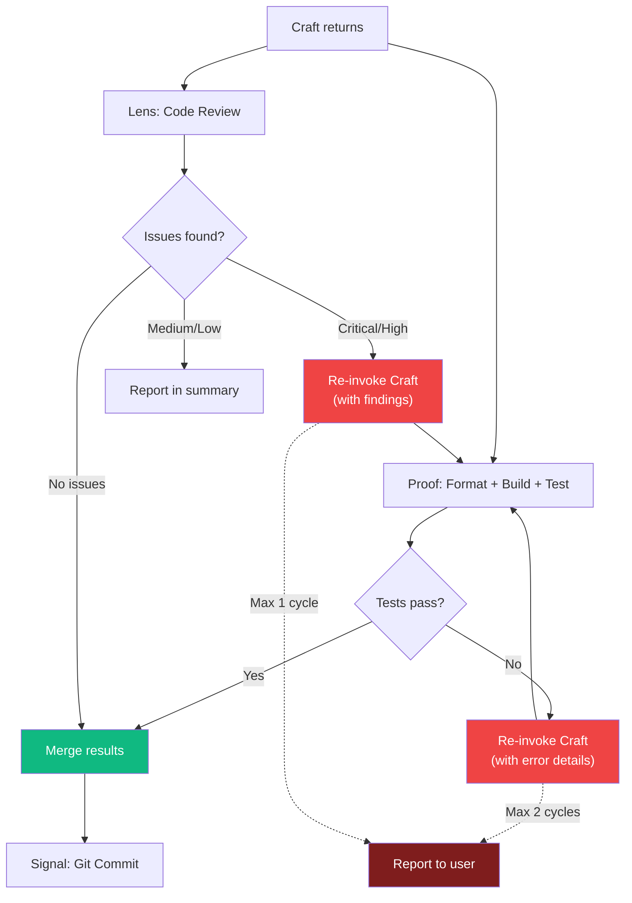

### 4.7 User-Configurable Models & Reasoning (Priority F)

**Problem:** Models, reasoning effort, and temperature are hardcoded in agent YAML frontmatter. Users who want different models must edit the agent files directly — error-prone and lost on updates.

**Solution:** A single JSON config file that users customize per-project or globally. Ensemble reads this at pipeline start and applies overrides when invoking subagents.

#### Config File Location

Lookup order (first found wins):
1. **Project-level:** `.opencode/team-config.json` — per-project overrides
2. **Global:** `~/.config/opencode/team-config.json` — user defaults
3. **Fallback:** Agent YAML frontmatter values — zero-config still works

#### Config Schema

```json
{
  "$schema": "https://json-schema.org/draft/2020-12/schema",
  "type": "object",
  "properties": {
    "models": {
      "description": "Map abstract tiers to your available models",
      "type": "object",
      "properties": {
        "best": { "type": "string" },
        "mid": { "type": "string" },
        "cheapest": { "type": "string" }
      }
    },
    "agents": {
      "description": "Per-agent overrides for model tier, reasoning, and temperature",
      "type": "object",
      "patternProperties": {
        "^(ensemble|scope|craft|proof|lens|signal|trace)$": {
          "type": "object",
          "properties": {
            "tier": { "enum": ["best", "mid", "cheapest"] },
            "reasoning": { "enum": ["high", "medium", "low", "none"] },
            "temperature": { "type": "number", "minimum": 0, "maximum": 1 }
          }
        }
      }
    },
    "pipeline": {
      "description": "Pipeline behavior overrides",
      "type": "object",
      "properties": {
        "budgets": {
          "type": "object",
          "properties": {
            "trivial": { "type": "integer" },
            "simple": { "type": "integer" },
            "standard": { "type": "integer" },
            "complex": { "type": "integer" }
          }
        }
      }
    }
  }
}
```

#### Example Configurations

**Cost-conscious setup (use cheaper models where possible):**

```json
{
  "models": {
    "best": "claude-sonnet-4",
    "mid": "claude-haiku-3.5",
    "cheapest": "gpt-5-mini"
  },
  "agents": {
    "scope": { "tier": "best", "reasoning": "high" },
    "craft": { "tier": "best", "reasoning": "medium" },
    "proof": { "tier": "mid", "reasoning": "low" },
    "lens": { "tier": "mid", "reasoning": "medium" },
    "signal": { "tier": "cheapest", "reasoning": "low" }
  }
}
```

**Maximum quality setup:**

```json
{
  "models": {
    "best": "claude-opus-4",
    "mid": "claude-sonnet-4",
    "cheapest": "claude-haiku-3.5"
  },
  "agents": {
    "scope": { "tier": "best", "reasoning": "high", "temperature": 0.6 },
    "craft": { "tier": "best", "reasoning": "high" },
    "proof": { "tier": "mid" },
    "lens": { "tier": "best", "reasoning": "high" },
    "signal": { "tier": "cheapest" }
  }
}
```

**Custom pipeline budgets:**

```json
{
  "pipeline": {
    "budgets": {
      "trivial": 3,
      "simple": 8,
      "standard": 12,
      "complex": 20
    }
  }
}
```

#### Ensemble Prompt Additions

```markdown
## User Configuration

At pipeline start, load the user's configuration:

1. Check for `.opencode/team-config.json` (project-level)
2. If not found, check `~/.config/opencode/team-config.json` (global)
3. If neither exists, use default agent frontmatter values

**Config applies to:**
- `models` → resolves tier names to actual model IDs for model routing
- `agents.<name>.tier` → overrides which model tier an agent uses
- `agents.<name>.reasoning` → overrides reasoning effort for the agent
- `agents.<name>.temperature` → overrides temperature for the agent
- `pipeline.budgets` → overrides invocation limits per classification

**Note:** Config is read once at pipeline start and cached for the session.
If no config exists, everything works with current defaults — zero breaking change.
```

#### How It Integrates

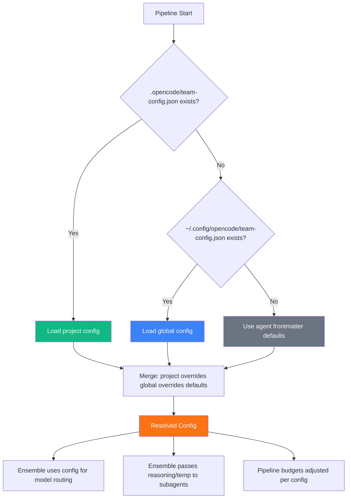

### 4.8 Token Impact Summary (Phase 1)

| Change | Tokens Added | Tokens Saved | Net |
|--------|-------------|-------------|-----|
| Pattern Memory protocol | +120 (Ensemble) | 0 | +120 |
| Parallel Execution rules | +80 (Ensemble) | 0 | +80 |
| Drift Detection | +100 (Ensemble) | 0 | +100 |
| Model Routing hints | +80 (Ensemble) | 0 | +80 |
| Hooks references | +30 (Ensemble) | 0 | +30 |
| User Configuration protocol | +50 (Ensemble) | 0 | +50 |
| **Total** | **+460** | **0** | **+460** |

**Net result:** +460 tokens per pipeline from prompt changes. Acceptable trade-off for the capabilities gained (pattern memory, drift detection, parallel execution, user-configurable models). The user config read itself adds ~200-400 tokens per pipeline depending on config file size, but avoids the need for users to edit agent files.

---

## 5. Phase 2-7: MCP Server Design

### 5.1 Overview

`ensemble-mcp` is a Python MCP (Model Context Protocol) server that provides:
- **Vector memory** for semantic pattern search
- **Token tracking** with per-agent cost breakdown
- **Drift detection** via embedding similarity
- **Model routing** recommendations
- **Skills discovery** for project-specific knowledge
- **Session management** for pipeline state
- **Codebase indexing** for faster Scope exploration on repeat visits

### MCP Server Component Architecture

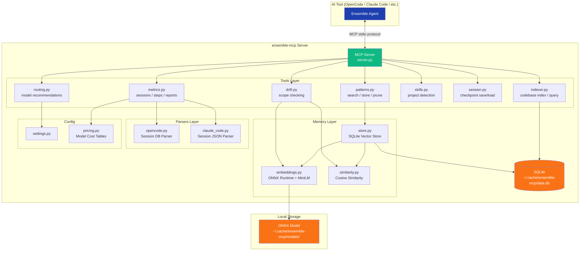

### 5.2 Technology Stack

| Component | Choice | Rationale |
|-----------|--------|-----------|
| Language | Python 3.11+ | User familiarity, best ML ecosystem |
| Distribution | `uvx` (via `uv` by Astral) | Auto-installs Python, cross-platform, zero-hassle |
| MCP Framework | `mcp` (official Python SDK) | Standard MCP protocol implementation |
| Embeddings | ONNX Runtime + MiniLM-L6-v2 | ~22MB model, no PyTorch (saves ~2.4GB) |
| Vector Storage | SQLite + numpy cosine similarity | Zero external dependencies, portable |
| Token Counting | `tiktoken` | OpenAI's fast token counter, works for estimation |
| Package Size | ~90MB (including ONNX + model) | Acceptable; PyTorch would be ~2.5GB |

**Why not PyTorch/sentence-transformers?**
- sentence-transformers pulls in PyTorch (~2.5GB)
- ONNX Runtime is ~60MB and runs the same MiniLM model
- For semantic search over <10K patterns, performance is identical

**Why not ChromaDB/FAISS?**
- ChromaDB adds ~100MB and its own SQLite dependency
- FAISS requires C++ compilation, fragile cross-platform
- Raw numpy cosine similarity over <10K vectors is <1ms
- SQLite gives us ACID transactions for free

### 5.3 Project Structure

```
ensemble-mcp/
  pyproject.toml
  README.md
  Dockerfile
  src/
    ensemble_mcp/
      __init__.py
      __main__.py           # Entry point: python -m ensemble_mcp
      server.py             # MCP server setup and tool registration
      config/
        __init__.py
        settings.py          # Configuration management
        pricing.py           # Model pricing tables
      tools/
        __init__.py
        patterns.py          # patterns_search, patterns_store, patterns_prune
        metrics.py           # metrics_start_session, metrics_record_step, etc.
        drift.py             # drift_check
        routing.py           # model_recommend
        skills.py            # skills_discover
        session.py           # session_save, session_load
        indexer.py           # project_index, project_query
      memory/
        __init__.py
        store.py             # SQLite-backed vector store
        embeddings.py        # ONNX Runtime embedding generation
        similarity.py        # Cosine similarity search
      parsers/
        __init__.py
        opencode.py          # Parse OpenCode session files
        claude_code.py       # Parse Claude Code session files
      installer/
        __init__.py
        setup.py             # Auto-detect AI tools, copy agents, register MCP
  tests/
    test_patterns.py
    test_metrics.py
    test_drift.py
    test_embeddings.py
    test_parsers.py
    test_indexer.py
```

### 5.4 MCP Tools (19 total)

#### Tool Taxonomy

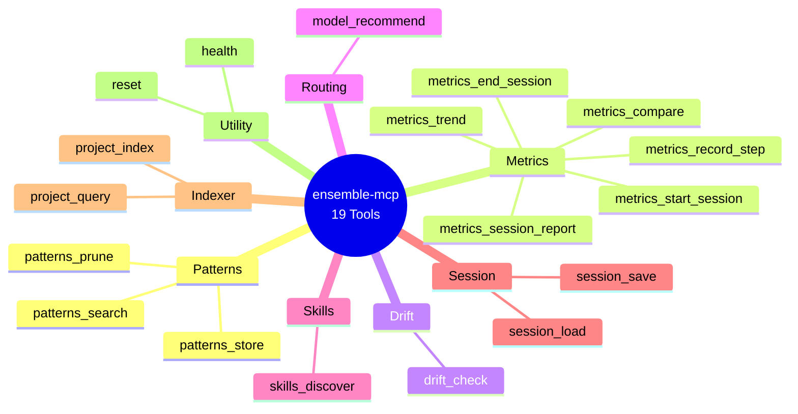

#### Patterns (3 tools)

| Tool | Input | Output | Description |
|------|-------|--------|-------------|
| `patterns_search` | `query: str, top_k: int = 3, project: str?` | `[{name, context, approach, outcome, score}]` | Semantic search over stored patterns |
| `patterns_store` | `name, context, approach, outcome, project: str?` | `{id, stored: true}` | Store a new pattern with embedding |
| `patterns_prune` | `max_age_days: int = 90, min_score: float = 0.3` | `{pruned: int, remaining: int}` | Remove old/low-relevance patterns |

#### Metrics (6 tools)

| Tool | Input | Output | Description |
|------|-------|--------|-------------|
| `metrics_start_session` | `task, classification, ai_tool` | `{session_id}` | Start tracking a pipeline session |
| `metrics_record_step` | `session_id, agent, input_tokens, output_tokens, cached_tokens?, model?, duration_ms?` | `{recorded: true}` | Record per-agent token usage |
| `metrics_end_session` | `session_id, status` | `{session_id, total_cost}` | Finalize session, compute totals |
| `metrics_session_report` | `session_id` | `{report: str}` | Generate formatted session report |
| `metrics_trend` | `days: int = 30` | `{daily_costs, avg_tokens, trend}` | Cost/token trends over time |
| `metrics_compare` | `session_id_a, session_id_b` | `{diff}` | Compare two sessions |

#### Drift (1 tool)

| Tool | Input | Output | Description |
|------|-------|--------|-------------|
| `drift_check` | `task_description, changed_files, diff_summary` | `{score: 0-1, flags: [], verdict}` | Cosine similarity between task and changes |

#### Routing (1 tool)

| Tool | Input | Output | Description |
|------|-------|--------|-------------|
| `model_recommend` | `agent, task_classification, task_description?` | `{tier: "best"/"mid"/"cheapest", reason}` | Recommend model tier for an agent |

#### Skills (1 tool)

| Tool | Input | Output | Description |
|------|-------|--------|-------------|
| `skills_discover` | `project_path, query?` | `{detected: [{name, source_tool, path, confidence}], snippets?: [{content, relevance}]}` | Scan tool-native skill locations (`.ai/skills/`, `.claude/skills/`, `.cursor/rules/`, etc.), embed content into vector store, and return relevant skills. Optional `query` enables semantic search across all discovered skills. |

#### Session (2 tools)

| Tool | Input | Output | Description |
|------|-------|--------|-------------|
| `session_save` | `session_id, state: dict` | `{saved: true}` | Save pipeline checkpoint state |
| `session_load` | `session_id?` | `{state: dict}` or `{found: false}` | Load latest or specific checkpoint |

#### Indexer (3 tools)

| Tool | Input | Output | Description |
|------|-------|--------|-------------|
| `project_index` | `project_path, force: bool = false` | `{indexed: true, files: int, cached: bool, duration_ms}` | Build or refresh the codebase index. Scans file tree, extracts exports/classes/functions per file. Uses mtime to skip unchanged files. |
| `project_query` | `project_path, query: str?, file_types: [str]?, path_pattern: str?` | `{files: [{path, type, exports, size, modified}]}` | Query the index — find files by type, path pattern, or semantic query. Returns compact file map for Scope consumption. |
| `project_dependencies` | `project_path, file_path` | `{imports: [str], imported_by: [str], related: [str]}` | Get import/dependency graph for a specific file. Shows what a file imports and what imports it. |

**How indexing works:**

1. **First run:** `project_index` scans the full project tree, builds the index in SQLite
2. **Subsequent runs:** Checks file mtimes — only re-indexes changed files (incremental)
3. **Scope calls `project_query`** instead of manually globbing/grepping — returns a compact file map
4. **Token savings:** Scope skips manual exploration on repeat visits, saving ~40-60% exploration tokens

**What gets indexed per file:**
- File path, size, last modified time
- Language/type detection (from extension + content heuristics)
- Exported symbols: classes, functions, constants, types (language-aware parsing)
- Import statements (for dependency graph)
- File role heuristic: model, controller, service, test, config, migration, etc.

**What does NOT get indexed:**
- File contents (too large for SQLite, and the AI tool can read files directly)
- Node modules, vendor directories, build outputs (respects `.gitignore`)
- Binary files

#### Utility (2 tools)

| Tool | Input | Output | Description |
|------|-------|--------|-------------|
| `health` | (none) | `{status, version, db_size, pattern_count}` | Server health check |
| `reset` | `confirm: bool` | `{reset: true}` | Reset all data (destructive) |

### 5.5 Zero-LLM-Call Principle

**The MCP server makes ZERO LLM/API calls.** All intelligence is local:

- **Embeddings:** ONNX Runtime runs MiniLM-L6-v2 locally (CPU inference, ~5ms per embedding)
- **Similarity:** numpy cosine similarity (pure math, no API)
- **Token counting:** tiktoken (local BPE tokenizer, no API)
- **Storage:** SQLite (local file database)
- **Drift detection:** Cosine similarity between embeddings (local math)

This means:
- No API keys required for the MCP server itself
- No additional cost beyond the AI tool's own token usage
- Works offline (after initial model download)
- No privacy concerns — all data stays local

---

## 6. Architecture Decisions

### 6.1 Python with `uvx` Distribution

**Decision:** Python 3.11+ distributed via `uvx` (from `uv` by Astral).

**Alternatives considered:**

| Option | Pros | Cons | Verdict |
|--------|------|------|---------|
| **Python + uvx** | User familiar, best ML ecosystem, uvx auto-installs Python | Larger than Go/Deno | **Chosen** |
| TypeScript/Node | Good MCP SDK support | Weak ML ecosystem, ONNX bindings fragile | Rejected |
| Deno | Modern, good DX, built-in TypeScript | User unfamiliar, ML ecosystem weak | Rejected |
| Go | Fast, small binary, easy cross-compile | No good embedding libraries, user unfamiliar | Rejected |

**Why `uvx`?**
- `uv` is by Astral (makers of Ruff) — fast, reliable, actively maintained
- `uvx` auto-downloads Python if not installed on the system
- Works on Mac, Linux, and Windows
- Single command: `uvx ensemble-mcp` — no manual Python/pip/venv setup
- Developers don't need Python knowledge to use it

### 6.2 Embedding Model Choice

**Decision:** ONNX Runtime + MiniLM-L6-v2

| Model | Size | Dimensions | Speed | Quality |
|-------|------|-----------|-------|---------|
| **MiniLM-L6-v2** | 22MB | 384 | ~5ms/embed | Good enough for pattern matching |
| all-MiniLM-L12-v2 | 44MB | 384 | ~10ms/embed | Slightly better, 2x slower |
| all-mpnet-base-v2 | 109MB | 768 | ~20ms/embed | Best quality, overkill for <10K patterns |

MiniLM-L6-v2 is the sweet spot: small, fast, and quality is sufficient for matching code patterns.

**Model download:** On first run, the server downloads the ONNX model (~22MB) to `~/.cache/ensemble-mcp/models/`. Subsequent runs use the cached model.

### 6.3 Vector Storage: SQLite + numpy

**Decision:** Store embeddings as BLOBs in SQLite, compute cosine similarity with numpy.

**Why not a vector database?**

| Option | Size | Complexity | Performance at <10K vectors |
|--------|------|-----------|---------------------------|
| **SQLite + numpy** | 0MB extra | Zero | <1ms search |
| ChromaDB | ~100MB | Medium (own SQLite, migrations) | <1ms search |
| FAISS | ~50MB | High (C++ compilation) | <0.1ms search |
| Pinecone/Weaviate | Cloud | High (API, account, cost) | Variable |

For pattern memory with <10K entries, brute-force cosine similarity is perfectly adequate. Adding a vector DB would be premature optimization.

### 6.4 Token Tracking: Hybrid Approach

**Decision:** Three-source hybrid with accuracy indicators.

#### Token Data Flow

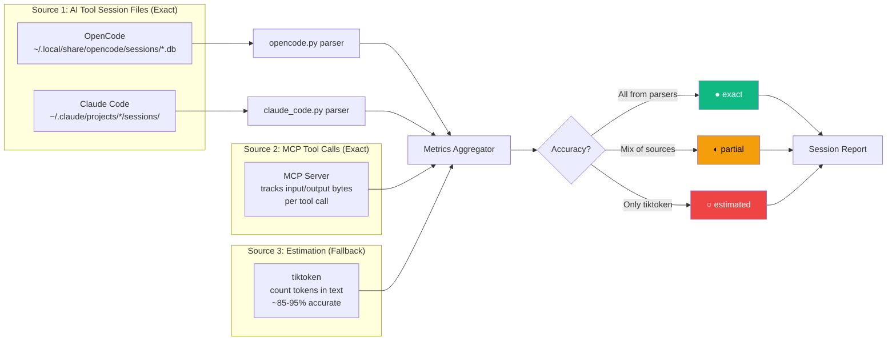

| Source | Method | Accuracy | When Available |
|--------|--------|----------|----------------|
| **AI tool session files** | Parse SQLite/JSON from `~/.local/share/opencode/sessions/` or `~/.claude/projects/` | Exact | OpenCode, Claude Code |
| **MCP tool call sizes** | Track input/output byte sizes of MCP tool calls | Exact (for MCP layer) | Always |
| **tiktoken estimation** | Count tokens in text flowing through Ensemble's context | Estimated (~85-95% accurate) | Always (fallback) |

**Accuracy indicators in reports:**
- `●` exact — from AI tool session files
- `◐` partial — mix of exact and estimated
- `○` estimated — tiktoken estimation only

### 6.5 Parallel Execution: Conservative

**Decision:** Only Proof + Lens run in parallel. Craft parallelism deferred to v2.

**Rationale:**
- Proof (format + build + test) and Lens (read-only review) are independent
- Lens reviews pre-format code (logical changes), Proof formats and tests
- Multi-file Craft parallelism has merge conflict risks and dependency ordering complexity
- Conservative approach reduces risk for v1

### 6.6 Drift Detection: Soft Warnings

**Decision:** Drift detection produces warnings, not hard blocks.

**Rationale:**
- Craft agents sometimes legitimately touch files not in the plan (discovered dependencies)
- Hard blocks would require user intervention on every pipeline, reducing automation
- Soft warnings appear in the final report, user can choose to investigate
- MCP version returns a 0-1 score; Ensemble can configure a threshold for escalation

### 6.7 Codebase Indexing: Incremental with mtime

**Decision:** Lightweight file-level index stored in SQLite, refreshed incrementally using file modification times.

**Rationale:**
- The Scope agent spends the most tokens on codebase exploration — it's the biggest overhead step
- On repeat visits to the same project, re-exploring unchanged files is pure waste
- A file-structure index (paths, exports, classes, function signatures, file roles) gives Scope a "project map" without manual glob/grep
- Incremental updates via mtime checks mean only changed files are re-scanned

**What gets indexed (per file):**

| Field | Example | Purpose |
|-------|---------|---------|
| `path` | `src/services/AuthService.ts` | File identification |
| `language` | `typescript` | Language-aware parsing |
| `size_bytes` | `2,340` | Quick relevance filtering |
| `modified_at` | `2026-03-30T10:00:00Z` | Incremental refresh |
| `role` | `service` | Heuristic: model, controller, service, test, config, migration |
| `exports` | `["AuthService", "validateToken"]` | Classes, functions, constants exported |
| `imports` | `["./UserModel", "jsonwebtoken"]` | Dependency tracking |

**Alternatives considered:**

| Option | Pros | Cons | Verdict |
|--------|------|------|---------|
| **SQLite index (mtime-based)** | Fast, incremental, portable | ~100ms initial scan for 1K files | **Chosen** |
| Full AST parsing (tree-sitter) | Precise symbol extraction | Heavy dependency (~50MB), complex | Deferred to v2 |
| Embedding-based code search | Semantic search over code | High token cost for embedding, overkill for file-level | Rejected |
| Just cache glob results | Simpler | Stale quickly, no structure info | Rejected |

**Performance expectations:**
- Initial index build (1,000 files): ~200-500ms
- Incremental refresh (10 changed files): ~20-50ms
- Query response: <5ms
- Index size: ~100KB per 1,000 files

**Language support for export extraction (v1):**

| Language | Exports Detected |
|----------|-----------------|
| TypeScript/JavaScript | `export class/function/const`, `module.exports` |
| Python | Top-level `class`, `def`, `__all__` |
| PHP | `class`, `interface`, `trait`, `function` |
| Go | Capitalized functions/types (exported by convention) |
| Rust | `pub fn`, `pub struct`, `pub enum`, `pub trait` |
| Ruby | `class`, `module`, `def` (top-level) |
| Other | File path + size only (no export parsing) |

### 6.8 User Configuration: Layered Defaults

**Decision:** Three-layer config with project → global → frontmatter fallback.

**Rationale:**
- Users should never need to edit agent files to customize models or behavior
- Project-level config (`.opencode/team-config.json`) allows per-project tuning (e.g., cheaper models for prototyping, expensive models for production code)
- Global config (`~/.config/opencode/team-config.json`) sets user-wide defaults
- Agent frontmatter provides sensible defaults for zero-config operation
- Layered merge means users only need to specify what they want to override

**Key principles:**
- Config is **optional** — everything works without it (current behavior preserved)
- Config is **additive** — partial configs are valid (specify only what you want to change)
- Config is **not an agent file** — it's a data file Ensemble reads, not a prompt

---

## 7. Token & Cost Analysis

### 7.1 Model Pricing Table

| Model | Input ($/1M) | Cached Input ($/1M) | Output ($/1M) |
|-------|-------------|-------------------|---------------|
| claude-opus-4 | $15.00 | $1.50 | $75.00 |
| claude-sonnet-4 | $3.00 | $0.30 | $15.00 |
| claude-haiku-3.5 | $0.80 | $0.08 | $4.00 |
| gpt-4o | $2.50 | $1.25 | $10.00 |
| gpt-4o-mini | $0.15 | $0.075 | $0.60 |
| gpt-5-mini | $0.20 | $0.10 | $0.80 |
| o1 | $15.00 | $7.50 | $60.00 |

*Prices as of early 2026. The MCP server stores these in `config/pricing.py` and can be updated.*

### 7.2 Typical Pipeline Token Usage (Current System)

Estimated tokens per standard pipeline (feature implementation):

| Agent | Input Tokens | Output Tokens | Model | Est. Cost |
|-------|-------------|--------------|-------|-----------|
| Ensemble (orchestration) | ~8,000 | ~3,000 | Opus | $0.345 |
| Scope | ~12,000 | ~2,500 | Opus | $0.368 |
| Craft | ~10,000 | ~4,000 | Opus | $0.450 |
| Proof | ~6,000 | ~1,500 | Sonnet | $0.041 |
| Lens | ~8,000 | ~1,000 | Sonnet | $0.039 |
| Signal | ~2,000 | ~500 | GPT-5-mini | $0.001 |
| **Total** | **~46,000** | **~12,500** | | **~$1.24** |

### 7.3 Markdown Patterns vs MCP Patterns Cost

**Markdown patterns (Phase 1):**
- Reading full `patterns.md` (30 entries): ~3,500 tokens input
- At Opus pricing: 3,500 × $15/1M = $0.053 per pipeline
- Per month (10 runs/day): $0.053 × 300 = **$15.75/month** on pattern reading alone

**MCP patterns (Phase 2+):**
- `patterns_search` returns top-3 matches: ~500 tokens input
- MCP tool definition overhead: ~1,200 tokens (fixed, amortized across session)
- At Opus pricing: 500 × $15/1M = $0.0075 per pipeline
- Per month: $0.0075 × 300 = **$2.25/month** on pattern reading
- Plus tool definitions: 1,200 × $15/1M × 300 = $5.40/month (amortized)
- **Total: ~$7.65/month**

**MCP savings: ~$8.10/month per developer** ($15.75 - $7.65)

### 7.4 Break-Even Analysis

MCP tool definitions add ~1,200 tokens fixed overhead per session. This is the "cost" of having MCP tools available.

- **1,200 tokens × $15/1M = $0.018** per session for tool definitions
- **Pattern search saves**: 3,000 tokens × $15/1M = $0.045 per pipeline
- **Net savings per pipeline**: $0.045 - $0.018 = **$0.027**
- **MCP breaks even on the first pipeline run**

### 7.5 Monthly Projections

At 10 pipeline runs/day, 30 days/month:

| Metric | Without MCP | With MCP | Savings |
|--------|------------|---------|---------|
| Pattern reading tokens | 1,050,000 | 150,000 | 900,000 |
| Tool definition tokens | 0 | 360,000 | -360,000 |
| **Net token difference** | | | **540,000 fewer** |
| Monthly cost (patterns only) | $15.75 | $7.65 | **$8.10/dev** |

With all MCP features (metrics, drift, routing, indexing), estimated monthly savings: **$12-18/developer** (indexing adds ~$4-6/dev savings from reduced Scope exploration).

---

## 8. Implementation Plan

### Delivery Timeline

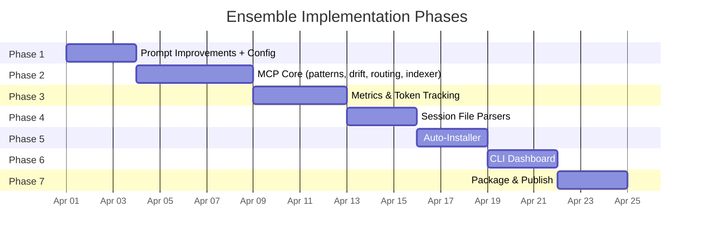

### Phase Dependencies

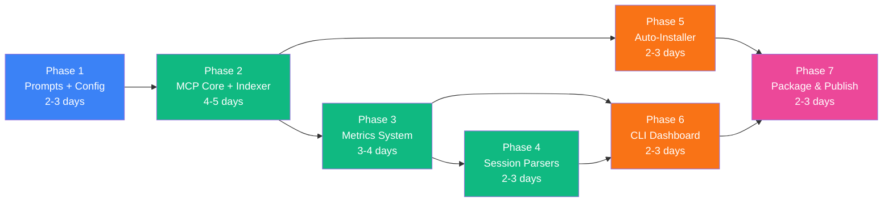

### 8.1 Delivery Phases

| Phase | Duration | Deliverables |
|-------|----------|-------------|
| **Phase 1: Prompt Improvements** | 2-3 days | Updated 7 agent files, `.opencode/patterns.md` template, `.opencode/team-config.json` schema, `.gitignore` |
| **Phase 2: MCP Core** | 4-5 days | Python project scaffold, patterns tools, drift tool, routing tool, codebase indexer |
| **Phase 3: Metrics System** | 3-4 days | Token tracking, session reports, cost calculation |
| **Phase 4: Session Parsers** | 2-3 days | OpenCode session file parser, Claude Code parser |
| **Phase 5: Auto-Installer** | 2-3 days | AI tool detection, agent copying, MCP registration |
| **Phase 6: CLI Dashboard** | 2-3 days | Terminal-based metrics dashboard |
| **Phase 7: Package & Publish** | 2-3 days | PyPI publishing, Docker image, documentation |

**Total estimated timeline: 19-24 days**

### 8.2 Phase 1 Detailed Steps

1. **Create `.gitignore`** — add `.opencode/`, Python artifacts, IDE files ✅ DONE
2. **Create `.opencode/patterns.md`** — empty template with format documentation
3. **Define `.opencode/team-config.json` schema** — document the config format and provide example configs
4. **Update `team-captain.md`** — add pattern memory protocol, parallel execution, drift detection, hooks, model routing hints, user configuration loading
5. **Update `team-architect.md`** — add pattern context reception, drift scope output
6. **Update `team-engineer.md`** — existing skill references are already correct and tool-agnostic; minor hooks/parallel additions only
7. **Update `team-forge.md`** — clarify parallel behavior (existing skill reference is already correct)
8. **Update `team-inspector.md`** — clarify parallel behavior (existing skill reference is already correct)
9. **Update `team-shipper.md`** — minimal changes (add session ID to commit metadata)
10. **Update `README.md`** — document new features including user configuration

### 8.3 Phase 2 Detailed Steps

1. Create `ensemble-mcp/` project structure
2. Set up `pyproject.toml` with dependencies:
   ```toml
   [project]
   name = "ensemble-mcp"
   version = "0.1.0"
   requires-python = ">=3.11"
   dependencies = [
       "mcp>=1.0",
       "onnxruntime>=1.17",
       "numpy>=1.26",
       "tiktoken>=0.6",
   ]

   [project.scripts]
   ensemble-mcp = "ensemble_mcp.__main__:main"
   ```
3. Implement `memory/embeddings.py` — ONNX model loading and inference
4. Implement `memory/store.py` — SQLite-backed vector store
5. Implement `memory/similarity.py` — cosine similarity search
6. Implement `tools/patterns.py` — search, store, prune
7. Implement `tools/drift.py` — embedding-based drift detection
8. Implement `tools/routing.py` — model tier recommendations
9. Implement `tools/skills.py` — project type detection
10. Implement `tools/indexer.py` — codebase index build, query, and dependency graph
11. Implement `server.py` — MCP server with tool registration
12. Write tests for all tools (including indexer)

### 8.4 Phase 3 Detailed Steps

1. Implement `config/pricing.py` — model pricing table
2. Implement `tools/metrics.py` — session tracking, step recording
3. Implement session report generation (ASCII table format)
4. Implement `metrics_trend` — daily cost/token aggregation
5. Implement `metrics_compare` — session diff
6. Write tests for metrics tools

### 8.5 Phase 4 Detailed Steps

1. Implement `parsers/opencode.py` — parse `~/.local/share/opencode/sessions/*.db`
2. Implement `parsers/claude_code.py` — parse `~/.claude/projects/*/sessions/`
3. Add parser auto-detection (which AI tool is running)
4. Integrate parsers with metrics for exact token counts
5. Write tests with fixture data

### 8.6 Phase 5 Detailed Steps

1. Implement AI tool detection (check for config files/directories)
2. Implement agent file copying (from package to project)
3. Implement MCP server registration in each tool's config
4. Create `ensemble-mcp install` CLI command
5. Test on all supported platforms

### 8.7 Phase 6 Detailed Steps

1. Design CLI dashboard layout (terminal width detection)
2. Implement real-time session display
3. Implement historical trends view
4. Implement cost breakdown charts (ASCII)
5. Add `ensemble-mcp dashboard` CLI command

### 8.8 Phase 7 Detailed Steps

1. Final testing on Mac, Linux, Windows
2. Create `Dockerfile` for containerized deployment
3. Publish to PyPI (`uv publish` or `twine upload`)
4. Verify `uvx ensemble-mcp` works end-to-end
5. Write user documentation

---

## 9. Cross-Tool Compatibility

### MCP Integration Architecture

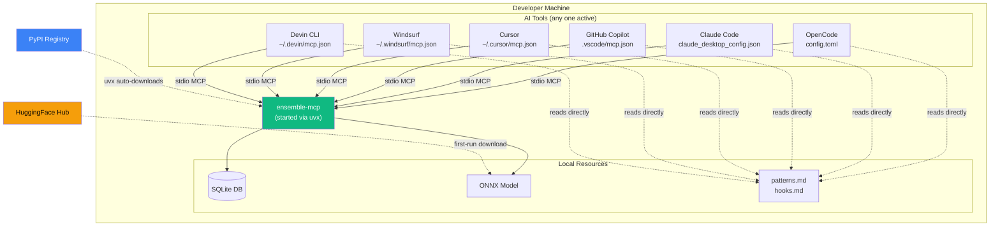

### 9.1 Supported AI Tools

| AI Tool | MCP Config Location | Config Format |
|---------|-------------------|---------------|
| OpenCode | `~/.config/opencode/config.toml` or project `.opencode.toml` | TOML |
| Claude Code | `~/.claude/claude_desktop_config.json` | JSON |
| GitHub Copilot (VS Code) | `.vscode/mcp.json` or VS Code settings | JSON |
| Cursor | `~/.cursor/mcp.json` | JSON |
| Windsurf | `~/.windsurf/mcp.json` | JSON |
| Devin CLI | `~/.devin/mcp.json` | JSON |

### 9.2 MCP Registration Examples

**OpenCode (`~/.config/opencode/config.toml`):**
```toml
[mcp.ensemble]
type = "stdio"
command = "uvx"
args = ["ensemble-mcp"]
```

**Claude Code (`~/.claude/claude_desktop_config.json`):**
```json
{
  "mcpServers": {
    "ensemble": {
      "command": "uvx",
      "args": ["ensemble-mcp"]
    }
  }
}
```

**GitHub Copilot (`.vscode/mcp.json`):**
```json
{
  "servers": {
    "ensemble": {
      "command": "uvx",
      "args": ["ensemble-mcp"]
    }
  }
}
```

**Cursor (`~/.cursor/mcp.json`):**
```json
{
  "mcpServers": {
    "ensemble": {
      "command": "uvx",
      "args": ["ensemble-mcp"]
    }
  }
}
```

### 9.3 Model Tier Mapping

The `model_recommend` tool returns abstract tiers. Each AI tool maps these to its own models.

**Default tier mapping (can be overridden in `team-config.json`):**

| Tier | OpenCode | Claude Code | Copilot | Cursor |
|------|----------|-------------|---------|--------|
| `best` | claude-opus-4 | claude-opus-4 | gpt-4o / claude-opus-4 | claude-opus-4 |
| `mid` | claude-sonnet-4 | claude-sonnet-4 | gpt-4o-mini / claude-sonnet-4 | claude-sonnet-4 |
| `cheapest` | gpt-5-mini | claude-haiku-3.5 | gpt-4o-mini | claude-haiku-3.5 |

The mapping is configured per-tool, not hardcoded in the MCP server. Users can override the tier-to-model mapping in their `team-config.json`:

```json
{
  "models": {
    "best": "claude-opus-4",
    "mid": "claude-sonnet-4",
    "cheapest": "gpt-5-mini"
  }
}
```

This allows users to use whatever models their AI tool and provider support, without needing to modify agent files or MCP server code.

---

## 10. Schemas & Data Models

### 10.1 SQLite Database Schema

The MCP server uses a single SQLite database at `~/.cache/ensemble-mcp/data.db`.

#### Entity Relationship Diagram

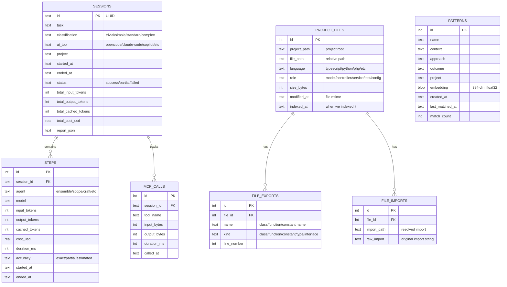

#### Patterns Table

```sql
CREATE TABLE patterns (
    id INTEGER PRIMARY KEY AUTOINCREMENT,
    name TEXT NOT NULL,
    context TEXT NOT NULL,
    approach TEXT NOT NULL,
    outcome TEXT NOT NULL,
    project TEXT,                    -- optional: scope to a project
    embedding BLOB NOT NULL,         -- 384-dim float32 vector (1,536 bytes)
    created_at TEXT DEFAULT (datetime('now')),
    last_matched_at TEXT,            -- updated on each search hit
    match_count INTEGER DEFAULT 0    -- popularity tracking
);

CREATE INDEX idx_patterns_project ON patterns(project);
CREATE INDEX idx_patterns_created ON patterns(created_at);
```

#### Sessions Table

```sql
CREATE TABLE sessions (
    id TEXT PRIMARY KEY,             -- UUID
    task TEXT NOT NULL,
    classification TEXT NOT NULL,    -- trivial/simple/standard/complex
    ai_tool TEXT,                    -- opencode/claude-code/copilot/cursor/etc
    project TEXT,
    started_at TEXT DEFAULT (datetime('now')),
    ended_at TEXT,
    status TEXT,                     -- success/partial/failed
    total_input_tokens INTEGER DEFAULT 0,
    total_output_tokens INTEGER DEFAULT 0,
    total_cached_tokens INTEGER DEFAULT 0,
    total_cost_usd REAL DEFAULT 0,
    report_json TEXT                 -- full report as JSON
);

CREATE INDEX idx_sessions_project ON sessions(project);
CREATE INDEX idx_sessions_started ON sessions(started_at);
```

#### Steps Table

```sql
CREATE TABLE steps (
    id INTEGER PRIMARY KEY AUTOINCREMENT,
    session_id TEXT NOT NULL REFERENCES sessions(id),
    agent TEXT NOT NULL,             -- ensemble/scope/craft/proof/lens/signal
    model TEXT,                      -- actual model used
    input_tokens INTEGER DEFAULT 0,
    output_tokens INTEGER DEFAULT 0,
    cached_tokens INTEGER DEFAULT 0,
    cost_usd REAL DEFAULT 0,
    duration_ms INTEGER,
    accuracy TEXT DEFAULT 'estimated',  -- exact/partial/estimated
    started_at TEXT DEFAULT (datetime('now')),
    ended_at TEXT
);

CREATE INDEX idx_steps_session ON steps(session_id);
```

#### MCP Calls Table

```sql
CREATE TABLE mcp_calls (
    id INTEGER PRIMARY KEY AUTOINCREMENT,
    session_id TEXT REFERENCES sessions(id),
    tool_name TEXT NOT NULL,
    input_bytes INTEGER DEFAULT 0,
    output_bytes INTEGER DEFAULT 0,
    duration_ms INTEGER,
    called_at TEXT DEFAULT (datetime('now'))
);

CREATE INDEX idx_mcp_calls_session ON mcp_calls(session_id);
```

#### Project Files Table (Codebase Index)

```sql
CREATE TABLE project_files (
    id INTEGER PRIMARY KEY AUTOINCREMENT,
    project_path TEXT NOT NULL,          -- absolute path to project root
    file_path TEXT NOT NULL,             -- relative path within project
    language TEXT,                        -- detected language
    role TEXT,                           -- heuristic: model/controller/service/test/config/migration/etc
    size_bytes INTEGER DEFAULT 0,
    modified_at TEXT NOT NULL,            -- file mtime (ISO 8601)
    indexed_at TEXT DEFAULT (datetime('now')),
    UNIQUE(project_path, file_path)
);

CREATE INDEX idx_project_files_project ON project_files(project_path);
CREATE INDEX idx_project_files_lang ON project_files(project_path, language);
CREATE INDEX idx_project_files_role ON project_files(project_path, role);
```

#### File Exports Table

```sql
CREATE TABLE file_exports (
    id INTEGER PRIMARY KEY AUTOINCREMENT,
    file_id INTEGER NOT NULL REFERENCES project_files(id) ON DELETE CASCADE,
    name TEXT NOT NULL,                  -- exported symbol name
    kind TEXT NOT NULL,                  -- class/function/constant/type/interface/trait/module
    line_number INTEGER,
    UNIQUE(file_id, name, kind)
);

CREATE INDEX idx_file_exports_file ON file_exports(file_id);
CREATE INDEX idx_file_exports_name ON file_exports(name);
```

#### File Imports Table

```sql
CREATE TABLE file_imports (
    id INTEGER PRIMARY KEY AUTOINCREMENT,
    file_id INTEGER NOT NULL REFERENCES project_files(id) ON DELETE CASCADE,
    import_path TEXT NOT NULL,           -- resolved import path
    raw_import TEXT NOT NULL             -- original import string as written
);

CREATE INDEX idx_file_imports_file ON file_imports(file_id);
CREATE INDEX idx_file_imports_path ON file_imports(import_path);
```

### 10.2 Pattern Memory File Format (Phase 1)

Used before MCP server is available. Stored at `.opencode/patterns.md`:

```markdown
# Pattern Memory

> Auto-maintained by Ensemble. Max 30 entries. Oldest pruned first.

## vue2-options-api-mixins
- **Context:** Vue 2 project using Options API with mixins for shared logic
- **Approach:** Use mixins for cross-component logic; avoid Composition API backports
- **Outcome:** Success — consistent with existing codebase patterns
- **Date:** 2026-03-15

## laravel-pest-parallel
- **Context:** Laravel project with Pest tests taking >2min
- **Approach:** Use `pest --parallel` with `RefreshDatabase` trait, not `DatabaseTransactions`
- **Outcome:** Success — test time reduced from 2min to 35sec
- **Date:** 2026-03-20
```

### 10.3 Session Report Format

#### In-Tool Report (Ensemble's final output)

```
╔══════════════════════════════════════════════════════════════╗
║                    SESSION REPORT                            ║
║  Task: Add user profile settings page                        ║
║  Classification: STANDARD  │  Status: SUCCESS                ║
╠══════════════════════════════════════════════════════════════╣
║                                                              ║
║  AGENT BREAKDOWN                                    ◐ partial║
║  ┌──────────┬──────────┬──────────┬────────┬────────┐       ║
║  │ Agent    │ In Tkns  │ Out Tkns │ Cached │ Cost   │       ║
║  ├──────────┼──────────┼──────────┼────────┼────────┤       ║
║  │ Ensemble │   8,234  │   2,891  │  1,200 │ $0.337 │       ║
║  │ Scope   │  11,567  │   2,234  │  3,400 │ $0.336 │       ║
║  │ Craft   │   9,823  │   3,567  │  2,100 │ $0.412 │       ║
║  │ Proof    │   5,891  │   1,234  │    890 │ $0.036 │       ║
║  │ Lens    │   7,456  │     891  │  1,100 │ $0.035 │       ║
║  │ Signal   │   1,923  │     456  │    300 │ $0.001 │       ║
║  ├──────────┼──────────┼──────────┼────────┼────────┤       ║
║  │ TOTAL    │  44,894  │  11,273  │  8,990 │ $1.157 │       ║
║  └──────────┴──────────┴──────────┴────────┴────────┘       ║
║                                                              ║
║  MCP TOOL CALLS                                              ║
║  ┌────────────────────┬───────┬─────────┐                   ║
║  │ Tool               │ Calls │ Tokens  │                   ║
║  ├────────────────────┼───────┼─────────┤                   ║
║  │ patterns_search    │     2 │     340 │                   ║
║  │ drift_check        │     1 │     180 │                   ║
║  │ model_recommend    │     3 │     120 │                   ║
║  │ metrics_record_step│     6 │     240 │                   ║
║  ├────────────────────┼───────┼─────────┤                   ║
║  │ TOTAL              │    12 │     880 │                   ║
║  └────────────────────┴───────┴─────────┘                   ║
║                                                              ║
║  SAVINGS ANALYSIS                                            ║
║  • Pattern memory saved ~3,000 tokens (semantic search       ║
║    vs reading full patterns file)                            ║
║  • Cached tokens saved: $0.122 (8,990 tokens at cache rate)  ║
║                                                              ║
║  CUMULATIVE (this project)                                   ║
║  • Sessions: 47  │  Total cost: $52.34  │  Avg: $1.11/run   ║
║  • Trend: ↓ 8% cost reduction over last 7 days              ║
║                                                              ║
║  Accuracy: ◐ partial (MCP exact + tiktoken estimated)        ║
╚══════════════════════════════════════════════════════════════╝
```

**Accuracy indicators:**
- `●` exact — all data from AI tool session files
- `◐` partial — mix of exact (MCP calls) and estimated (agent tokens)
- `○` estimated — all data from tiktoken estimation

#### CLI Dashboard Format

```
$ ensemble-mcp dashboard

  Ensemble MCP - Dashboard
  ═══════════════════════════

  Today: 8 sessions │ $9.42 │ 378K tokens
  Week:  42 sessions │ $48.67 │ 1.94M tokens
  Month: 156 sessions │ $178.23 │ 7.1M tokens

  Cost by Agent (today)
  ┌──────────┬────────┬───────┐
  │ Agent    │ Cost   │ Share │
  ├──────────┼────────┼───────┤
  │ Craft    │ $3.78  │  40%  │
  │ Scope   │ $2.84  │  30%  │
  │ Ensemble │ $2.10  │  22%  │
  │ Proof    │ $0.52  │   6%  │
  │ Lens    │ $0.14  │   1%  │
  │ Signal   │ $0.04  │  <1%  │
  └──────────┴────────┴───────┘

  Recent Sessions
  ┌────┬────────────────────────┬──────────┬────────┬────────┐
  │ #  │ Task                   │ Class    │ Cost   │ Status │
  ├────┼────────────────────────┼──────────┼────────┼────────┤
  │ 8  │ Fix login redirect bug │ simple   │ $0.82  │ ✓      │
  │ 7  │ Add profile settings   │ standard │ $1.16  │ ✓      │
  │ 6  │ Refactor auth service  │ complex  │ $2.34  │ ✓      │
  │ 5  │ Update README          │ trivial  │ $0.12  │ ✓      │
  └────┴────────────────────────┴──────────┴────────┴────────┘
```

---

## 11. Code Examples

### 11.1 ONNX Embedding Generation

```python
# memory/embeddings.py

import os
import numpy as np
from pathlib import Path

CACHE_DIR = Path.home() / ".cache" / "ensemble-mcp" / "models"
MODEL_NAME = "all-MiniLM-L6-v2"
MODEL_URL = f"https://huggingface.co/sentence-transformers/{MODEL_NAME}/resolve/main/onnx/model.onnx"
TOKENIZER_URL = f"https://huggingface.co/sentence-transformers/{MODEL_NAME}/resolve/main/tokenizer.json"

class EmbeddingModel:
    def __init__(self):
        self._session = None
        self._tokenizer = None

    def _ensure_model(self):
        """Download model files if not cached."""
        CACHE_DIR.mkdir(parents=True, exist_ok=True)
        model_path = CACHE_DIR / "model.onnx"
        tokenizer_path = CACHE_DIR / "tokenizer.json"

        if not model_path.exists():
            import urllib.request
            urllib.request.urlretrieve(MODEL_URL, model_path)

        if not tokenizer_path.exists():
            import urllib.request
            urllib.request.urlretrieve(TOKENIZER_URL, tokenizer_path)

        return model_path, tokenizer_path

    def _load(self):
        """Lazy-load ONNX session and tokenizer."""
        if self._session is not None:
            return

        import onnxruntime as ort
        from tokenizers import Tokenizer

        model_path, tokenizer_path = self._ensure_model()
        self._session = ort.InferenceSession(str(model_path))
        self._tokenizer = Tokenizer.from_file(str(tokenizer_path))

    def embed(self, text: str) -> np.ndarray:
        """Generate a 384-dimensional embedding for the given text."""
        self._load()

        # Tokenize
        encoded = self._tokenizer.encode(text)
        input_ids = np.array([encoded.ids], dtype=np.int64)
        attention_mask = np.array([encoded.attention_mask], dtype=np.int64)
        token_type_ids = np.zeros_like(input_ids)

        # Run inference
        outputs = self._session.run(
            None,
            {
                "input_ids": input_ids,
                "attention_mask": attention_mask,
                "token_type_ids": token_type_ids,
            },
        )

        # Mean pooling
        token_embeddings = outputs[0]  # (1, seq_len, 384)
        mask_expanded = attention_mask[:, :, np.newaxis].astype(np.float32)
        summed = np.sum(token_embeddings * mask_expanded, axis=1)
        counted = np.sum(mask_expanded, axis=1)
        embedding = summed / counted

        # Normalize
        norm = np.linalg.norm(embedding)
        if norm > 0:
            embedding = embedding / norm

        return embedding.flatten()  # (384,)

    def embed_batch(self, texts: list[str]) -> list[np.ndarray]:
        """Embed multiple texts. Simple loop for now; batch ONNX later if needed."""
        return [self.embed(t) for t in texts]
```

### 11.2 Cosine Similarity Search

```python
# memory/similarity.py

import numpy as np

def cosine_similarity(a: np.ndarray, b: np.ndarray) -> float:
    """Compute cosine similarity between two vectors."""
    dot = np.dot(a, b)
    norm_a = np.linalg.norm(a)
    norm_b = np.linalg.norm(b)
    if norm_a == 0 or norm_b == 0:
        return 0.0
    return float(dot / (norm_a * norm_b))

def search_similar(
    query_embedding: np.ndarray,
    stored_embeddings: list[tuple[int, np.ndarray]],  # (id, embedding) pairs
    top_k: int = 3,
    min_score: float = 0.3,
) -> list[tuple[int, float]]:
    """Find top-K most similar embeddings above min_score threshold."""
    scores = []
    for id_, emb in stored_embeddings:
        score = cosine_similarity(query_embedding, emb)
        if score >= min_score:
            scores.append((id_, score))

    scores.sort(key=lambda x: x[1], reverse=True)
    return scores[:top_k]
```

### 11.3 SQLite Vector Store

```python
# memory/store.py

import sqlite3
import numpy as np
from pathlib import Path
from .embeddings import EmbeddingModel
from .similarity import search_similar

DB_PATH = Path.home() / ".cache" / "ensemble-mcp" / "data.db"

class VectorStore:
    def __init__(self, db_path: Path = DB_PATH):
        self.db_path = db_path
        db_path.parent.mkdir(parents=True, exist_ok=True)
        self.conn = sqlite3.connect(str(db_path))
        self._create_tables()
        self.model = EmbeddingModel()

    def _create_tables(self):
        self.conn.executescript("""
            CREATE TABLE IF NOT EXISTS patterns (
                id INTEGER PRIMARY KEY AUTOINCREMENT,
                name TEXT NOT NULL,
                context TEXT NOT NULL,
                approach TEXT NOT NULL,
                outcome TEXT NOT NULL,
                project TEXT,
                embedding BLOB NOT NULL,
                created_at TEXT DEFAULT (datetime('now')),
                last_matched_at TEXT,
                match_count INTEGER DEFAULT 0
            );
            CREATE INDEX IF NOT EXISTS idx_patterns_project ON patterns(project);
        """)
        self.conn.commit()

    def store_pattern(self, name: str, context: str, approach: str,
                      outcome: str, project: str = None) -> int:
        text = f"{name} {context} {approach}"
        embedding = self.model.embed(text)
        emb_blob = embedding.tobytes()

        cursor = self.conn.execute(
            "INSERT INTO patterns (name, context, approach, outcome, project, embedding) "
            "VALUES (?, ?, ?, ?, ?, ?)",
            (name, context, approach, outcome, project, emb_blob),
        )
        self.conn.commit()
        return cursor.lastrowid

    def search_patterns(self, query: str, top_k: int = 3,
                        project: str = None, min_score: float = 0.3):
        query_embedding = self.model.embed(query)

        # Load all embeddings
        if project:
            rows = self.conn.execute(
                "SELECT id, embedding FROM patterns WHERE project = ? OR project IS NULL",
                (project,),
            ).fetchall()
        else:
            rows = self.conn.execute("SELECT id, embedding FROM patterns").fetchall()

        stored = [(r[0], np.frombuffer(r[1], dtype=np.float32)) for r in rows]
        matches = search_similar(query_embedding, stored, top_k, min_score)

        results = []
        for id_, score in matches:
            row = self.conn.execute(
                "SELECT name, context, approach, outcome FROM patterns WHERE id = ?",
                (id_,),
            ).fetchone()
            if row:
                # Update match stats
                self.conn.execute(
                    "UPDATE patterns SET last_matched_at = datetime('now'), "
                    "match_count = match_count + 1 WHERE id = ?",
                    (id_,),
                )
                results.append({
                    "id": id_,
                    "name": row[0],
                    "context": row[1],
                    "approach": row[2],
                    "outcome": row[3],
                    "score": round(score, 3),
                })
        self.conn.commit()
        return results

    def prune(self, max_age_days: int = 90, min_score: float = 0.3) -> int:
        cursor = self.conn.execute(
            "DELETE FROM patterns WHERE "
            "created_at < datetime('now', ? || ' days') AND match_count = 0",
            (f"-{max_age_days}",),
        )
        pruned = cursor.rowcount
        self.conn.commit()
        return pruned
```

### 11.4 Token Estimation

```python
# tools/metrics.py (token estimation helper)

import tiktoken

# Use cl100k_base (GPT-4/Claude compatible) for estimation
_encoder = None

def _get_encoder():
    global _encoder
    if _encoder is None:
        _encoder = tiktoken.get_encoding("cl100k_base")
    return _encoder

def estimate_tokens(text: str) -> int:
    """Estimate token count for a text string. ~85-95% accurate across models."""
    return len(_get_encoder().encode(text))

def calculate_cost(
    input_tokens: int,
    output_tokens: int,
    cached_tokens: int,
    model: str,
) -> float:
    """Calculate cost in USD for a given token usage."""
    pricing = MODEL_PRICING.get(model, MODEL_PRICING["claude-sonnet-4"])

    input_cost = (input_tokens - cached_tokens) * pricing["input"] / 1_000_000
    cached_cost = cached_tokens * pricing["cached_input"] / 1_000_000
    output_cost = output_tokens * pricing["output"] / 1_000_000

    return input_cost + cached_cost + output_cost

MODEL_PRICING = {
    "claude-opus-4": {"input": 15.0, "cached_input": 1.5, "output": 75.0},
    "claude-sonnet-4": {"input": 3.0, "cached_input": 0.30, "output": 15.0},
    "claude-haiku-3.5": {"input": 0.80, "cached_input": 0.08, "output": 4.0},
    "gpt-4o": {"input": 2.50, "cached_input": 1.25, "output": 10.0},
    "gpt-4o-mini": {"input": 0.15, "cached_input": 0.075, "output": 0.60},
    "gpt-5-mini": {"input": 0.20, "cached_input": 0.10, "output": 0.80},
    "o1": {"input": 15.0, "cached_input": 7.50, "output": 60.0},
}
```

### 11.5 Session File Parser (OpenCode)

```python
# parsers/opencode.py

import sqlite3
import json
from pathlib import Path
from typing import Optional

# OpenCode stores session data in SQLite
OPENCODE_SESSIONS_DIR = Path.home() / ".local" / "share" / "opencode" / "sessions"

def find_latest_session() -> Optional[Path]:
    """Find the most recent OpenCode session database."""
    if not OPENCODE_SESSIONS_DIR.exists():
        return None

    db_files = sorted(OPENCODE_SESSIONS_DIR.glob("*.db"), key=lambda p: p.stat().st_mtime, reverse=True)
    return db_files[0] if db_files else None

def parse_session(db_path: Path) -> dict:
    """Parse an OpenCode session database for token usage."""
    conn = sqlite3.connect(str(db_path))
    conn.row_factory = sqlite3.Row

    # Query message history for token usage
    # (exact schema depends on OpenCode version)
    try:
        rows = conn.execute("""
            SELECT role, model, input_tokens, output_tokens, cache_read_tokens
            FROM messages
            ORDER BY created_at
        """).fetchall()
    except sqlite3.OperationalError:
        # Schema mismatch — return empty
        return {"found": False, "reason": "schema_mismatch"}

    steps = []
    for row in rows:
        steps.append({
            "role": row["role"],
            "model": row["model"],
            "input_tokens": row["input_tokens"] or 0,
            "output_tokens": row["output_tokens"] or 0,
            "cached_tokens": row["cache_read_tokens"] or 0,
        })

    conn.close()
    return {"found": True, "accuracy": "exact", "steps": steps}
```

### 11.6 MCP Server Entry Point

```python
# server.py

from mcp.server import Server
from mcp.server.stdio import stdio_server
from mcp.types import Tool, TextContent

from .tools import patterns, metrics, drift, routing, skills, session, indexer
from .memory.store import VectorStore

app = Server("ensemble-mcp")
store = VectorStore()

# ─── Pattern Tools ───

@app.tool()
async def patterns_search(query: str, top_k: int = 3, project: str = None) -> list[dict]:
    """Search stored patterns by semantic similarity."""
    return store.search_patterns(query, top_k, project)

@app.tool()
async def patterns_store(name: str, context: str, approach: str,
                         outcome: str, project: str = None) -> dict:
    """Store a new pattern from a successful pipeline."""
    id_ = store.store_pattern(name, context, approach, outcome, project)
    return {"id": id_, "stored": True}

@app.tool()
async def patterns_prune(max_age_days: int = 90, min_score: float = 0.3) -> dict:
    """Prune old/unused patterns."""
    pruned = store.prune(max_age_days, min_score)
    remaining = store.conn.execute("SELECT COUNT(*) FROM patterns").fetchone()[0]
    return {"pruned": pruned, "remaining": remaining}

# ─── Drift Tool ───

@app.tool()
async def drift_check(task_description: str, changed_files: list[str],
                      diff_summary: str) -> dict:
    """Check if code changes drift from the original task."""
    return drift.check(store.model, task_description, changed_files, diff_summary)

# ─── Routing Tool ───

@app.tool()
async def model_recommend(agent: str, task_classification: str,
                          task_description: str = None) -> dict:
    """Recommend a model tier for the given agent and task."""
    return routing.recommend(agent, task_classification, task_description)

# ... (additional tools registered similarly)

# ─── Indexer Tools ───

@app.tool()
async def project_index(project_path: str, force: bool = False) -> dict:
    """Build or refresh the codebase index for faster Scope exploration."""
    return indexer.index_project(project_path, force=force)

@app.tool()
async def project_query(project_path: str, query: str = None,
                        file_types: list[str] = None,
                        path_pattern: str = None) -> dict:
    """Query the project index — find files by type, path, or semantic query."""
    return indexer.query_project(project_path, query=query,
                                 file_types=file_types, path_pattern=path_pattern)

@app.tool()
async def project_dependencies(project_path: str, file_path: str) -> dict:
    """Get import/dependency graph for a specific file."""
    return indexer.get_dependencies(project_path, file_path)

async def main():
    async with stdio_server() as (read_stream, write_stream):
        await app.run(read_stream, write_stream, app.create_initialization_options())

if __name__ == "__main__":
    import asyncio
    asyncio.run(main())
```

### 11.7 Drift Detection Implementation

```python
# tools/drift.py

import numpy as np
from ..memory.embeddings import EmbeddingModel
from ..memory.similarity import cosine_similarity

def check(
    model: EmbeddingModel,
    task_description: str,
    changed_files: list[str],
    diff_summary: str,
) -> dict:
    """
    Check if changes drift from the task.
    Returns a 0-1 score (0 = no drift, 1 = complete drift)
    and specific flags.
    """
    task_emb = model.embed(task_description)
    diff_emb = model.embed(diff_summary)

    # Core similarity
    similarity = cosine_similarity(task_emb, diff_emb)
    drift_score = 1.0 - similarity  # Higher = more drift

    flags = []

    # Check for suspicious file patterns
    suspicious_patterns = [
        "migration", "schema", "config", ".env",
        "package.json", "composer.json",
    ]
    for f in changed_files:
        for pattern in suspicious_patterns:
            if pattern in f.lower():
                # Check if this file type is mentioned in the task
                file_emb = model.embed(f)
                file_sim = cosine_similarity(task_emb, file_emb)
                if file_sim < 0.3:
                    flags.append(f"Unexpected file change: {f}")

    # Determine verdict
    if drift_score < 0.3:
        verdict = "aligned"
    elif drift_score < 0.6:
        verdict = "minor_drift"
    else:
        verdict = "significant_drift"

    return {
        "score": round(drift_score, 3),
        "similarity": round(similarity, 3),
        "flags": flags,
        "verdict": verdict,
    }
```

### 11.8 Auto-Installer

```python
# installer/setup.py

import json
import shutil
from pathlib import Path
from typing import Optional

AI_TOOLS = {
    "opencode": {
        "config_path": Path.home() / ".config" / "opencode",
        "config_file": "config.toml",
        "detect_files": [".opencode.toml", Path.home() / ".config" / "opencode"],
        "mcp_config": '[mcp.ensemble]\ntype = "stdio"\ncommand = "uvx"\nargs = ["ensemble-mcp"]\n',
    },
    "claude_code": {
        "config_path": Path.home() / ".claude",
        "config_file": "claude_desktop_config.json",
        "detect_files": [Path.home() / ".claude"],
        "mcp_config": {
            "mcpServers": {
                "ensemble": {
                    "command": "uvx",
                    "args": ["ensemble-mcp"],
                }
            }
        },
    },
    "copilot": {
        "config_path": Path(".vscode"),
        "config_file": "mcp.json",
        "detect_files": [Path.home() / ".vscode"],
        "mcp_config": {
            "servers": {
                "ensemble": {
                    "command": "uvx",
                    "args": ["ensemble-mcp"],
                }
            }
        },
    },
    "cursor": {
        "config_path": Path.home() / ".cursor",
        "config_file": "mcp.json",
        "detect_files": [Path.home() / ".cursor"],
        "mcp_config": {
            "mcpServers": {
                "ensemble": {
                    "command": "uvx",
                    "args": ["ensemble-mcp"],
                }
            }
        },
    },
    "windsurf": {
        "config_path": Path.home() / ".windsurf",
        "config_file": "mcp.json",
        "detect_files": [Path.home() / ".windsurf"],
        "mcp_config": {
            "mcpServers": {
                "ensemble": {
                    "command": "uvx",
                    "args": ["ensemble-mcp"],
                }
            }
        },
    },
}

def detect_installed_tools() -> list[str]:
    """Detect which AI tools are installed on this system."""
    installed = []
    for tool_name, config in AI_TOOLS.items():
        for detect_path in config["detect_files"]:
            p = Path(detect_path)
            if p.exists():
                installed.append(tool_name)
                break
    return installed

def register_mcp_server(tool_name: str) -> bool:
    """Register the MCP server with the specified AI tool."""
    config = AI_TOOLS.get(tool_name)
    if not config:
        return False

    config_path = config["config_path"]
    config_file = config_path / config["config_file"]

    if tool_name == "opencode":
        # TOML format — append to config
        config_path.mkdir(parents=True, exist_ok=True)
        with open(config_file, "a") as f:
            f.write("\n" + config["mcp_config"])
    else:
        # JSON format — merge into existing config
        config_path.mkdir(parents=True, exist_ok=True)
        existing = {}
        if config_file.exists():
            with open(config_file) as f:
                existing = json.load(f)

        # Deep merge
        mcp_key = list(config["mcp_config"].keys())[0]
        if mcp_key not in existing:
            existing[mcp_key] = {}
        existing[mcp_key].update(config["mcp_config"][mcp_key])

        with open(config_file, "w") as f:
            json.dump(existing, f, indent=2)

    return True

def install(copy_agents: bool = True, register_mcp: bool = True) -> dict:
    """Full installation: detect tools, copy agents, register MCP."""
    installed = detect_installed_tools()
    results = {"detected_tools": installed, "registered": [], "errors": []}

    if register_mcp:
        for tool in installed:
            try:
                register_mcp_server(tool)
                results["registered"].append(tool)
            except Exception as e:
                results["errors"].append(f"{tool}: {str(e)}")

    return results
```

---

## 12. Risk Assessment

### 12.1 Technical Risks

| Risk | Probability | Impact | Mitigation |
|------|------------|--------|------------|
| ONNX model download fails on corporate networks | Medium | Medium | Bundle model in package (adds ~22MB to install size) |
| OpenCode session DB schema changes between versions | Medium | Low | Graceful fallback to tiktoken estimation |
| `uvx` not available on older systems | Low | Medium | Provide `pip install` fallback instructions |
| SQLite concurrent write conflicts (multiple sessions) | Low | Medium | WAL mode + file locking |
| Token estimation accuracy varies by model | High | Low | Clearly label estimates with `○` indicator |
| Pattern memory grows too large | Low | Low | Auto-prune + configurable max entries |
| Codebase index stale after external changes (IDE, git checkout) | Medium | Low | mtime check on query; stale files re-indexed on access |
| Export parsing misses symbols in complex syntax | Medium | Low | Graceful degradation — file still indexed, exports just incomplete |

### 12.2 Operational Risks

| Risk | Probability | Impact | Mitigation |
|------|------------|--------|------------|
| Users forget to start MCP server | Medium | Low | Phase 1 works without MCP; prompts handle gracefully |
| AI tool MCP config format changes | Medium | Medium | Abstract config layer; update per-tool templates |
| Cross-platform path differences | High | Medium | Use `pathlib.Path` everywhere; test on Mac/Linux/Windows |
| Pricing table becomes outdated | High | Low | Store in config file, easy to update |
| User config file has invalid JSON | Medium | Low | Ensemble logs warning and falls back to defaults; never crashes |

### 12.3 Token Budget Risks

| Risk | Description | Mitigation |
|------|------------|------------|
| Pattern file grows unbounded | 30-entry cap in Phase 1; auto-prune in MCP | Enforce max entries |
| MCP tool definitions consume tokens | Fixed ~1,200 tokens per session (now ~1,500 with indexer tools) | Break-even after 1 pipeline; net positive |
| Drift check adds latency | Embedding computation ~5ms | Negligible; runs once per pipeline |
| User config adds input tokens | Config file read adds ~200-400 tokens | Tiny cost; avoids larger cost of wrong model selection |

---

## Appendix A: Inspiration Sources

- **Ruflo/Claude Flow** (https://github.com/ruvnet/ruflo) — Multi-agent orchestration patterns, session management, quality gates
- **OpenCode** (https://opencode.ai) — MCP integration, session persistence, agent system
- **Anthropic MCP Specification** — Standard protocol for tool integration

## Appendix B: Glossary

| Term | Definition |
|------|-----------|
| **MCP** | Model Context Protocol — standard for AI tool ↔ external service communication |
| **uvx** | Package runner from `uv` by Astral — auto-downloads Python + dependencies |
| **ONNX** | Open Neural Network Exchange — portable ML model format |
| **MiniLM** | Small transformer model for sentence embeddings (22MB) |
| **tiktoken** | OpenAI's byte-pair encoding tokenizer for token counting |
| **Drift** | When agent output deviates from the planned task scope |
| **Pattern** | A learned solution or pitfall from a previous pipeline run |
| **Tier** | Abstract model quality level: best / mid / cheapest |
| **Codebase Index** | File-level map of a project (paths, exports, imports, roles) stored in SQLite for fast Scope exploration |
| **team-config.json** | User configuration file for customizing models, reasoning effort, temperature, and pipeline budgets |

## Appendix C: File Sizes After Changes

| File | Current Lines | Projected Lines | Change |
|------|--------------|----------------|--------|
| `team-captain.md` | 250 | ~330 | +80 (patterns, parallel, drift, hooks, config) |
| `team-architect.md` | 159 | ~170 | +11 (pattern context, drift scope) |
| `team-engineer.md` | 67 | ~72 | +5 (minor hooks/parallel additions) |
| `team-forge.md` | 134 | ~140 | +6 (parallel clarification) |
| `team-hunter.md` | 228 | 228 | 0 (unchanged, isolated agent) |
| `team-inspector.md` | 142 | ~148 | +6 (parallel clarification) |
| `team-shipper.md` | 88 | ~92 | +4 (session ID) |
| **Total** | **1,068** | **~1,180** | **+112 net** |

### New Files Created (Phase 1)

| File | Lines | Purpose |
|------|-------|---------|
| `.opencode/patterns.md` | ~15 | Empty pattern memory template with format docs |
| `.opencode/team-config.json` | ~20-50 | User-configurable models, reasoning, pipeline budgets (optional) |
