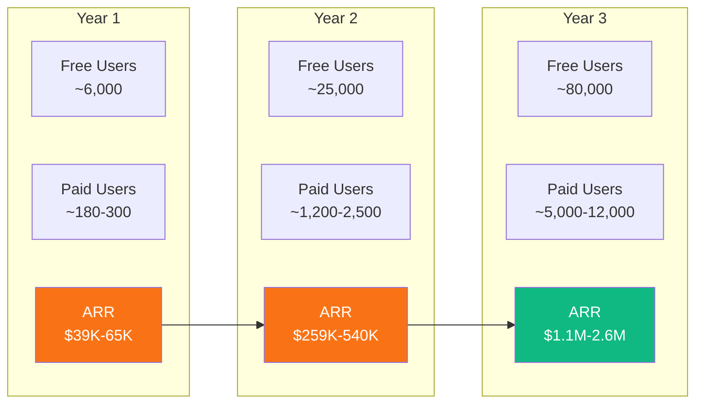
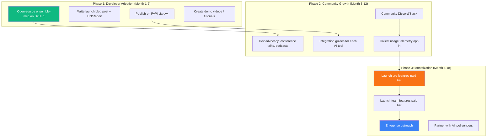

# Ensemble — Business Case & Investor Metrics

> Internal playbook for generating proof points **and** polished investor-facing findings for the Ensemble multi-agent orchestration system.

**Status:** Living Document — Updated as benchmarks are completed  
**Last Updated:** 2026-04-04  
**Audience:** Founders, investors, advisory board

---

## Table of Contents

1. [Executive Summary](#1-executive-summary)
2. [Market Opportunity](#2-market-opportunity)
3. [Technical Proof Points](#3-technical-proof-points)
4. [Financial Model](#4-financial-model)
5. [Growth Strategy](#5-growth-strategy)
6. [Risk Assessment](#6-risk-assessment)
7. [Appendix](#7-appendix)

---

## 1. Executive Summary

### The Problem

AI-assisted software engineering is exploding — but current single-agent workflows are **wasteful, unpredictable, and lack memory**. Developers using tools like GitHub Copilot, Claude Code, and Cursor face:

- **No learning** — every session starts from zero; the same mistakes repeat across pipelines
- **Silent drift** — agents deviate from the plan with no detection or correction
- **Static routing** — the same expensive model is used for trivial and complex tasks alike
- **Redundant exploration** — codebase analysis repeats from scratch every run

These problems compound at scale. A team of 10 engineers running 10 pipelines/day each wastes an estimated **16.2M tokens/month** on redundant pattern reading alone (see [Phase 1 Design Spec §3.5](archive/DESIGN-SPEC-PHASE-01.md)).

### The Solution

**Ensemble** is a 7-agent orchestration pipeline backed by `ensemble-mcp` — a local Python MCP server providing vector memory, drift detection, smart model routing, and codebase indexing. It works with any MCP-compatible AI tool (OpenCode, Claude Code, GitHub Copilot, Cursor, Windsurf, Devin CLI).

### Key Differentiators

| Differentiator | Why It Matters |
|---------------|----------------|
| **Zero-LLM-Call architecture** | All intelligence runs locally (ONNX embeddings, SQLite). Near-zero marginal cost per user. No API keys required. |
| **Cross-tool compatibility** | Works with 6+ AI tools via the open MCP protocol. Not locked to one IDE or vendor. |
| **Memory that compounds** | Patterns learned in session 1 improve session 100. Teams build institutional AI knowledge. |
| **Zero-config installation** | Single command: `uvx ensemble-mcp`. No Docker, no cloud, no setup. |

### The Ask

*[To be defined — seed round amount, use of funds, timeline to milestones]*

---

## 2. Market Opportunity

### 2.1 TAM / SAM / SOM Analysis

#### How to Calculate (Methodology)

1. **TAM (Total Addressable Market):** Global spend on AI coding tools + developer productivity tooling. Sources: Gartner, IDC, GitHub/Microsoft earnings, Cognition AI (Devin) funding announcements, Anysphere (Cursor) valuation.
2. **SAM (Serviceable Addressable Market):** Developers actively using MCP-compatible AI tools who run multi-step coding workflows.
3. **SOM (Serviceable Obtainable Market):** Realistic year-1 capture assuming open-source distribution + paid team/enterprise features.

#### Market Sizing

| Segment | Metric | Value | Source |
|---------|--------|-------|--------|
| **TAM** | Global AI coding tools market (2027 projected) | $5-7B | *[Cite: Gartner/IDC report]* |
| | GitHub Copilot paid subscribers (2025) | ~1.8M | Microsoft earnings Q4 2025 |
| | Cursor estimated ARR (2025) | ~$100M+ | *[Cite: funding round press]* |
| | Cognition AI (Devin) valuation | $2B | Series A, 2024 |
| **SAM** | Developers using MCP-compatible tools | *[To be researched]* | MCP adoption reports |
| | Teams running 5+ AI pipelines/day | *[To be researched]* | Survey data |
| **SOM** | Year-1 target: individual developers (free tier) | *[TBD]* | — |
| | Year-1 target: paid team seats | *[TBD]* | — |
| | Year-1 target ARR | *[TBD]* | — |

#### Market Tailwinds

- MCP is becoming an industry standard — Anthropic, OpenAI, and IDE vendors are adopting it
- AI coding spend is growing faster than any other developer tooling category
- Cost optimization becomes critical as teams scale AI usage beyond 1-2 developers
- No dominant player in the "AI coding orchestration + cost optimization" niche

### 2.2 Competitive Landscape

| Feature | Ensemble | Raw Single-Agent | GitHub Copilot Workspace | Devin (Cognition) | Cursor Composer |
|---------|----------|-----------------|-------------------------|-------------------|----------------|
| Multi-agent pipeline | 7 specialized agents | Single agent | Proprietary pipeline | Proprietary agent | Single agent |
| Cross-session memory | Vector memory (local) | None | None | Proprietary | None |
| Drift detection | Cosine similarity scoring | None | None | Unknown | None |
| Model routing | Task-aware tier recommendations | Fixed model | Fixed model | Fixed model | User-selected |
| Codebase indexing | Local SQLite index | Per-session exploration | GitHub-level | Full repo context | Per-session |
| Works with multiple AI tools | 6+ via MCP | Tool-specific | GitHub only | Standalone | Cursor only |
| Data leaves your machine | No (zero-LLM-call) | Yes (API calls) | Yes (cloud) | Yes (cloud) | Yes (API calls) |
| Pricing | Open-source core + paid features | Included in tool subscription | Included in Copilot | $500/month | Included in Cursor |

**Positioning:** Ensemble is not a replacement for Copilot or Cursor — it is an **orchestration and intelligence layer** that makes any MCP-compatible tool smarter, more efficient, and more cost-effective.

### 2.3 Market Validation Methodology

#### Pre-Launch Validation Channels

| Channel | Target Metric | How to Measure | Status |
|---------|--------------|----------------|--------|
| **Landing page + waitlist** | Visitor-to-signup conversion rate (target: >5%) | Analytics (Plausible/PostHog) | *[Not started]* |
| **Developer survey** | 50+ responses validating pain points | Google Forms / Typeform | *[Not started]* |
| **Letters of Intent** | 3-5 soft LOIs from engineering leads | Direct outreach | *[Not started]* |
| **GitHub stars** | 500+ stars within 30 days of open-source launch | GitHub API | *[Not started]* |
| **Community** | Discord/Slack members, HN/Reddit engagement | Community platforms | *[Not started]* |
| **Beta pilot commitments** | 5-10 teams willing to run beta | Direct outreach | *[Not started]* |

#### Survey Template

Target: individual developers and engineering leads using AI coding tools.

**Screening questions:**
1. Which AI coding tools do you use? (Copilot, Claude Code, Cursor, Windsurf, Other)
2. How many AI-assisted coding sessions do you run per day? (1-3, 4-10, 10+)

**Pain point validation:**
3. How often does your AI tool repeat mistakes you've corrected before? (Never / Sometimes / Often / Almost always)
4. Do you track how much you spend on AI coding tool API tokens? (Yes / No / I don't know my spend)
5. Have you experienced AI agents going off-track from your original request? (Never / Sometimes / Often)
6. Rate your frustration with each: [No memory, No cost visibility, Agent drift, Slow codebase exploration] (1-5 scale)

**Willingness to pay:**
7. If a tool reduced your AI coding costs by 30-50% and eliminated repeated mistakes, what would you pay per month? ($0 / $10-20 / $20-50 / $50-100 / $100+)
8. Would your team adopt an open-source orchestration layer if it worked with your existing AI tool? (Definitely / Probably / Unlikely / No)

**Results:** *[To be collected]*

---

## 3. Technical Proof Points

### 3.1 Benchmark Methodology

#### Benchmark Design

To generate credible, reproducible numbers, run the following benchmark suite:

**Test Repositories (select 5-10):**

| Repo | Language | Size | Why |
|------|----------|------|-----|
| [express](https://github.com/expressjs/express) | JavaScript | Medium | Popular, well-understood |
| [fastapi](https://github.com/tiangolo/fastapi) | Python | Medium | Modern Python, good structure |
| [laravel/framework](https://github.com/laravel/framework) | PHP | Large | Ensemble's home turf |
| [django/django](https://github.com/django/django) | Python | Large | Large mature codebase |
| [vitejs/vite](https://github.com/vitejs/vite) | TypeScript | Medium | Modern tooling project |

**Test Tasks (per repo, 5-10 tasks each):**
- Bug fix from a real closed issue (known solution for comparison)
- Add a new feature (small: 1-3 files, medium: 3-10 files)
- Refactor an existing module
- Add tests for an untested function
- Documentation update

**Measurement Protocol:**

| Metric | How to Measure | Tool |
|--------|---------------|------|
| Total tokens consumed | Estimated from model pricing and pipeline structure | Manual estimation |
| Total cost (USD) | Computed from token count estimates + pricing table | Manual estimation |
| Per-agent token breakdown | Estimated per pipeline step | Manual estimation |
| Task completion (pass/fail) | Does the output compile, pass tests, and match the expected solution? | Manual review + CI |
| Drift score | `drift_check` comparing task description to final diff | ensemble-mcp |
| Wall-clock time | Session start to session end | Timestamp delta |
| Memory hit rate | Patterns recalled vs. patterns available | ensemble-mcp logs |

**Baseline Definition:**
- Single-agent execution using the same model (Claude Opus) with no memory, no indexing, no drift detection
- Same task, same repo, same prompt
- Each task run 3 times to account for variance; report median

**Treatment (Ensemble):**
- Full 7-agent pipeline with ensemble-mcp active
- Memory populated from previous runs (test runs 3-5 benefit from runs 1-2)
- Codebase indexer pre-populated

#### Running the Benchmarks

```bash
# 1. Index the target repo (available now via MCP tool)
# project_index is called by the AI agent, not as a CLI command

# 2. Run multiple pipeline sessions and record results manually
# Token usage can be estimated from model pricing tables
```

### 3.2 Token & Cost Savings

#### Existing Estimates (from Design Spec)

These estimates are derived from the [Phase 1 Design Specification §3.2-3.5](archive/DESIGN-SPEC-PHASE-01.md):

**Per-Pipeline Cost (Standard Feature Implementation):**

| Agent | Input Tokens | Output Tokens | Model | Est. Cost |
|-------|-------------|--------------|-------|-----------|
| Ensemble (orchestration) | ~8,000 | ~3,000 | Opus | $0.345 |
| Scope | ~12,000 | ~2,500 | Opus | $0.368 |
| Craft | ~10,000 | ~4,000 | Opus | $0.450 |
| Proof | ~6,000 | ~1,500 | Sonnet | $0.041 |
| Lens | ~8,000 | ~1,000 | Sonnet | $0.039 |
| Signal | ~2,000 | ~500 | GPT-5-mini | $0.001 |
| **Total** | **~46,000** | **~12,500** | | **~$1.24** |

**Monthly Savings Projection (per developer, 10 runs/day):**

| Savings Source | Monthly Savings | Mechanism |
|---------------|----------------|-----------|
| Pattern search vs. full pattern file | ~$8.10/dev | Top-3 semantic match vs. dumping 30 entries |
| Codebase indexing (reduced Scope exploration) | ~$4-6/dev | Index query vs. manual glob/grep |
| Smart model routing (tier recommendations) | *[To be measured]* | Using Sonnet/Haiku where Opus is unnecessary |
| **Total estimated** | **$12-18/dev/month** | |

**Scaling Example:**

| Team Size | Monthly Savings (Low) | Monthly Savings (High) | Annual Savings (Mid) |
|-----------|----------------------|----------------------|---------------------|
| 1 developer | $12 | $18 | $180 |
| 10 developers | $120 | $180 | $1,800 |
| 50 developers | $600 | $900 | $9,000 |
| 100 developers | $1,200 | $1,800 | $18,000 |
| 500 developers | $6,000 | $9,000 | $90,000 |

*Note: These are directional estimates from the design spec. See §3.1 for the benchmark methodology to validate with real measurements.*

#### Benchmark Results (To Be Collected)

| Benchmark | Baseline (Single-Agent) | Ensemble | Improvement | Confidence |
|-----------|------------------------|----------|-------------|------------|
| Tokens per pipeline (median) | *[TBD]* | *[TBD]* | *[TBD]* | — |
| Cost per pipeline (median) | *[TBD]* | *[TBD]* | *[TBD]* | — |
| Scope agent token reduction | *[TBD]* | *[TBD]* | *[TBD]* | — |
| Pattern recall improvement (run 5 vs run 1) | *[TBD]* | *[TBD]* | *[TBD]* | — |
| Task completion rate | *[TBD]* | *[TBD]* | *[TBD]* | — |

### 3.3 Quality & Drift Metrics

#### What to Measure

| Metric | Definition | Target |
|--------|-----------|--------|
| **Drift score accuracy** | Does the 0-1 drift score correlate with actual off-task behavior? | >85% agreement with human labeling |
| **Code review pass rate** | % of Craft (Engineer) output that passes Lens (Inspector) on first attempt | >70% first-pass |
| **Bug detection rate** | % of intentionally introduced bugs caught by Hunter agent | >60% detection |
| **Test pass rate** | % of Proof (Forge) runs where all tests pass | >80% |
| **Remediation success** | % of test/review failures fixed within the 2-retry budget | >50% |

#### Methodology

1. **Drift accuracy:** Create a labeled dataset of 30 task+diff pairs. 15 on-task (drift <0.3 expected), 15 off-task (drift >0.7 expected). Run `drift_check` and measure precision/recall against human labels.
2. **Code review pass rate:** Run 20 feature tasks through the full pipeline. Record how many pass Inspector on the first attempt vs. requiring remediation.
3. **Bug detection:** Fork 5 repos, introduce 5 known bugs each (25 total). Run Hunter agent. Measure detection rate.

#### Results

| Metric | Result | N (sample size) | Date Measured |
|--------|--------|-----------------|---------------|
| Drift score accuracy | *[TBD]* | *[TBD]* | — |
| Code review first-pass rate | *[TBD]* | *[TBD]* | — |
| Bug detection rate | *[TBD]* | *[TBD]* | — |
| Test pass rate | *[TBD]* | *[TBD]* | — |
| Remediation success rate | *[TBD]* | *[TBD]* | — |

### 3.4 Performance Benchmarks

#### What to Measure

| Operation | Expected Latency | How to Measure |
|-----------|-----------------|----------------|
| Embedding generation (single text) | ~5ms | `time.perf_counter()` around `embeddings.embed()` |
| Vector search (top-3 over 1K patterns) | <1ms | SQLite query + numpy cosine similarity |
| Codebase indexing (1K files) | <5s | `project_index` wall clock |
| Codebase indexing (10K files) | <30s | `project_index` wall clock |
| Incremental re-index (10 changed files) | <1s | mtime-based delta |
| Drift check | <10ms | `drift_check` with pre-computed embeddings |

#### Results

| Operation | Measured Latency | Test Conditions | Date |
|-----------|-----------------|-----------------|------|
| Embedding generation | *[TBD]* | *[TBD]* | — |
| Vector search (1K patterns) | *[TBD]* | *[TBD]* | — |
| Codebase indexing (1K files) | *[TBD]* | *[TBD]* | — |
| Codebase indexing (10K files) | *[TBD]* | *[TBD]* | — |
| Incremental re-index | *[TBD]* | *[TBD]* | — |
| Drift check | *[TBD]* | *[TBD]* | — |

---

## 4. Financial Model

### 4.1 Unit Economics

#### Cost Structure (COGS)

Ensemble's zero-LLM-call architecture means **near-zero marginal cost per user**:

| Cost Component | Per User/Month | Notes |
|---------------|---------------|-------|
| Compute (MCP server) | $0.00 | Runs locally on user's machine |
| LLM API calls | $0.00 | Zero external API calls |
| ONNX model serving | $0.00 | Local inference, ~22MB model |
| Data storage | $0.00 | Local SQLite, user's disk |
| Documentation hosting | ~$0.01 | Static site, amortized |
| PyPI distribution | $0.00 | Free for open-source |
| **Total COGS per user** | **~$0.00** | |

This gives Ensemble a **~99% gross margin** on any paid tier — comparable to pure SaaS at scale but achievable from day one.

#### Pricing Model Options

| Model | Free Tier | Pro (Individual) | Team | Enterprise |
|-------|-----------|-----------------|------|------------|
| **Option A: Feature-gated** | Core MCP tools (memory, drift, indexer) | + Advanced analytics | + Team shared memory | + SSO + audit logs + priority support |
| Price | $0 | $15-25/month | $30-50/seat/month | Custom |
| **Option B: Usage-based** | Up to 100 sessions/month | Unlimited sessions | + Team features | + Enterprise features |
| Price | $0 | $20/month | $40/seat/month | Custom |
| **Option C: Open-core** | Full MCP server (open-source) | + Reports | + Team analytics + shared patterns | + Self-hosted + support SLA |
| Price | $0 | $10-20/month | $25-40/seat/month | Custom |

*Recommended: Option C (open-core). Maximizes adoption of the free tier while monetizing team/enterprise features.*

#### Unit Economics (Option C, Base Case)

| Metric | Value | Assumption |
|--------|-------|------------|
| **ARPU** (blended across tiers) | $18/month | 80% free, 15% Pro, 5% Team |
| **COGS per paid user** | ~$0.50/month | Hosting, support overhead |
| **Gross margin** | ~97% | |
| **CAC** (content marketing + dev advocacy) | $50-100 | SEO, blog posts, conference talks, open-source community |
| **LTV** (24-month average retention) | $432 | $18 ARPU x 24 months |
| **LTV:CAC ratio** | 4.3-8.6x | Healthy range (target >3x) |
| **Payback period** | 3-6 months | CAC / monthly ARPU |

### 4.2 Revenue Projections

#### Assumptions

| Assumption | Pessimistic | Base | Optimistic |
|------------|------------|------|------------|
| Monthly organic signups (free) | 200 | 500 | 1,500 |
| Free-to-paid conversion rate | 2% | 5% | 8% |
| Monthly churn (paid users) | 8% | 5% | 3% |
| ARPU (paid users) | $12 | $18 | $25 |
| Growth rate (month-over-month signups) | 5% | 10% | 20% |

#### Year 1-3 Projections



| Metric | Year 1 (Base) | Year 2 (Base) | Year 3 (Base) |
|--------|--------------|--------------|--------------|
| Total free users (cumulative) | ~6,000 | ~25,000 | ~80,000 |
| New paid users (annual) | ~300 | ~1,250 | ~4,000 |
| Paid users (end of year, net of churn) | ~240 | ~1,500 | ~5,500 |
| Monthly revenue (end of year) | ~$4,300 | ~$27,000 | ~$99,000 |
| **ARR (end of year)** | **~$52K** | **~$324K** | **~$1.2M** |

*Model assumes base-case scenario. Actual results depend on product-market fit, marketing spend, and competitive dynamics.*

#### Sensitivity Analysis

| Scenario | Year 1 ARR | Year 3 ARR | Key Lever |
|----------|-----------|-----------|-----------|
| **Pessimistic** | ~$26K | ~$480K | Low conversion (2%), high churn (8%) |
| **Base** | ~$52K | ~$1.2M | Moderate growth, 5% conversion |
| **Optimistic** | ~$144K | ~$3.6M | Strong virality, 8% conversion, low churn |
| **Breakout** (enterprise deal) | ~$200K+ | ~$5M+ | 1-2 enterprise contracts change trajectory |

### 4.3 Break-Even Analysis

#### Business-Level Break-Even

| Cost Category | Monthly | Annual |
|--------------|---------|--------|
| Founder salaries (2 founders, modest) | $8,000 | $96,000 |
| Infrastructure (hosting, CI, domains) | $200 | $2,400 |
| Marketing/community | $500 | $6,000 |
| Legal/accounting | $200 | $2,400 |
| **Total monthly burn** | **$8,900** | **$106,800** |

**Break-even point:** ~495 paid users at $18 ARPU ($8,900 / $18 = 495 users)

At base-case growth, break-even is reached in **month 18-22** (Year 2).

#### Per-Customer Value Break-Even

From the customer's perspective, Ensemble pays for itself quickly:

| Customer Size | Monthly Cost (Team tier) | Monthly Savings (Ensemble) | Payback |
|--------------|------------------------|---------------------------|---------|
| Solo developer | $0 (free tier) | $12-18/month token savings | Immediate |
| 10-person team | $300-500/month | $120-180/month token savings | Partial savings; quality + memory are the real value |
| 50-person team | $1,250-2,000/month | $600-900/month token savings | Token savings cover 50-70%; quality gains justify remainder |

*Note: Token savings alone don't fully justify team/enterprise pricing. The real value proposition is **compounding memory, drift prevention, and quality improvement** — harder to quantify but more valuable.*

---

## 5. Growth Strategy

### 5.1 Go-To-Market



**Distribution advantage:** `uvx ensemble-mcp` is a single command. No Docker, no cloud account, no API keys. This dramatically reduces friction for developer adoption — comparable to how `npx` drove adoption of JS tooling.

**Network effects:** As more developers use Ensemble on a codebase, the shared pattern memory becomes more valuable. Teams have an incentive to standardize on Ensemble once one developer starts using it.

### 5.2 Growth Metrics & Proxies

#### Pre-Launch (Current Phase)

| Metric | Target | Current | How to Track |
|--------|--------|---------|--------------|
| Waitlist signups | 500 | *[Not started]* | Landing page form |
| GitHub stars (within 30 days of launch) | 500 | N/A | GitHub API |
| Beta pilot commitments | 5-10 teams | *[Not started]* | Direct outreach |
| Survey responses | 50+ | *[Not started]* | Typeform/Google Forms |
| Soft LOIs from eng leads | 3-5 | *[Not started]* | Email/LinkedIn |

#### Post-Launch

| Metric | Month 1 Target | Month 6 Target | Month 12 Target |
|--------|---------------|----------------|-----------------|
| PyPI installs (monthly) | 500 | 3,000 | 10,000 |
| DAU (MCP server active sessions) | 50 | 500 | 2,000 |
| MAU | 200 | 2,000 | 8,000 |
| DAU/MAU ratio | >20% | >25% | >25% |
| Paid conversion rate | — | 3% | 5% |
| NPS (Net Promoter Score) | >30 | >40 | >50 |
| Monthly churn (paid) | <10% | <7% | <5% |

### 5.3 Traction Tracker

*This table is updated as milestones are achieved. Present the latest version to investors.*

| Milestone | Target Date | Status | Evidence |
|-----------|-----------|--------|----------|
| Design specification complete | 2026-03-30 | Done | [DESIGN-SPEC.md](DESIGN-SPEC.md), [Phase 1 Spec](archive/DESIGN-SPEC-PHASE-01.md) |
| Phase 1 implementation complete | 2026-04-10 | In Progress | — |
| First benchmark suite run | *[TBD]* | Not Started | — |
| Token savings validated on 5+ repos | *[TBD]* | Not Started | — |
| Landing page live | *[TBD]* | Not Started | — |
| 100 waitlist signups | *[TBD]* | Not Started | — |
| Open-source launch (GitHub + PyPI) | *[TBD]* | Not Started | — |
| First beta pilot team onboarded | *[TBD]* | Not Started | — |
| 500 GitHub stars | *[TBD]* | Not Started | — |
| First paid customer | *[TBD]* | Not Started | — |

---

## 6. Risk Assessment

| Risk | Likelihood | Impact | Mitigation |
|------|-----------|--------|------------|
| **AI tools build native orchestration** (e.g., Copilot adds multi-agent natively) | Medium | High | Ensemble is cross-tool and open-source; vendor lock-in is a moat. MCP protocol ensures interop. |
| **MCP protocol loses adoption** | Low | High | MCP is backed by Anthropic and adopted by major players. Ensemble could adapt to alternative protocols. |
| **Token costs drop so much that savings don't matter** | Medium | Medium | Cost savings are one pillar; memory, drift detection, and quality are independent of token price. |
| **Open-source competitors emerge** | Medium | Medium | First-mover advantage in MCP orchestration. Community and pattern memory network effects. |
| **Slow developer adoption** | Medium | Medium | Zero-config install reduces friction. Content marketing and dev advocacy drive awareness. |
| **Technical: embedding model limitations (128-token limit)** | Low | Low | Chunking strategy documented; upgrade path to larger models planned (see [Future Plans §7](FUTURE-PLANS.md)). |
| **Execution risk: small team, ambitious scope** | Medium | Medium | Phased delivery (6 phases, 22-30 days). Ship core value first, iterate. |

---

## 7. Appendix

### A. Benchmark Raw Data Template

*Copy this table for each benchmark run. Store completed tables in a `benchmarks/` directory.*

| Field | Value |
|-------|-------|
| **Date** | |
| **Repo** | |
| **Repo size (files/LOC)** | |
| **Task description** | |
| **Task classification** | Trivial / Simple / Standard / Complex |
| **Run type** | Baseline (single-agent) / Ensemble |
| **Run number** | (1 of 3) |
| **Total input tokens** | |
| **Total output tokens** | |
| **Total cost (USD)** | |
| **Per-agent breakdown** | Scope: / Craft: / Proof: / Lens: / Signal: |
| **Drift score** | |
| **Task completed?** | Yes / No / Partial |
| **Tests pass?** | Yes / No / N/A |
| **Inspector pass on first attempt?** | Yes / No |
| **Remediation cycles needed** | 0 / 1 / 2 |
| **Wall-clock time** | |
| **Patterns recalled** | (count) |
| **Notes** | |

### B. Financial Model Assumptions (Detailed)

| Parameter | Value | Rationale |
|-----------|-------|-----------|
| Monthly organic signups (month 1) | 500 | Based on comparable open-source dev tools launch (e.g., Ruff, uv by Astral) |
| Signup growth rate (MoM) | 10% | Conservative for dev tools with strong HN/Reddit presence |
| Free-to-paid conversion | 5% | Industry average for developer tools with free tier |
| Monthly paid churn | 5% | Standard for B2B SaaS at early stage |
| ARPU | $18 | Blended: 75% Pro at $15 + 25% Team at $35 |
| CAC | $75 | Content-driven acquisition (blog, SEO, community) |
| Time to first paid conversion | Month 3 | After open-source launch + pro features release |

### C. Key References

| Document | What It Contains |
|----------|-----------------|
| [Design Specification](DESIGN-SPEC.md) | Executive summary, system analysis, improvement priorities |
| [Phase 1: MCP Server Design](archive/DESIGN-SPEC-PHASE-01.md) | Historical design spec (tool APIs, schemas, cost analysis, break-even calculations) |
| [Future Plans](FUTURE-PLANS.md) | Web dashboard, team analytics, CI/CD integration, plugin system, scaling roadmap |
| [Agent Reference](references/README.md) | Pipeline overview and per-agent documentation |

### D. Glossary

| Term | Definition |
|------|-----------|
| **MCP** | Model Context Protocol — an open standard for connecting AI tools to external data/tools |
| **LLM** | Large Language Model (e.g., Claude, GPT-4) |
| **Token** | The basic unit of text processed by an LLM; ~0.75 words per token |
| **ONNX** | Open Neural Network Exchange — a portable model format for local inference |
| **TAM/SAM/SOM** | Total/Serviceable/Obtainable Addressable Market |
| **ARR** | Annual Recurring Revenue |
| **ARPU** | Average Revenue Per User |
| **CAC** | Customer Acquisition Cost |
| **LTV** | Lifetime Value |
| **NPS** | Net Promoter Score |
| **LOI** | Letter of Intent |
