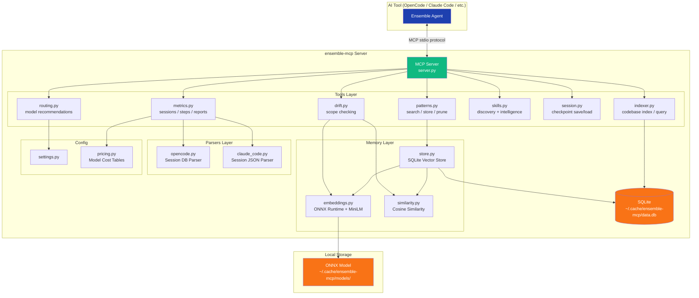
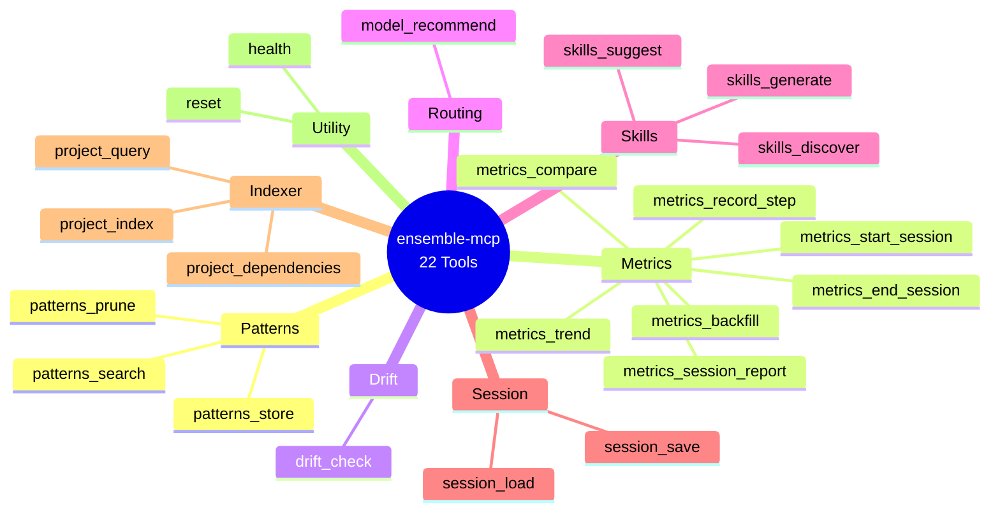
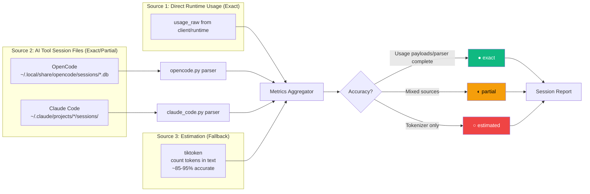
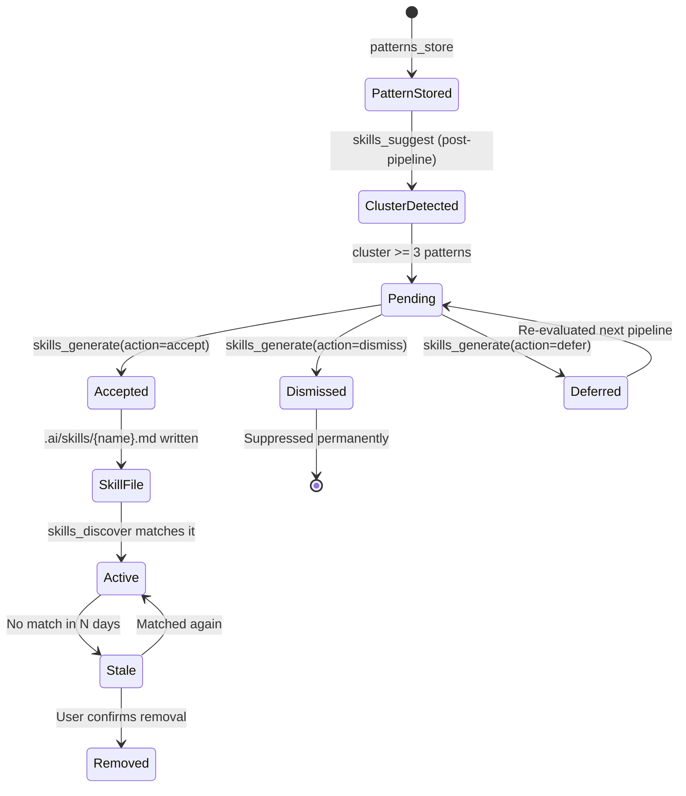
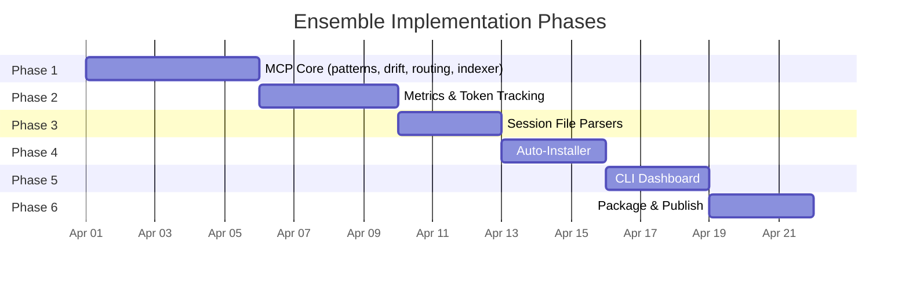
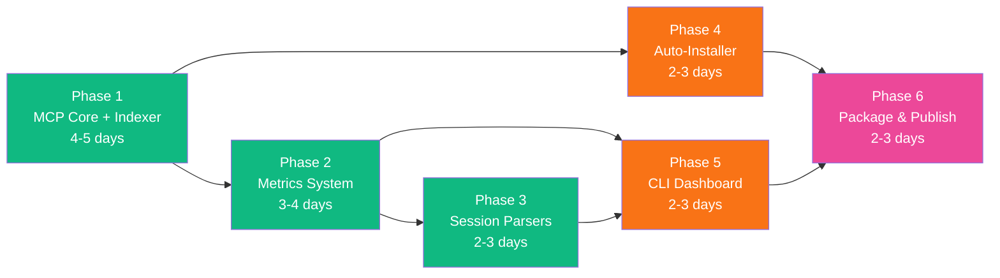
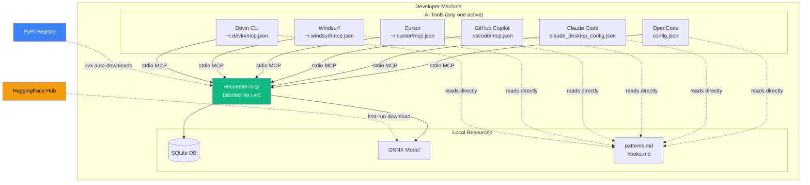
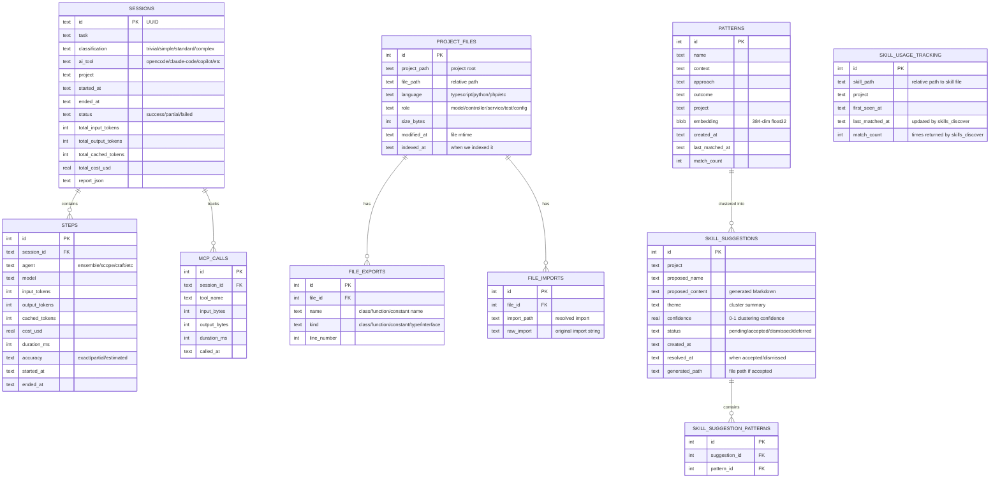

# Ensemble Design Specification - MCP Server Design

> Extracted from `DESIGN-SPEC.md` for MCP server design and downstream implementation planning.

---

## 1. MCP Server Design

### 1.1 Overview

`ensemble-mcp` is a Python MCP (Model Context Protocol) server that provides:
- **Vector memory** for semantic pattern search
- **Token tracking** with per-agent cost breakdown
- **Drift detection** via embedding similarity
- **Model routing** recommendations
- **Skills discovery** for project-specific knowledge
- **Session management** for pipeline state
- **Codebase indexing** for faster Scope exploration on repeat visits

Informed by production orchestration patterns (typed tool boundaries, explicit task lifecycle, policy-aware execution, and resilient settings handling), Phase 1 is designed as a **contract-first service** rather than just a set of utility tools.

### 1.1.1 Contract-First Tool API Envelope

All MCP tools return a normalized envelope to keep behavior consistent across AI clients:

```json
{
  "ok": true,
  "data": {},
  "error": null,
  "meta": {
    "duration_ms": 12,
    "source": "local",
    "confidence": "exact"
  }
}
```

Error responses use the same shape:

```json
{
  "ok": false,
  "data": null,
  "error": {
    "code": "SESSION_NOT_FOUND",
    "message": "No session with id sess_123",
    "retryable": false,
    "details": { "session_id": "sess_123" }
  },
  "meta": {
    "duration_ms": 3,
    "source": "local",
    "confidence": "exact"
  }
}
```

### 1.1.2 Session Lifecycle and Idempotency

Session and step tracking follow an explicit lifecycle:

`pending -> running -> completed | failed | killed`

Each mutating tool call supports `idempotency_key` (optional but recommended). If the same key is replayed within a session, the server returns the previously committed result instead of applying changes twice.

### 1.1.3 Error Taxonomy and Retry Policy

Standard error classes:

- `VALIDATION_*` — bad input (never retry)
- `NOT_FOUND_*` — missing resource (never retry)
- `CONFLICT_*` — stale version or optimistic lock failure (retry after refresh)
- `TIMEOUT_*` — local operation timeout (retry with backoff)
- `IO_*` — filesystem/db transient errors (retry with backoff)
- `INTERNAL_*` — unexpected server error (retryable only if marked)

Default retry guidance for clients:

- max 3 attempts
- exponential backoff: 250ms, 1s, 2s
- retry only when `error.retryable == true`

### MCP Server Component Architecture



### 1.2 Technology Stack

| Component | Choice | Rationale |
|-----------|--------|-----------|
| Language | Python 3.11+ | User familiarity, best ML ecosystem |
| Distribution | `uvx` (via `uv` by Astral) | Auto-installs Python, cross-platform, zero-hassle |
| MCP Framework | `mcp` (official Python SDK) | Standard MCP protocol implementation |
| Embeddings | ONNX Runtime + MiniLM-L6-v2 | ~22MB model, no PyTorch (saves ~2.4GB) |
| Vector Storage | SQLite + numpy cosine similarity | Zero external dependencies, portable |
| Token & Cost Tracking | Direct usage ingestion + session parsers + `tiktoken` | Exact when usage is available; robust fallback when it is not |
| Package Size | ~90MB (including ONNX + model) | Acceptable; PyTorch would be ~2.5GB |

**Why not PyTorch/sentence-transformers?**
- sentence-transformers pulls in PyTorch (~2.5GB)
- ONNX Runtime is ~60MB and runs the same MiniLM model
- For semantic search over <10K patterns, performance is identical

**Why not ChromaDB/FAISS?**
- ChromaDB adds ~100MB and its own SQLite dependency
- FAISS requires C++ compilation, fragile cross-platform
- Raw numpy cosine similarity over <10K vectors is <1ms
- SQLite gives us ACID transactions for free

### 1.3 Project Structure

```
ensemble-mcp/
  pyproject.toml
  README.md
  Dockerfile
  src/
    ensemble_mcp/
      __init__.py
      __main__.py           # Entry point: python -m ensemble_mcp
      server.py             # MCP server setup and tool registration
      config/
        __init__.py
        settings.py          # Configuration management
        defaults.py          # Default limits, thresholds, feature toggles
        pricing.py           # Model pricing tables
      contracts/
        __init__.py
        envelope.py          # Standard tool response/error envelope
        errors.py            # Error taxonomy + helpers
      state/
        __init__.py
        lifecycle.py         # Session/step state machine + transitions
        idempotency.py       # idempotency_key dedup store
        locks.py             # SQLite/file lock helpers
      tools/
        __init__.py
        patterns.py          # patterns_search, patterns_store, patterns_prune
        metrics.py           # metrics_start_session, metrics_record_step, metrics_backfill, etc.
        drift.py             # drift_check
        routing.py           # model_recommend
        skills.py            # skills_discover, skills_suggest, skills_generate
        session.py           # session_save, session_load
        indexer.py           # project_index, project_query
      memory/
        __init__.py
        store.py             # SQLite-backed vector store
        embeddings.py        # ONNX Runtime embedding generation
        similarity.py        # Cosine similarity search
      parsers/
        __init__.py
        opencode.py          # Parse OpenCode session files
        claude_code.py       # Parse Claude Code session files
      security/
        __init__.py
        redaction.py         # Secret/PII redaction before persistence
        trust.py             # Trust boundary + source policy checks
      installer/
        __init__.py
        setup.py             # Auto-detect AI tools, copy agents, register MCP
  tests/
    test_patterns.py
    test_metrics.py
    test_drift.py
    test_embeddings.py
    test_parsers.py
    test_indexer.py
```

### 1.4 MCP Tools (22 total)

### Tool Response Contract (applies to all tools)

All tools return the standardized envelope from Section 1.1.1.

- Success: `ok=true`, populated `data`, `error=null`
- Failure: `ok=false`, `data=null`, structured `error`
- `meta.confidence`: `exact | partial | estimated`
- `meta.source`: local component that produced the result (`sqlite`, `parser`, `estimator`, `hybrid`)

#### Tool Taxonomy



#### Patterns (3 tools)

| Tool | Input | Output | Description |
|------|-------|--------|-------------|
| `patterns_search` | `query: str, top_k: int = 3, project: str?, idempotency_key?: str` | `envelope<{matches: [{name, context, approach, outcome, score}]}>` | Semantic search over stored patterns |
| `patterns_store` | `name, context, approach, outcome, project: str?, idempotency_key?: str` | `envelope<{id, stored: true}>` | Store a new pattern with embedding |
| `patterns_prune` | `max_age_days: int = 90, min_score: float = 0.3, idempotency_key?: str` | `envelope<{pruned: int, remaining: int}>` | Remove old/low-relevance patterns |

#### Metrics (7 tools)

| Tool | Input | Output | Description |
|------|-------|--------|-------------|
| `metrics_start_session` | `task, classification, ai_tool, idempotency_key?: str` | `envelope<{session_id, state}>` | Start tracking a pipeline session |
| `metrics_record_step` | `session_id, agent, input_tokens?, output_tokens?, cache_read_tokens?, cache_write_tokens?, web_search_requests?, cached_tokens?, usage_raw?, provider?, model?, source?, confidence?, pricing_version?, duration_ms?, idempotency_key?: str` | `envelope<{recorded: true, step_id, confidence, source}>` | Record per-agent token and cost usage using best available source |
| `metrics_end_session` | `session_id, status, idempotency_key?: str` | `envelope<{session_id, total_cost, state}>` | Finalize session, compute totals |
| `metrics_session_report` | `session_id` | `envelope<{report: str, confidence}>` | Generate formatted session report |
| `metrics_trend` | `days: int = 30` | `envelope<{daily_costs, avg_tokens, trend, confidence}>` | Cost/token trends over time |
| `metrics_compare` | `session_id_a, session_id_b` | `envelope<{diff, confidence}>` | Compare two sessions |
| `metrics_backfill` | `session_id?, force?: bool, ai_tool?: str, idempotency_key?: str` | `envelope<{backfilled: int, skipped: int, errors: int, details: []}>` | Backfill session steps with real token data from AI tool session files |

`metrics_record_step` precedence rules:
1. Use `usage_raw` (provider/runtime usage payload) when present.
2. Otherwise use parsed session-file usage.
3. Otherwise estimate from text with `tiktoken`.

This makes direct response usage optional per client integration while keeping cross-tool support reliable.

When `usage_raw` is unavailable, integrations should still send whatever is known (`model`, `duration_ms`, partial token fields). The server fills missing values via parser/estimator and returns the resulting `confidence`.

#### Drift (1 tool)

| Tool | Input | Output | Description |
|------|-------|--------|-------------|
| `drift_check` | `task_description, changed_files, diff_summary, idempotency_key?: str` | `envelope<{score: 0-1, flags: [], verdict}>` | Cosine similarity between task and changes |

#### Routing (1 tool)

| Tool | Input | Output | Description |
|------|-------|--------|-------------|
| `model_recommend` | `agent, task_classification, task_description?, idempotency_key?: str` | `envelope<{tier: "best"/"mid"/"cheapest", reason}>` | Recommend model tier for an agent |

#### Skills (3 tools)

| Tool | Input | Output | Description |
|------|-------|--------|-------------|
| `skills_discover` | `project_path, query?, idempotency_key?: str` | `envelope<{detected: [{name, source_tool, path, confidence}], snippets?: [{content, relevance}]}>` | Scan tool-native skill locations (`.ai/skills/`, `.claude/skills/`, `.cursor/rules/`, etc.), embed content into vector store, and return relevant skills. Optional `query` enables semantic search across all discovered skills. Also updates `skill_usage_tracking` for stale detection. |
| `skills_suggest` | `project_path, min_cluster_size: int = 3, stale_threshold_days: int = 60, idempotency_key?: str` | `envelope<{suggestions: [{id, pattern_ids, theme, confidence, proposed_name, proposed_content}], stale_skills: [{path, last_matched_at, days_unused}]}>` | Cluster similar patterns by embedding cosine similarity (threshold >= 0.75). Groups with `min_cluster_size` or more patterns are proposed as reusable skills. Also scans `skill_usage_tracking` to flag skills not matched within `stale_threshold_days`. Previously dismissed suggestions are excluded. Designed for post-pipeline hook invocation. |
| `skills_generate` | `suggestion_id: int, action: "accept" \| "dismiss" \| "defer", output_dir: str = ".ai/skills/", idempotency_key?: str` | `envelope<{generated: bool, path?: str, content?: str, status: str}>` | Accept, dismiss, or defer a skill suggestion. On accept: generates a Markdown skill file in `output_dir` from the clustered patterns and marks the suggestion as accepted. On dismiss: marks the suggestion so it won't be re-suggested. On defer: leaves the suggestion pending for future review. |

**How Skill Intelligence works:**

1. **Post-pipeline:** After every successful pipeline, the post-pipeline hook calls `skills_suggest` with the project path
2. **Clustering:** The tool loads all patterns for the project, computes pairwise cosine similarity, and applies agglomerative clustering (threshold >= 0.75)
3. **Threshold:** Clusters with >= 3 patterns (configurable via `min_cluster_size`) are proposed as skills
4. **Deduplication:** Suggestions already in `skill_suggestions` table (accepted or dismissed) are excluded
5. **Stale detection:** Skills tracked in `skill_usage_tracking` that haven't been matched via `skills_discover` within `stale_threshold_days` are flagged for removal
6. **User approval:** Suggestions are presented to the user who can accept (generates file), dismiss (suppresses), or defer (revisit later)
7. **Zero-LLM generation:** Skill file content is synthesized locally by combining pattern fields — no LLM API calls are made

#### Session (2 tools)

| Tool | Input | Output | Description |
|------|-------|--------|-------------|
| `session_save` | `session_id, state: dict, version?: int, idempotency_key?: str` | `envelope<{saved: true, version}>` | Save pipeline checkpoint state (optimistic versioning) |
| `session_load` | `session_id?` | `envelope<{state: dict, version}>` or `envelope<{found: false}>` | Load latest or specific checkpoint |

#### Indexer (3 tools)

| Tool | Input | Output | Description |
|------|-------|--------|-------------|
| `project_index` | `project_path, force: bool = false, idempotency_key?: str` | `envelope<{indexed: true, files: int, cached: bool, duration_ms}>` | Build or refresh the codebase index. Scans file tree, extracts exports/classes/functions per file. Uses mtime to skip unchanged files. |
| `project_query` | `project_path, query: str?, file_types: [str]?, path_pattern: str?` | `envelope<{files: [{path, type, exports, size, modified}]}>` | Query the index — find files by type, path pattern, or semantic query. Returns compact file map for Scope consumption. |
| `project_dependencies` | `project_path, file_path` | `envelope<{imports: [str], imported_by: [str], related: [str]}>` | Get import/dependency graph for a specific file. Shows what a file imports and what imports it. |

**How indexing works:**

1. **First run:** `project_index` scans the full project tree, builds the index in SQLite
2. **Subsequent runs:** Checks file mtimes — only re-indexes changed files (incremental)
3. **Scope calls `project_query`** instead of manually globbing/grepping — returns a compact file map
4. **Token savings:** Scope skips manual exploration on repeat visits, saving ~40-60% exploration tokens

**What gets indexed per file:**
- File path, size, last modified time
- Language/type detection (from extension + content heuristics)
- Exported symbols: classes, functions, constants, types (language-aware parsing)
- Import statements (for dependency graph)
- File role heuristic: model, controller, service, test, config, migration, etc.

**What does NOT get indexed:**
- File contents (too large for SQLite, and the AI tool can read files directly)
- Node modules, vendor directories, build outputs (respects `.gitignore`)
- Binary files

#### Utility (2 tools)

| Tool | Input | Output | Description |
|------|-------|--------|-------------|
| `health` | (none) | `envelope<{status, version, db_size, pattern_count}>` | Server health check |
| `reset` | `confirm: bool, idempotency_key?: str` | `envelope<{reset: true}>` | Reset all data (destructive) |

### 1.5 Zero-LLM-Call Principle

**The MCP server makes ZERO LLM/API calls.** All intelligence is local:

- **Embeddings:** ONNX Runtime runs MiniLM-L6-v2 locally (CPU inference, ~5ms per embedding)
- **Similarity:** numpy cosine similarity (pure math, no API)
- **Token counting:** tiktoken (local BPE tokenizer, no API)
- **Storage:** SQLite (local file database)
- **Drift detection:** Cosine similarity between embeddings (local math)

This means:
- No API keys required for the MCP server itself
- No additional cost beyond the AI tool's own token usage
- Works offline (after initial model download)
- No privacy concerns — all data stays local

---

## 2. Architecture Decisions

### 2.1 Python with `uvx` Distribution

**Decision:** Python 3.11+ distributed via `uvx` (from `uv` by Astral).

**Alternatives considered:**

| Option | Pros | Cons | Verdict |
|--------|------|------|---------|
| **Python + uvx** | User familiar, best ML ecosystem, uvx auto-installs Python | Larger than Go/Deno | **Chosen** |
| TypeScript/Node | Good MCP SDK support | Weak ML ecosystem, ONNX bindings fragile | Rejected |
| Deno | Modern, good DX, built-in TypeScript | User unfamiliar, ML ecosystem weak | Rejected |
| Go | Fast, small binary, easy cross-compile | No good embedding libraries, user unfamiliar | Rejected |

**Why `uvx`?**
- `uv` is by Astral (makers of Ruff) — fast, reliable, actively maintained
- `uvx` auto-downloads Python if not installed on the system
- Works on Mac, Linux, and Windows
- Single command: `uvx ensemble-mcp` — no manual Python/pip/venv setup
- Developers don't need Python knowledge to use it

### 2.2 Embedding Model Choice

**Decision:** ONNX Runtime + MiniLM-L6-v2

| Model | Size | Dimensions | Speed | Quality |
|-------|------|-----------|-------|---------|
| **MiniLM-L6-v2** | 22MB | 384 | ~5ms/embed | Good enough for pattern matching |
| all-MiniLM-L12-v2 | 44MB | 384 | ~10ms/embed | Slightly better, 2x slower |
| all-mpnet-base-v2 | 109MB | 768 | ~20ms/embed | Best quality, overkill for <10K patterns |

MiniLM-L6-v2 is the sweet spot: small, fast, and quality is sufficient for matching code patterns.

**Model download:** On first run, the server downloads the ONNX model (~22MB) to `~/.cache/ensemble-mcp/models/`. Subsequent runs use the cached model.

#### 2.2.1 Known Limitations: 128-Token Context Window

MiniLM-L6-v2 has a **hard maximum of 128 input tokens** (~80-100 words). Text beyond 128 tokens is silently truncated — the model ignores everything past that boundary.

**Impact on ensemble-mcp operations:**

| Use Case | Typical Input Length | Fits in 128 tokens? | Risk Level |
|----------|---------------------|---------------------|------------|
| `patterns_search` query | ~10-30 words | Yes | None |
| `patterns_store` (name + context + approach) | ~50-80 words | Usually yes | Low |
| `drift_check` task description | ~20-50 words | Yes | None |
| `drift_check` diff summary | ~50-300 words | **Often truncated** | Medium |
| `skills_discover` skill file content | ~100-500 words | **Truncated** | Medium |

**Where truncation matters:**
- **Large diff summaries** in `drift_check` — if the drift-indicative content appears after the first ~100 words, it is invisible to the model
- **Long skill files** in `skills_discover` — only the first ~100 words of a skill file are embedded; relevant content deeper in the file is missed
- **Detailed patterns** in `patterns_store` — patterns with long context descriptions lose tail detail

**Current mitigations:**
- `store.py` embeds the most important fields first: `f"{name} {context} {approach}"`, front-loading high-signal text
- Agent prompts encourage concise task descriptions and diff summaries
- Pattern storage favors short, descriptive names and contexts

**Chunking strategy (recommended for v2):**
For inputs that routinely exceed 128 tokens (diff summaries, skill files), split text into overlapping 128-token chunks, embed each chunk separately, and store multiple vectors per entry. Search then matches against any chunk, returning the parent entry. This requires changes to `store.py` and `similarity.py` but no model change.

**Drop-in model upgrades if 128 tokens proves insufficient:**

| Model | Max Tokens | Dimensions | Size | Notes |
|-------|-----------|------------|------|-------|
| **MiniLM-L6-v2 (current)** | **128** | 384 | 22MB | Current choice |
| BGE-small-en-v1.5 | 512 | 384 | 33MB | 4x context, same dimensions, drop-in replacement |
| GTE-small | 512 | 384 | 33MB | 4x context, same dimensions, drop-in replacement |
| all-mpnet-base-v2 | 384 | 768 | 109MB | 3x context, higher quality, requires dimension changes |

BGE-small or GTE-small are the most likely upgrade path — same 384 dimensions means no schema migration for stored embeddings is needed if we re-embed on upgrade. The swap is a model file change + re-embed stored patterns, not an architecture change.

### 2.3 Vector Storage: SQLite + numpy

**Decision:** Store embeddings as BLOBs in SQLite, compute cosine similarity with numpy.

**Why not a vector database?**

| Option | Size | Complexity | Performance at <10K vectors |
|--------|------|-----------|---------------------------|
| **SQLite + numpy** | 0MB extra | Zero | <1ms search |
| ChromaDB | ~100MB | Medium (own SQLite, migrations) | <1ms search |
| FAISS | ~50MB | High (C++ compilation) | <0.1ms search |
| Pinecone/Weaviate | Cloud | High (API, account, cost) | Variable |

For pattern memory with <10K entries, brute-force cosine similarity is perfectly adequate. Adding a vector DB would be premature optimization.

### 2.4 Token Tracking: Hybrid Approach

**Decision:** Source-precedence hybrid with accuracy indicators.

Primary design goal: handle multi-tool environments where some clients expose exact usage in real time and others do not.

#### 2.4.1 Source Precedence

For each step/session metric, use the highest-confidence source available:

1. **Direct response usage (Exact)** — usage counters delivered from runtime/provider response payloads.
2. **AI tool session parsers (Exact/Partial)** — reconstructed usage from local session files/DB.
3. **Tokenizer estimation (Estimated)** — `tiktoken` fallback on text when exact usage is unavailable.

`source` values returned in metrics metadata:
- `live_response_usage`
- `session_parser`
- `estimator`
- `hybrid`

`confidence` values:
- `exact` — provider counters or complete parser reconstruction
- `partial` — mixed exact + estimated values
- `estimated` — tokenizer-only approximation

#### 2.4.2 Direct Response Usage Availability

Not all AI tools expose usage payloads to MCP integrations the same way. The design therefore treats direct usage as an **optional high-quality input**, not a mandatory dependency.

- If available: ingest directly via `metrics_record_step.usage_raw`
- If unavailable: parser and/or estimator paths continue to work without breaking the pipeline

#### Token Data Flow



| Source | Method | Accuracy | When Available |
|--------|--------|----------|----------------|
| **Direct runtime usage** | Ingest provider/runtime usage payload (`usage_raw`) from client integration | Exact | Tool-dependent |
| **AI tool session files** | Parse SQLite/JSON from `~/.local/share/opencode/sessions/` or `~/.claude/projects/` | Exact or Partial | OpenCode, Claude Code |
| **tiktoken estimation** | Count tokens in text flowing through context | Estimated (~85-95% accurate) | Always (fallback) |

**Accuracy indicators in reports:**
- `●` exact — from direct runtime usage and/or complete parser data
- `◐` partial — mix of exact and estimated
- `○` estimated — tiktoken estimation only

#### 2.4.3 Cost Calculation Model

Cost is computed from usage components, not only input/output tokens:

- input tokens
- output tokens
- cache read tokens
- cache write tokens
- web search requests (if provider/tool exposes this)

If model pricing is unknown:
- use configured fallback pricing tier
- mark `unknown_model_cost=true`
- degrade confidence to at most `partial`

All computed rows retain:
- `pricing_version`
- `model_canonical_name`
- `source`
- `confidence`

### 2.5 Parallel Execution: Conservative

**Decision:** Only Proof + Lens run in parallel. Craft parallelism deferred to v2.

**Rationale:**
- Proof (format + build + test) and Lens (read-only review) are independent
- Lens reviews pre-format code (logical changes), Proof formats and tests
- Multi-file Craft parallelism has merge conflict risks and dependency ordering complexity
- Conservative approach reduces risk for v1

### 2.6 Drift Detection: Soft Warnings

**Decision:** Drift detection produces warnings, not hard blocks.

**Rationale:**
- Craft agents sometimes legitimately touch files not in the plan (discovered dependencies)
- Hard blocks would require user intervention on every pipeline, reducing automation
- Soft warnings appear in the final report, user can choose to investigate
- MCP version returns a 0-1 score; Ensemble can configure a threshold for escalation

### 2.7 Codebase Indexing: Incremental with mtime

**Decision:** Lightweight file-level index stored in SQLite, refreshed incrementally using file modification times.

**Rationale:**
- The Scope agent spends the most tokens on codebase exploration — it's the biggest overhead step
- On repeat visits to the same project, re-exploring unchanged files is pure waste
- A file-structure index (paths, exports, classes, function signatures, file roles) gives Scope a "project map" without manual glob/grep
- Incremental updates via mtime checks mean only changed files are re-scanned

**What gets indexed (per file):**

| Field | Example | Purpose |
|-------|---------|---------|
| `path` | `src/services/AuthService.ts` | File identification |
| `language` | `typescript` | Language-aware parsing |
| `size_bytes` | `2,340` | Quick relevance filtering |
| `modified_at` | `2026-03-30T10:00:00Z` | Incremental refresh |
| `role` | `service` | Heuristic: model, controller, service, test, config, migration |
| `exports` | `["AuthService", "validateToken"]` | Classes, functions, constants exported |
| `imports` | `["./UserModel", "jsonwebtoken"]` | Dependency tracking |

**Alternatives considered:**

| Option | Pros | Cons | Verdict |
|--------|------|------|---------|
| **SQLite index (mtime-based)** | Fast, incremental, portable | ~100ms initial scan for 1K files | **Chosen** |
| Full AST parsing (tree-sitter) | Precise symbol extraction | Heavy dependency (~50MB), complex | Deferred to v2 |
| Embedding-based code search | Semantic search over code | High token cost for embedding, overkill for file-level | Rejected |
| Just cache glob results | Simpler | Stale quickly, no structure info | Rejected |

**Performance expectations:**
- Initial index build (1,000 files): ~200-500ms
- Incremental refresh (10 changed files): ~20-50ms
- Query response: <5ms
- Index size: ~100KB per 1,000 files

**Language support for export extraction (v1):**

| Language | Exports Detected |
|----------|-----------------|
| TypeScript/JavaScript | `export class/function/const`, `module.exports` |
| Python | Top-level `class`, `def`, `__all__` |
| PHP | `class`, `interface`, `trait`, `function` |
| Go | Capitalized functions/types (exported by convention) |
| Rust | `pub fn`, `pub struct`, `pub enum`, `pub trait` |
| Ruby | `class`, `module`, `def` (top-level) |
| Other | File path + size only (no export parsing) |

### 2.8 User Configuration: Layered Defaults

**Decision:** Three-layer config with project → global → frontmatter fallback.

**Rationale:**
- Users should never need to edit agent files to customize models or behavior
- Project-level config (`.opencode/team-config.json`) allows per-project tuning (e.g., cheaper models for prototyping, expensive models for production code)
- Global config (`~/.config/opencode/team-config.json`) sets user-wide defaults
- Agent frontmatter provides sensible defaults for zero-config operation
- Layered merge means users only need to specify what they want to override

**Key principles:**
- Config is **optional** — everything works without it (current behavior preserved)
- Config is **additive** — partial configs are valid (specify only what you want to change)
- Config is **not an agent file** — it's a data file Ensemble reads, not a prompt

### 2.9 Contract and State Model (New)

**Decision:** Define a strict contract layer (`ok/data/error/meta`) and explicit session state transitions before implementing tool logic.

**Rationale:**
- Prevents drift in tool behavior as the server grows
- Makes integration predictable across OpenCode, Claude Code, Copilot, Cursor, Windsurf, and Devin
- Simplifies client retries and observability

**State transitions:**
- Session: `pending -> running -> completed | failed | killed`
- Step: `pending -> running -> completed | failed | skipped`
- Invalid transitions are rejected with `CONFLICT_INVALID_STATE_TRANSITION`

### 2.10 Config Precedence and Cache Model (New)

**Decision:** Layered config with deterministic merge order and explicit cache invalidation.

**Precedence (low to high):**
1. package defaults (`config/defaults.py`)
2. global user config (`~/.config/ensemble-mcp/config.toml`)
3. project config (`.ensemble-mcp.toml`)
4. runtime overrides (CLI/env)

**Rules:**
- Scalar values override
- Maps merge shallowly by key
- Lists are replace-by-default (no implicit concatenation)
- Every resolved config includes `source_map` for debug (`value -> source`)

### 2.11 Trust Boundary and Source Policy (New)

**Decision:** Treat all inbound data as untrusted unless explicitly from local server state.

**Source classes:**
- `local_state` — SQLite/session state generated by ensemble-mcp
- `client_input` — MCP tool arguments from AI clients
- `filesystem_scan` — project files, skill files, and parser inputs

**Policy:**
- Persisted text is redacted before storage (common secret patterns)
- Parser failures never crash tool calls; return partial data with `confidence=partial`
- Destructive operations (`reset`) require explicit confirmation and are always audited

### 2.12 Schema Migration and Concurrency (New)

**Decision:** Use versioned SQLite migrations with WAL mode and optimistic concurrency for checkpoint-like records.

**Rationale:**
- Handles multi-process access safely
- Supports additive evolution without data loss
- Prevents silent overwrite in concurrent sessions

**Rules:**
- `PRAGMA journal_mode=WAL`
- `schema_version` table required
- Migrations are forward-only and idempotent
- `session_save` supports `version`; mismatches return `CONFLICT_VERSION_MISMATCH`

### 2.13 Skill Intelligence: Pattern-to-Skill Graduation

**Decision:** Automatically detect recurring work patterns and suggest converting them into reusable skill files. Also detect stale/unused skills and suggest removal.

**Context:**
- The patterns system (Section 1.4, Patterns tools) stores learned approaches retrospectively — what happened
- The skills system (Section 1.4, Skills tools) provides proactive guidance — how to do things
- There is no bridge between them: users must manually notice recurring patterns and manually create skill files
- This creates a gap where valuable institutional knowledge stays trapped in the pattern store instead of being promoted to reusable, cross-tool skills

**Rationale:**
- Patterns already carry `match_count` and `last_matched_at` — high-match patterns are strong skill candidates
- Embeddings (384-dim MiniLM-L6-v2) are already stored per pattern — pairwise cosine similarity is a free clustering signal
- The post-pipeline hook system already exists — it's the natural trigger point
- `.ai/skills/` is the cross-tool convention for skill files (works with OpenCode, Claude Code, Cursor, etc.)
- Generating a Markdown skill file from pattern fields requires only string formatting — no LLM call needed

**Approach:**
- **Forward detection:** After each successful pipeline, cluster project patterns by embedding similarity (threshold >= 0.75). Clusters with >= 3 members (configurable) become skill suggestions
- **Reverse detection:** Track when `skills_discover` last matched each skill file. Skills not matched within a configurable threshold (default: 60 days) are flagged as stale
- **User approval flow:** Suggestions are presented to the user with accept/dismiss/defer actions. No skill file is created without explicit user approval
- **Persistence:** Suggestions are stored in SQLite (`skill_suggestions` table) to avoid re-suggesting dismissed ideas

**Constraints:**
- Zero-LLM-Call Principle applies — skill content is synthesized from pattern fields (name, context, approach, outcome) using local string formatting, not LLM generation
- Skill files are written to `.ai/skills/` by default, which is accessible to all supported AI tools
- The clustering algorithm uses brute-force pairwise similarity (O(n^2)), which is acceptable for the expected pattern count (<1,000 per project)



---

## 3. Token & Cost Analysis

### 3.1 Model Pricing Table

| Model | Input ($/1M) | Cached Input ($/1M) | Output ($/1M) |
|-------|-------------|-------------------|---------------|
| claude-opus-4 | $15.00 | $1.50 | $75.00 |
| claude-sonnet-4 | $3.00 | $0.30 | $15.00 |
| claude-haiku-3.5 | $0.80 | $0.08 | $4.00 |
| gpt-4o | $2.50 | $1.25 | $10.00 |
| gpt-4o-mini | $0.15 | $0.075 | $0.60 |
| gpt-5-mini | $0.20 | $0.10 | $0.80 |
| o1 | $15.00 | $7.50 | $60.00 |

*Prices as of early 2026. The MCP server stores these in `config/pricing.py` and can be updated.*

Implementation notes for pricing parity:
- Track cache **read** and cache **write** token costs separately when provider data exposes both.
- Include per-request server tool costs (for example, web search requests) when exposed.
- Use `pricing_version` on every computed row so historical reports remain reproducible after pricing table updates.
- If model pricing is missing, compute with fallback tier and set `unknown_model_cost=true`.

### 3.2 Typical Pipeline Token Usage (Current System)

Estimated tokens per standard pipeline (feature implementation):

| Agent | Input Tokens | Output Tokens | Model | Est. Cost |
|-------|-------------|--------------|-------|-----------|
| Ensemble (orchestration) | ~8,000 | ~3,000 | Opus | $0.345 |
| Scope | ~12,000 | ~2,500 | Opus | $0.368 |
| Craft | ~10,000 | ~4,000 | Opus | $0.450 |
| Proof | ~6,000 | ~1,500 | Sonnet | $0.041 |
| Lens | ~8,000 | ~1,000 | Sonnet | $0.039 |
| Signal | ~2,000 | ~500 | GPT-5-mini | $0.001 |
| **Total** | **~46,000** | **~12,500** | | **~$1.24** |

### 3.3 Markdown Patterns vs MCP Patterns Cost

**Markdown patterns (baseline):**
- Reading full `patterns.md` (30 entries): ~3,500 tokens input
- At Opus pricing: 3,500 × $15/1M = $0.053 per pipeline
- Per month (10 runs/day): $0.053 × 300 = **$15.75/month** on pattern reading alone

**MCP patterns:**
- `patterns_search` returns top-3 matches: ~500 tokens input
- MCP tool definition overhead: ~1,200 tokens (fixed, amortized across session)
- At Opus pricing: 500 × $15/1M = $0.0075 per pipeline
- Per month: $0.0075 × 300 = **$2.25/month** on pattern reading
- Plus tool definitions: 1,200 × $15/1M × 300 = $5.40/month (amortized)
- **Total: ~$7.65/month**

**MCP savings: ~$8.10/month per developer** ($15.75 - $7.65)

### 3.4 Break-Even Analysis

MCP tool definitions add ~1,200 tokens fixed overhead per session. This is the "cost" of having MCP tools available.

- **1,200 tokens × $15/1M = $0.018** per session for tool definitions
- **Pattern search saves**: 3,000 tokens × $15/1M = $0.045 per pipeline
- **Net savings per pipeline**: $0.045 - $0.018 = **$0.027**
- **MCP breaks even on the first pipeline run**

### 3.5 Monthly Projections

At 10 pipeline runs/day, 30 days/month:

| Metric | Without MCP | With MCP | Savings |
|--------|------------|---------|---------|
| Pattern reading tokens | 1,050,000 | 150,000 | 900,000 |
| Tool definition tokens | 0 | 360,000 | -360,000 |
| **Net token difference** | | | **540,000 fewer** |
| Monthly cost (patterns only) | $15.75 | $7.65 | **$8.10/dev** |

With all MCP features (metrics, drift, routing, indexing), estimated monthly savings: **$12-18/developer** (indexing adds ~$4-6/dev savings from reduced Scope exploration).

Projection caveat: these are directional estimates. Actual cost depends on model mix, cache hit behavior, tool call profile, and whether direct usage payloads are available from the active client integration.

---

## 4. Implementation Plan

### Delivery Timeline



### 4.0 Phase 1 Contract Foundation (Recommended Pre-Phase)

Before implementing tool internals, establish the server contract and state model:

1. Define response envelope and error taxonomy (`contracts/envelope.py`, `contracts/errors.py`)
2. Implement session/step lifecycle transitions with guards (`state/lifecycle.py`)
3. Add idempotency key support for mutating tools (`state/idempotency.py`)
4. Add migration scaffold + schema versioning (`migrations/` + bootstrap checks)
5. Add retry guidance and confidence propagation to all tool outputs

Estimated: 1-2 days. This reduces rework across every later phase.

### Phase Dependencies



### 4.1 Delivery Phases

| Phase | Duration | Deliverables |
|-------|----------|-------------|
| **Phase 1.0: Contract Foundation** | 1-2 days | Response envelope, error taxonomy, lifecycle state machine, idempotency, migration scaffold |
| **Phase 1: MCP Core** | 4-5 days | Python project scaffold, patterns tools, drift tool, routing tool, codebase indexer (all using standardized envelope) |
| **Phase 2: Metrics System** | 3-4 days | Token tracking, session reports, cost calculation |
| **Phase 3: Session Parsers** | 2-3 days | OpenCode session file parser, Claude Code parser |
| **Phase 4: Auto-Installer** | 2-3 days | AI tool detection, agent copying, MCP registration |
| **Phase 5: CLI Dashboard** | 2-3 days | Terminal-based metrics dashboard |
| **Phase 6: Package & Publish** | 2-3 days | PyPI publishing, Docker image, documentation |

**Total estimated timeline: 18-23 days**

### 4.2 Phase 1 Detailed Steps

1. Create `ensemble-mcp/` project structure
2. Set up `pyproject.toml` with dependencies:
   ```toml
   [project]
   name = "ensemble-mcp"
   version = "0.1.0"
   requires-python = ">=3.11"
   dependencies = [
       "mcp>=1.0",
       "onnxruntime>=1.17",
       "numpy>=1.26",
       "tiktoken>=0.6",
   ]

   [project.scripts]
   ensemble-mcp = "ensemble_mcp.__main__:main"
   ```
3. Implement `memory/embeddings.py` — ONNX model loading and inference
4. Implement `memory/store.py` — SQLite-backed vector store
5. Implement `memory/similarity.py` — cosine similarity search
6. Implement `tools/patterns.py` — search, store, prune
7. Implement `tools/drift.py` — embedding-based drift detection
8. Implement `tools/routing.py` — model tier recommendations
9. Implement `tools/skills.py` — skill discovery, skill suggestion detection (pattern clustering), and skill file generation
10. Implement skill intelligence tables (`skill_suggestions`, `skill_suggestion_patterns`, `skill_usage_tracking`) in SQLite schema
11. Implement `tools/indexer.py` — codebase index build, query, and dependency graph
12. Implement `contracts/envelope.py` + `contracts/errors.py` and wire all tools through it
13. Implement `state/lifecycle.py` + `state/idempotency.py` and apply to mutating tools
14. Implement `server.py` — MCP server with tool registration
15. Write tests for all tools (including indexer), plus contract/lifecycle/idempotency tests

### 4.3 Phase 2 Detailed Steps

1. Implement `config/pricing.py` — model pricing table
2. Implement `tools/metrics.py` — session tracking, step recording
3. Implement session report generation (ASCII table format)
4. Implement `metrics_trend` — daily cost/token aggregation
5. Implement `metrics_compare` — session diff
6. Write tests for metrics tools

### 4.4 Phase 3 Detailed Steps

1. Implement `parsers/opencode.py` — parse `~/.local/share/opencode/sessions/*.db`
2. Implement `parsers/claude_code.py` — parse `~/.claude/projects/*/sessions/`
3. Add parser auto-detection (which AI tool is running)
4. Integrate parsers with metrics for exact token counts
5. Write tests with fixture data

### 4.5 Phase 4 Detailed Steps

1. Implement AI tool detection (check for config files/directories)
2. Implement agent file copying (from package to project)
3. Implement MCP server registration in each tool's config
4. Create `ensemble-mcp install` CLI command
5. Test on all supported platforms

### 4.6 Phase 5 Detailed Steps

1. Design CLI dashboard layout (terminal width detection)
2. Implement real-time session display
3. Implement historical trends view
4. Implement cost breakdown charts (ASCII)
5. Add `ensemble-mcp dashboard` CLI command

### 4.7 Phase 6 Detailed Steps

1. Final testing on Mac, Linux, Windows
2. Create `Dockerfile` for containerized deployment
3. Publish to PyPI (`uv publish` or `twine upload`)
4. Verify `uvx ensemble-mcp` works end-to-end
5. Write user documentation

---

## 5. Cross-Tool Compatibility

### MCP Integration Architecture



### 5.1 Supported AI Tools

| AI Tool | MCP Config Location | Config Format |
|---------|-------------------|---------------|
| OpenCode | `~/.config/opencode/config.json` or project `config.json` | JSON |
| Claude Code | `~/.claude/claude_desktop_config.json` | JSON |
| GitHub Copilot (VS Code) | `.vscode/mcp.json` or VS Code settings | JSON |
| Cursor | `~/.cursor/mcp.json` | JSON |
| Windsurf | `~/.windsurf/mcp.json` | JSON |
| Devin CLI | `~/.devin/mcp.json` | JSON |

### 5.2 MCP Registration Examples

**OpenCode (`~/.config/opencode/config.json` or project `config.json`):**
```json
{
  "$schema": "https://opencode.ai/config.json",
  "mcp": {
    "ensemble": {
      "type": "local",
      "command": ["uvx", "ensemble-mcp"]
    }
  }
}
```

**Claude Code (`~/.claude/claude_desktop_config.json`):**
```json
{
  "mcpServers": {
    "ensemble": {
      "command": "uvx",
      "args": ["ensemble-mcp"]
    }
  }
}
```

**GitHub Copilot (`.vscode/mcp.json`):**
```json
{
  "servers": {
    "ensemble": {
      "command": "uvx",
      "args": ["ensemble-mcp"]
    }
  }
}
```

**Cursor (`~/.cursor/mcp.json`):**
```json
{
  "mcpServers": {
    "ensemble": {
      "command": "uvx",
      "args": ["ensemble-mcp"]
    }
  }
}
```

### 5.3 Model Tier Mapping

The `model_recommend` tool returns abstract tiers. Each AI tool maps these to its own models.

**Default tier mapping (can be overridden in `team-config.json`):**

| Tier | OpenCode | Claude Code | Copilot | Cursor |
|------|----------|-------------|---------|--------|
| `best` | claude-opus-4 | claude-opus-4 | gpt-4o / claude-opus-4 | claude-opus-4 |
| `mid` | claude-sonnet-4 | claude-sonnet-4 | gpt-4o-mini / claude-sonnet-4 | claude-sonnet-4 |
| `cheapest` | gpt-5-mini | claude-haiku-3.5 | gpt-4o-mini | claude-haiku-3.5 |

The mapping is configured per-tool, not hardcoded in the MCP server. Users can override the tier-to-model mapping in their `team-config.json`:

```json
{
  "models": {
    "best": "claude-opus-4",
    "mid": "claude-sonnet-4",
    "cheapest": "gpt-5-mini"
  }
}
```

This allows users to use whatever models their AI tool and provider support, without needing to modify agent files or MCP server code.

---

## 6. Schemas & Data Models

### 6.1 SQLite Database Schema

The MCP server uses a single SQLite database at `~/.cache/ensemble-mcp/data.db`.

#### Entity Relationship Diagram



#### Patterns Table

```sql
CREATE TABLE patterns (
    id INTEGER PRIMARY KEY AUTOINCREMENT,
    name TEXT NOT NULL,
    context TEXT NOT NULL,
    approach TEXT NOT NULL,
    outcome TEXT NOT NULL,
    project TEXT,                    -- optional: scope to a project
    embedding BLOB NOT NULL,         -- 384-dim float32 vector (1,536 bytes)
    created_at TEXT DEFAULT (datetime('now')),
    last_matched_at TEXT,            -- updated on each search hit
    match_count INTEGER DEFAULT 0    -- popularity tracking
);

CREATE INDEX idx_patterns_project ON patterns(project);
CREATE INDEX idx_patterns_created ON patterns(created_at);
```

#### Sessions Table

```sql
CREATE TABLE sessions (
    id TEXT PRIMARY KEY,             -- UUID
    task TEXT NOT NULL,
    classification TEXT NOT NULL,    -- trivial/simple/standard/complex
    ai_tool TEXT,                    -- opencode/claude-code/copilot/cursor/etc
    project TEXT,
    started_at TEXT DEFAULT (datetime('now')),
    ended_at TEXT,
    status TEXT,                     -- success/partial/failed
    total_input_tokens INTEGER DEFAULT 0,
    total_output_tokens INTEGER DEFAULT 0,
    total_cached_tokens INTEGER DEFAULT 0,
    total_cost_usd REAL DEFAULT 0,
    report_json TEXT                 -- full report as JSON
);

CREATE INDEX idx_sessions_project ON sessions(project);
CREATE INDEX idx_sessions_started ON sessions(started_at);
```

`sessions.total_*` fields are cumulative for the session and should support resume semantics (continuing the same `session_id` appends usage instead of resetting totals).

#### Steps Table

```sql
CREATE TABLE steps (
    id INTEGER PRIMARY KEY AUTOINCREMENT,
    session_id TEXT NOT NULL REFERENCES sessions(id),
    agent TEXT NOT NULL,             -- ensemble/scope/craft/proof/lens/signal
    model TEXT,                      -- actual model used
    model_canonical_name TEXT,       -- normalized model identifier used for pricing lookup
    input_tokens INTEGER DEFAULT 0,
    output_tokens INTEGER DEFAULT 0,
    cache_read_tokens INTEGER DEFAULT 0,
    cache_write_tokens INTEGER DEFAULT 0,
    web_search_requests INTEGER DEFAULT 0,
    cached_tokens INTEGER DEFAULT 0,
    cost_usd REAL DEFAULT 0,
    pricing_version TEXT,            -- pricing table version used for this row
    source TEXT DEFAULT 'estimator', -- live_response_usage/session_parser/estimator/hybrid
    duration_ms INTEGER,
    unknown_model_cost INTEGER DEFAULT 0,  -- boolean 0/1
    accuracy TEXT DEFAULT 'estimated',  -- exact/partial/estimated
    started_at TEXT DEFAULT (datetime('now')),
    ended_at TEXT
);

CREATE INDEX idx_steps_session ON steps(session_id);
```

#### MCP Calls Table

```sql
CREATE TABLE mcp_calls (
    id INTEGER PRIMARY KEY AUTOINCREMENT,
    session_id TEXT REFERENCES sessions(id),
    tool_name TEXT NOT NULL,
    input_bytes INTEGER DEFAULT 0,
    output_bytes INTEGER DEFAULT 0,
    duration_ms INTEGER,
    called_at TEXT DEFAULT (datetime('now'))
);

CREATE INDEX idx_mcp_calls_session ON mcp_calls(session_id);
```

#### Project Files Table (Codebase Index)

```sql
CREATE TABLE project_files (
    id INTEGER PRIMARY KEY AUTOINCREMENT,
    project_path TEXT NOT NULL,          -- absolute path to project root
    file_path TEXT NOT NULL,             -- relative path within project
    language TEXT,                        -- detected language
    role TEXT,                           -- heuristic: model/controller/service/test/config/migration/etc
    size_bytes INTEGER DEFAULT 0,
    modified_at TEXT NOT NULL,            -- file mtime (ISO 8601)
    indexed_at TEXT DEFAULT (datetime('now')),
    UNIQUE(project_path, file_path)
);

CREATE INDEX idx_project_files_project ON project_files(project_path);
CREATE INDEX idx_project_files_lang ON project_files(project_path, language);
CREATE INDEX idx_project_files_role ON project_files(project_path, role);
```

#### File Exports Table

```sql
CREATE TABLE file_exports (
    id INTEGER PRIMARY KEY AUTOINCREMENT,
    file_id INTEGER NOT NULL REFERENCES project_files(id) ON DELETE CASCADE,
    name TEXT NOT NULL,                  -- exported symbol name
    kind TEXT NOT NULL,                  -- class/function/constant/type/interface/trait/module
    line_number INTEGER,
    UNIQUE(file_id, name, kind)
);

CREATE INDEX idx_file_exports_file ON file_exports(file_id);
CREATE INDEX idx_file_exports_name ON file_exports(name);
```

#### File Imports Table

```sql
CREATE TABLE file_imports (
    id INTEGER PRIMARY KEY AUTOINCREMENT,
    file_id INTEGER NOT NULL REFERENCES project_files(id) ON DELETE CASCADE,
    import_path TEXT NOT NULL,           -- resolved import path
    raw_import TEXT NOT NULL             -- original import string as written
);

CREATE INDEX idx_file_imports_file ON file_imports(file_id);
CREATE INDEX idx_file_imports_path ON file_imports(import_path);
```

#### Skill Suggestions Table

```sql
CREATE TABLE skill_suggestions (
    id INTEGER PRIMARY KEY AUTOINCREMENT,
    project TEXT NOT NULL,               -- project path scope
    proposed_name TEXT NOT NULL,          -- slug: e.g. "laravel-pest-testing"
    proposed_content TEXT NOT NULL,       -- generated Markdown skill file content
    theme TEXT NOT NULL,                  -- human-readable cluster summary
    confidence REAL DEFAULT 0.0,         -- clustering confidence score (0-1)
    status TEXT DEFAULT 'pending',       -- pending/accepted/dismissed/deferred
    created_at TEXT DEFAULT (datetime('now')),
    resolved_at TEXT,                    -- when user accepted/dismissed
    generated_path TEXT                  -- file path written on accept (e.g. ".ai/skills/laravel-pest-testing.md")
);

CREATE INDEX idx_skill_suggestions_project ON skill_suggestions(project);
CREATE INDEX idx_skill_suggestions_status ON skill_suggestions(status);
```

#### Skill Suggestion Patterns Table (Junction)

```sql
CREATE TABLE skill_suggestion_patterns (
    id INTEGER PRIMARY KEY AUTOINCREMENT,
    suggestion_id INTEGER NOT NULL REFERENCES skill_suggestions(id) ON DELETE CASCADE,
    pattern_id INTEGER NOT NULL REFERENCES patterns(id) ON DELETE CASCADE,
    UNIQUE(suggestion_id, pattern_id)
);

CREATE INDEX idx_ssp_suggestion ON skill_suggestion_patterns(suggestion_id);
CREATE INDEX idx_ssp_pattern ON skill_suggestion_patterns(pattern_id);
```

#### Skill Usage Tracking Table

```sql
CREATE TABLE skill_usage_tracking (
    id INTEGER PRIMARY KEY AUTOINCREMENT,
    skill_path TEXT NOT NULL,            -- relative path to skill file (e.g. ".ai/skills/vue-composables.md")
    project TEXT NOT NULL,               -- project path scope
    first_seen_at TEXT DEFAULT (datetime('now')),
    last_matched_at TEXT,                -- updated each time skills_discover returns this skill
    match_count INTEGER DEFAULT 0,       -- times returned by skills_discover
    UNIQUE(skill_path, project)
);

CREATE INDEX idx_skill_usage_project ON skill_usage_tracking(project);
CREATE INDEX idx_skill_usage_last_matched ON skill_usage_tracking(last_matched_at);
```

### 6.2 Pattern Memory File Format (Baseline)

Used before MCP server is available. Stored at `.opencode/patterns.md`:

```markdown
# Pattern Memory

> Auto-maintained by Ensemble. Max 30 entries. Oldest pruned first.

## vue2-options-api-mixins
- **Context:** Vue 2 project using Options API with mixins for shared logic
- **Approach:** Use mixins for cross-component logic; avoid Composition API backports
- **Outcome:** Success — consistent with existing codebase patterns
- **Date:** 2026-03-15

## laravel-pest-parallel
- **Context:** Laravel project with Pest tests taking >2min
- **Approach:** Use `pest --parallel` with `RefreshDatabase` trait, not `DatabaseTransactions`
- **Outcome:** Success — test time reduced from 2min to 35sec
- **Date:** 2026-03-20
```

### 6.3 Session Report Format

#### In-Tool Report (Ensemble's final output)

```
╔══════════════════════════════════════════════════════════════╗
║                    SESSION REPORT                            ║
║  Task: Add user profile settings page                        ║
║  Classification: STANDARD  │  Status: SUCCESS                ║
╠══════════════════════════════════════════════════════════════╣
║                                                              ║
║  AGENT BREAKDOWN                                    ◐ partial║
║  ┌──────────┬──────────┬──────────┬────────┬────────┐       ║
║  │ Agent    │ In Tkns  │ Out Tkns │ Cached │ Cost   │       ║
║  ├──────────┼──────────┼──────────┼────────┼────────┤       ║
║  │ Ensemble │   8,234  │   2,891  │  1,200 │ $0.337 │       ║
║  │ Scope   │  11,567  │   2,234  │  3,400 │ $0.336 │       ║
║  │ Craft   │   9,823  │   3,567  │  2,100 │ $0.412 │       ║
║  │ Proof    │   5,891  │   1,234  │    890 │ $0.036 │       ║
║  │ Lens    │   7,456  │     891  │  1,100 │ $0.035 │       ║
║  │ Signal   │   1,923  │     456  │    300 │ $0.001 │       ║
║  ├──────────┼──────────┼──────────┼────────┼────────┤       ║
║  │ TOTAL    │  44,894  │  11,273  │  8,990 │ $1.157 │       ║
║  └──────────┴──────────┴──────────┴────────┴────────┘       ║
║                                                              ║
║  MCP TOOL CALLS                                              ║
║  ┌────────────────────┬───────┬─────────┐                   ║
║  │ Tool               │ Calls │ Tokens  │                   ║
║  ├────────────────────┼───────┼─────────┤                   ║
║  │ patterns_search    │     2 │     340 │                   ║
║  │ drift_check        │     1 │     180 │                   ║
║  │ model_recommend    │     3 │     120 │                   ║
║  │ metrics_record_step│     6 │     240 │                   ║
║  ├────────────────────┼───────┼─────────┤                   ║
║  │ TOTAL              │    12 │     880 │                   ║
║  └────────────────────┴───────┴─────────┘                   ║
║                                                              ║
║  SAVINGS ANALYSIS                                            ║
║  • Pattern memory saved ~3,000 tokens (semantic search       ║
║    vs reading full patterns file)                            ║
║  • Cached tokens saved: $0.122 (8,990 tokens at cache rate)  ║
║                                                              ║
║  CUMULATIVE (this project)                                   ║
║  • Sessions: 47  │  Total cost: $52.34  │  Avg: $1.11/run   ║
║  • Trend: ↓ 8% cost reduction over last 7 days              ║
║                                                              ║
║  Accuracy: ◐ partial (MCP exact + tiktoken estimated)        ║
╚══════════════════════════════════════════════════════════════╝
```

**Accuracy indicators:**
- `●` exact — all data from AI tool session files
- `◐` partial — mix of exact (MCP calls) and estimated (agent tokens)
- `○` estimated — all data from tiktoken estimation

#### CLI Dashboard Format

```
$ ensemble-mcp dashboard

  Ensemble MCP - Dashboard
  ═══════════════════════════

  Today: 8 sessions │ $9.42 │ 378K tokens
  Week:  42 sessions │ $48.67 │ 1.94M tokens
  Month: 156 sessions │ $178.23 │ 7.1M tokens

  Cost by Agent (today)
  ┌──────────┬────────┬───────┐
  │ Agent    │ Cost   │ Share │
  ├──────────┼────────┼───────┤
  │ Craft    │ $3.78  │  40%  │
  │ Scope   │ $2.84  │  30%  │
  │ Ensemble │ $2.10  │  22%  │
  │ Proof    │ $0.52  │   6%  │
  │ Lens    │ $0.14  │   1%  │
  │ Signal   │ $0.04  │  <1%  │
  └──────────┴────────┴───────┘

  Recent Sessions
  ┌────┬────────────────────────┬──────────┬────────┬────────┐
  │ #  │ Task                   │ Class    │ Cost   │ Status │
  ├────┼────────────────────────┼──────────┼────────┼────────┤
  │ 8  │ Fix login redirect bug │ simple   │ $0.82  │ ✓      │
  │ 7  │ Add profile settings   │ standard │ $1.16  │ ✓      │
  │ 6  │ Refactor auth service  │ complex  │ $2.34  │ ✓      │
  │ 5  │ Update README          │ trivial  │ $0.12  │ ✓      │
  └────┴────────────────────────┴──────────┴────────┴────────┘
```

---

## 7. Code Examples

### 7.1 ONNX Embedding Generation

```python
# memory/embeddings.py

import os
import numpy as np
from pathlib import Path

CACHE_DIR = Path.home() / ".cache" / "ensemble-mcp" / "models"
MODEL_NAME = "all-MiniLM-L6-v2"
MODEL_URL = f"https://huggingface.co/sentence-transformers/{MODEL_NAME}/resolve/main/onnx/model.onnx"
TOKENIZER_URL = f"https://huggingface.co/sentence-transformers/{MODEL_NAME}/resolve/main/tokenizer.json"

class EmbeddingModel:
    def __init__(self):
        self._session = None
        self._tokenizer = None

    def _ensure_model(self):
        """Download model files if not cached."""
        CACHE_DIR.mkdir(parents=True, exist_ok=True)
        model_path = CACHE_DIR / "model.onnx"
        tokenizer_path = CACHE_DIR / "tokenizer.json"

        if not model_path.exists():
            import urllib.request
            urllib.request.urlretrieve(MODEL_URL, model_path)

        if not tokenizer_path.exists():
            import urllib.request
            urllib.request.urlretrieve(TOKENIZER_URL, tokenizer_path)

        return model_path, tokenizer_path

    def _load(self):
        """Lazy-load ONNX session and tokenizer."""
        if self._session is not None:
            return

        import onnxruntime as ort
        from tokenizers import Tokenizer

        model_path, tokenizer_path = self._ensure_model()
        self._session = ort.InferenceSession(str(model_path))
        self._tokenizer = Tokenizer.from_file(str(tokenizer_path))

    def embed(self, text: str) -> np.ndarray:
        """Generate a 384-dimensional embedding for the given text."""
        self._load()

        # Tokenize
        encoded = self._tokenizer.encode(text)
        input_ids = np.array([encoded.ids], dtype=np.int64)
        attention_mask = np.array([encoded.attention_mask], dtype=np.int64)
        token_type_ids = np.zeros_like(input_ids)

        # Run inference
        outputs = self._session.run(
            None,
            {
                "input_ids": input_ids,
                "attention_mask": attention_mask,
                "token_type_ids": token_type_ids,
            },
        )

        # Mean pooling
        token_embeddings = outputs[0]  # (1, seq_len, 384)
        mask_expanded = attention_mask[:, :, np.newaxis].astype(np.float32)
        summed = np.sum(token_embeddings * mask_expanded, axis=1)
        counted = np.sum(mask_expanded, axis=1)
        embedding = summed / counted

        # Normalize
        norm = np.linalg.norm(embedding)
        if norm > 0:
            embedding = embedding / norm

        return embedding.flatten()  # (384,)

    def embed_batch(self, texts: list[str]) -> list[np.ndarray]:
        """Embed multiple texts. Simple loop for now; batch ONNX later if needed."""
        return [self.embed(t) for t in texts]
```

### 7.2 Cosine Similarity Search

```python
# memory/similarity.py

import numpy as np

def cosine_similarity(a: np.ndarray, b: np.ndarray) -> float:
    """Compute cosine similarity between two vectors."""
    dot = np.dot(a, b)
    norm_a = np.linalg.norm(a)
    norm_b = np.linalg.norm(b)
    if norm_a == 0 or norm_b == 0:
        return 0.0
    return float(dot / (norm_a * norm_b))

def search_similar(
    query_embedding: np.ndarray,
    stored_embeddings: list[tuple[int, np.ndarray]],  # (id, embedding) pairs
    top_k: int = 3,
    min_score: float = 0.3,
) -> list[tuple[int, float]]:
    """Find top-K most similar embeddings above min_score threshold."""
    scores = []
    for id_, emb in stored_embeddings:
        score = cosine_similarity(query_embedding, emb)
        if score >= min_score:
            scores.append((id_, score))

    scores.sort(key=lambda x: x[1], reverse=True)
    return scores[:top_k]
```

### 7.3 SQLite Vector Store

```python
# memory/store.py

import sqlite3
import numpy as np
from pathlib import Path
from .embeddings import EmbeddingModel
from .similarity import search_similar

DB_PATH = Path.home() / ".cache" / "ensemble-mcp" / "data.db"

class VectorStore:
    def __init__(self, db_path: Path = DB_PATH):
        self.db_path = db_path
        db_path.parent.mkdir(parents=True, exist_ok=True)
        self.conn = sqlite3.connect(str(db_path))
        self._create_tables()
        self.model = EmbeddingModel()

    def _create_tables(self):
        self.conn.executescript("""
            CREATE TABLE IF NOT EXISTS patterns (
                id INTEGER PRIMARY KEY AUTOINCREMENT,
                name TEXT NOT NULL,
                context TEXT NOT NULL,
                approach TEXT NOT NULL,
                outcome TEXT NOT NULL,
                project TEXT,
                embedding BLOB NOT NULL,
                created_at TEXT DEFAULT (datetime('now')),
                last_matched_at TEXT,
                match_count INTEGER DEFAULT 0
            );
            CREATE INDEX IF NOT EXISTS idx_patterns_project ON patterns(project);
        """)
        self.conn.commit()

    def store_pattern(self, name: str, context: str, approach: str,
                      outcome: str, project: str = None) -> int:
        text = f"{name} {context} {approach}"
        embedding = self.model.embed(text)
        emb_blob = embedding.tobytes()

        cursor = self.conn.execute(
            "INSERT INTO patterns (name, context, approach, outcome, project, embedding) "
            "VALUES (?, ?, ?, ?, ?, ?)",
            (name, context, approach, outcome, project, emb_blob),
        )
        self.conn.commit()
        return cursor.lastrowid

    def search_patterns(self, query: str, top_k: int = 3,
                        project: str = None, min_score: float = 0.3):
        query_embedding = self.model.embed(query)

        # Load all embeddings
        if project:
            rows = self.conn.execute(
                "SELECT id, embedding FROM patterns WHERE project = ? OR project IS NULL",
                (project,),
            ).fetchall()
        else:
            rows = self.conn.execute("SELECT id, embedding FROM patterns").fetchall()

        stored = [(r[0], np.frombuffer(r[1], dtype=np.float32)) for r in rows]
        matches = search_similar(query_embedding, stored, top_k, min_score)

        results = []
        for id_, score in matches:
            row = self.conn.execute(
                "SELECT name, context, approach, outcome FROM patterns WHERE id = ?",
                (id_,),
            ).fetchone()
            if row:
                # Update match stats
                self.conn.execute(
                    "UPDATE patterns SET last_matched_at = datetime('now'), "
                    "match_count = match_count + 1 WHERE id = ?",
                    (id_,),
                )
                results.append({
                    "id": id_,
                    "name": row[0],
                    "context": row[1],
                    "approach": row[2],
                    "outcome": row[3],
                    "score": round(score, 3),
                })
        self.conn.commit()
        return results

    def prune(self, max_age_days: int = 90, min_score: float = 0.3) -> int:
        cursor = self.conn.execute(
            "DELETE FROM patterns WHERE "
            "created_at < datetime('now', ? || ' days') AND match_count = 0",
            (f"-{max_age_days}",),
        )
        pruned = cursor.rowcount
        self.conn.commit()
        return pruned
```

### 7.4 Token Estimation

```python
# tools/metrics.py (token estimation helper)

import tiktoken

# Use cl100k_base (GPT-4/Claude compatible) for estimation
_encoder = None

def _get_encoder():
    global _encoder
    if _encoder is None:
        _encoder = tiktoken.get_encoding("cl100k_base")
    return _encoder

def estimate_tokens(text: str) -> int:
    """Estimate token count for a text string. ~85-95% accurate across models."""
    return len(_get_encoder().encode(text))

def calculate_cost(
    input_tokens: int,
    output_tokens: int,
    cached_tokens: int,
    model: str,
) -> float:
    """Calculate cost in USD for a given token usage."""
    pricing = MODEL_PRICING.get(model, MODEL_PRICING["claude-sonnet-4"])

    input_cost = (input_tokens - cached_tokens) * pricing["input"] / 1_000_000
    cached_cost = cached_tokens * pricing["cached_input"] / 1_000_000
    output_cost = output_tokens * pricing["output"] / 1_000_000

    return input_cost + cached_cost + output_cost

MODEL_PRICING = {
    "claude-opus-4": {"input": 15.0, "cached_input": 1.5, "output": 75.0},
    "claude-sonnet-4": {"input": 3.0, "cached_input": 0.30, "output": 15.0},
    "claude-haiku-3.5": {"input": 0.80, "cached_input": 0.08, "output": 4.0},
    "gpt-4o": {"input": 2.50, "cached_input": 1.25, "output": 10.0},
    "gpt-4o-mini": {"input": 0.15, "cached_input": 0.075, "output": 0.60},
    "gpt-5-mini": {"input": 0.20, "cached_input": 0.10, "output": 0.80},
    "o1": {"input": 15.0, "cached_input": 7.50, "output": 60.0},
}
```

### 7.5 Session File Parser (OpenCode)

```python
# parsers/opencode.py

import sqlite3
import json
from pathlib import Path
from typing import Optional

# OpenCode stores session data in SQLite
OPENCODE_SESSIONS_DIR = Path.home() / ".local" / "share" / "opencode" / "sessions"

def find_latest_session() -> Optional[Path]:
    """Find the most recent OpenCode session database."""
    if not OPENCODE_SESSIONS_DIR.exists():
        return None

    db_files = sorted(OPENCODE_SESSIONS_DIR.glob("*.db"), key=lambda p: p.stat().st_mtime, reverse=True)
    return db_files[0] if db_files else None

def parse_session(db_path: Path) -> dict:
    """Parse an OpenCode session database for token usage."""
    conn = sqlite3.connect(str(db_path))
    conn.row_factory = sqlite3.Row

    # Query message history for token usage
    # (exact schema depends on OpenCode version)
    try:
        rows = conn.execute("""
            SELECT role, model, input_tokens, output_tokens, cache_read_tokens
            FROM messages
            ORDER BY created_at
        """).fetchall()
    except sqlite3.OperationalError:
        # Schema mismatch — return empty
        return {"found": False, "reason": "schema_mismatch"}

    steps = []
    for row in rows:
        steps.append({
            "role": row["role"],
            "model": row["model"],
            "input_tokens": row["input_tokens"] or 0,
            "output_tokens": row["output_tokens"] or 0,
            "cached_tokens": row["cache_read_tokens"] or 0,
        })

    conn.close()
    return {"found": True, "accuracy": "exact", "steps": steps}
```

### 7.6 MCP Server Entry Point

```python
# server.py

from mcp.server import Server
from mcp.server.stdio import stdio_server
from mcp.types import Tool, TextContent

from .tools import patterns, metrics, drift, routing, skills, session, indexer
from .memory.store import VectorStore

app = Server("ensemble-mcp")
store = VectorStore()

# ─── Pattern Tools ───

@app.tool()
async def patterns_search(query: str, top_k: int = 3, project: str = None) -> list[dict]:
    """Search stored patterns by semantic similarity."""
    return store.search_patterns(query, top_k, project)

@app.tool()
async def patterns_store(name: str, context: str, approach: str,
                         outcome: str, project: str = None) -> dict:
    """Store a new pattern from a successful pipeline."""
    id_ = store.store_pattern(name, context, approach, outcome, project)
    return {"id": id_, "stored": True}

@app.tool()
async def patterns_prune(max_age_days: int = 90, min_score: float = 0.3) -> dict:
    """Prune old/unused patterns."""
    pruned = store.prune(max_age_days, min_score)
    remaining = store.conn.execute("SELECT COUNT(*) FROM patterns").fetchone()[0]
    return {"pruned": pruned, "remaining": remaining}

# ─── Drift Tool ───

@app.tool()
async def drift_check(task_description: str, changed_files: list[str],
                      diff_summary: str) -> dict:
    """Check if code changes drift from the original task."""
    return drift.check(store.model, task_description, changed_files, diff_summary)

# ─── Routing Tool ───

@app.tool()
async def model_recommend(agent: str, task_classification: str,
                          task_description: str = None) -> dict:
    """Recommend a model tier for the given agent and task."""
    return routing.recommend(agent, task_classification, task_description)

# ─── Skills Tools ───

@app.tool()
async def skills_discover(project_path: str, query: str = None) -> list[dict]:
    """Scan tool-native skill locations and return relevant skills via semantic search."""
    result = skills.discover(store, project_path, query)
    # Update usage tracking for matched skills
    for skill in result.get("detected", []):
        skills.track_usage(store.conn, skill["path"], project_path)
    return result

@app.tool()
async def skills_suggest(project_path: str, min_cluster_size: int = 3,
                         stale_threshold_days: int = 60) -> dict:
    """Detect recurring patterns and suggest them as reusable skills."""
    return skills.suggest_skills(
        store.conn, store.model, project_path,
        min_cluster_size=min_cluster_size,
        stale_threshold_days=stale_threshold_days,
    )

@app.tool()
async def skills_generate(suggestion_id: int, action: str = "accept",
                          output_dir: str = ".ai/skills/") -> dict:
    """Accept, dismiss, or defer a skill suggestion."""
    return skills.generate_skill(store.conn, suggestion_id, action, output_dir)

# ... (additional tools registered similarly)

# ─── Indexer Tools ───

@app.tool()
async def project_index(project_path: str, force: bool = False) -> dict:
    """Build or refresh the codebase index for faster Scope exploration."""
    return indexer.index_project(project_path, force=force)

@app.tool()
async def project_query(project_path: str, query: str = None,
                        file_types: list[str] = None,
                        path_pattern: str = None) -> dict:
    """Query the project index — find files by type, path, or semantic query."""
    return indexer.query_project(project_path, query=query,
                                 file_types=file_types, path_pattern=path_pattern)

@app.tool()
async def project_dependencies(project_path: str, file_path: str) -> dict:
    """Get import/dependency graph for a specific file."""
    return indexer.get_dependencies(project_path, file_path)

async def main():
    async with stdio_server() as (read_stream, write_stream):
        await app.run(read_stream, write_stream, app.create_initialization_options())

if __name__ == "__main__":
    import asyncio
    asyncio.run(main())
```

### 7.7 Drift Detection Implementation

```python
# tools/drift.py

import numpy as np
from ..memory.embeddings import EmbeddingModel
from ..memory.similarity import cosine_similarity

def check(
    model: EmbeddingModel,
    task_description: str,
    changed_files: list[str],
    diff_summary: str,
) -> dict:
    """
    Check if changes drift from the task.
    Returns a 0-1 score (0 = no drift, 1 = complete drift)
    and specific flags.
    """
    task_emb = model.embed(task_description)
    diff_emb = model.embed(diff_summary)

    # Core similarity
    similarity = cosine_similarity(task_emb, diff_emb)
    drift_score = 1.0 - similarity  # Higher = more drift

    flags = []

    # Check for suspicious file patterns
    suspicious_patterns = [
        "migration", "schema", "config", ".env",
        "package.json", "composer.json",
    ]
    for f in changed_files:
        for pattern in suspicious_patterns:
            if pattern in f.lower():
                # Check if this file type is mentioned in the task
                file_emb = model.embed(f)
                file_sim = cosine_similarity(task_emb, file_emb)
                if file_sim < 0.3:
                    flags.append(f"Unexpected file change: {f}")

    # Determine verdict
    if drift_score < 0.3:
        verdict = "aligned"
    elif drift_score < 0.6:
        verdict = "minor_drift"
    else:
        verdict = "significant_drift"

    return {
        "score": round(drift_score, 3),
        "similarity": round(similarity, 3),
        "flags": flags,
        "verdict": verdict,
    }
```

### 7.8 Auto-Installer

```python
# installer/setup.py

import json
import shutil
from pathlib import Path
from typing import Optional

AI_TOOLS = {
    "opencode": {
        "config_path": Path.home() / ".config" / "opencode",
        "config_file": "config.toml",
        "detect_files": [".opencode.toml", Path.home() / ".config" / "opencode"],
        "mcp_config": '[mcp.ensemble]\ntype = "stdio"\ncommand = "uvx"\nargs = ["ensemble-mcp"]\n',
    },
    "claude_code": {
        "config_path": Path.home() / ".claude",
        "config_file": "claude_desktop_config.json",
        "detect_files": [Path.home() / ".claude"],
        "mcp_config": {
            "mcpServers": {
                "ensemble": {
                    "command": "uvx",
                    "args": ["ensemble-mcp"],
                }
            }
        },
    },
    "copilot": {
        "config_path": Path(".vscode"),
        "config_file": "mcp.json",
        "detect_files": [Path.home() / ".vscode"],
        "mcp_config": {
            "servers": {
                "ensemble": {
                    "command": "uvx",
                    "args": ["ensemble-mcp"],
                }
            }
        },
    },
    "cursor": {
        "config_path": Path.home() / ".cursor",
        "config_file": "mcp.json",
        "detect_files": [Path.home() / ".cursor"],
        "mcp_config": {
            "mcpServers": {
                "ensemble": {
                    "command": "uvx",
                    "args": ["ensemble-mcp"],
                }
            }
        },
    },
    "windsurf": {
        "config_path": Path.home() / ".windsurf",
        "config_file": "mcp.json",
        "detect_files": [Path.home() / ".windsurf"],
        "mcp_config": {
            "mcpServers": {
                "ensemble": {
                    "command": "uvx",
                    "args": ["ensemble-mcp"],
                }
            }
        },
    },
}

def detect_installed_tools() -> list[str]:
    """Detect which AI tools are installed on this system."""
    installed = []
    for tool_name, config in AI_TOOLS.items():
        for detect_path in config["detect_files"]:
            p = Path(detect_path)
            if p.exists():
                installed.append(tool_name)
                break
    return installed

def register_mcp_server(tool_name: str) -> bool:
    """Register the MCP server with the specified AI tool."""
    config = AI_TOOLS.get(tool_name)
    if not config:
        return False

    config_path = config["config_path"]
    config_file = config_path / config["config_file"]

    if tool_name == "opencode":
        # TOML format — append to config
        config_path.mkdir(parents=True, exist_ok=True)
        with open(config_file, "a") as f:
            f.write("\n" + config["mcp_config"])
    else:
        # JSON format — merge into existing config
        config_path.mkdir(parents=True, exist_ok=True)
        existing = {}
        if config_file.exists():
            with open(config_file) as f:
                existing = json.load(f)

        # Deep merge
        mcp_key = list(config["mcp_config"].keys())[0]
        if mcp_key not in existing:
            existing[mcp_key] = {}
        existing[mcp_key].update(config["mcp_config"][mcp_key])

        with open(config_file, "w") as f:
            json.dump(existing, f, indent=2)

    return True

def install(copy_agents: bool = True, register_mcp: bool = True) -> dict:
    """Full installation: detect tools, copy agents, register MCP."""
    installed = detect_installed_tools()
    results = {"detected_tools": installed, "registered": [], "errors": []}

    if register_mcp:
        for tool in installed:
            try:
                register_mcp_server(tool)
                results["registered"].append(tool)
            except Exception as e:
                results["errors"].append(f"{tool}: {str(e)}")

    return results
```

### 7.9 Skill Suggestion Detection (Pattern Clustering)

```python
# tools/skills.py (skill suggestion detection)

import numpy as np
from datetime import datetime, timedelta
from ..memory.embeddings import EmbeddingModel
from ..memory.similarity import cosine_similarity

CLUSTER_SIMILARITY_THRESHOLD = 0.75  # patterns must be >= 75% similar to cluster
DEFAULT_MIN_CLUSTER_SIZE = 3         # minimum patterns to form a suggestion
DEFAULT_STALE_THRESHOLD_DAYS = 60    # days before a skill is considered stale


def _cluster_patterns(
    patterns: list[dict],
    threshold: float = CLUSTER_SIMILARITY_THRESHOLD,
) -> list[list[int]]:
    """
    Agglomerative clustering of patterns by embedding similarity.
    Returns list of clusters, each cluster is a list of pattern IDs.
    
    Algorithm: Single-linkage — a pattern joins a cluster if it has
    similarity >= threshold with ANY member of that cluster.
    """
    if not patterns:
        return []

    clusters: list[list[int]] = []

    for pattern in patterns:
        pid = pattern["id"]
        emb = np.frombuffer(pattern["embedding"], dtype=np.float32)
        best_cluster = None
        best_score = 0.0

        for i, cluster in enumerate(clusters):
            for member in cluster:
                member_emb = np.frombuffer(
                    next(p["embedding"] for p in patterns if p["id"] == member),
                    dtype=np.float32,
                )
                score = cosine_similarity(emb, member_emb)
                if score >= threshold and score > best_score:
                    best_cluster = i
                    best_score = score

        if best_cluster is not None:
            clusters[best_cluster].append(pid)
        else:
            clusters.append([pid])

    return clusters


def _generate_skill_content(
    patterns: list[dict],
    proposed_name: str,
) -> str:
    """
    Generate a Markdown skill file from clustered patterns.
    Zero-LLM: pure string formatting from pattern fields.
    """
    contexts = set()
    approaches = set()
    outcomes = []

    for p in patterns:
        contexts.add(p["context"])
        approaches.add(p["approach"])
        outcomes.append(f"- **{p['name']}:** {p['outcome']}")

    return f"""# {proposed_name}

> Auto-generated by Ensemble Skill Intelligence from {len(patterns)} similar patterns.

## When to Apply

{chr(10).join(f'- {c}' for c in contexts)}

## Approach

{chr(10).join(f'- {a}' for a in approaches)}

## Learned Outcomes

{chr(10).join(outcomes)}

---
*Source patterns: {', '.join(str(p['id']) for p in patterns)}*
*Generated: {datetime.now().strftime('%Y-%m-%d')}*
"""


def suggest_skills(
    conn,  # sqlite3.Connection
    model: EmbeddingModel,
    project: str,
    min_cluster_size: int = DEFAULT_MIN_CLUSTER_SIZE,
    stale_threshold_days: int = DEFAULT_STALE_THRESHOLD_DAYS,
) -> dict:
    """
    Main entry point for skill suggestion.
    Called by the skills_suggest MCP tool.
    """
    # 1. Load all patterns for the project
    rows = conn.execute(
        "SELECT id, name, context, approach, outcome, embedding "
        "FROM patterns WHERE project = ? OR project IS NULL",
        (project,),
    ).fetchall()

    patterns = [
        {
            "id": r[0], "name": r[1], "context": r[2],
            "approach": r[3], "outcome": r[4], "embedding": r[5],
        }
        for r in rows
    ]

    # 2. Cluster by embedding similarity
    clusters = _cluster_patterns(patterns, CLUSTER_SIMILARITY_THRESHOLD)

    # 3. Filter clusters meeting the minimum size
    viable_clusters = [c for c in clusters if len(c) >= min_cluster_size]

    # 4. Check against existing suggestions (avoid re-suggesting)
    existing = set()
    for row in conn.execute(
        "SELECT pattern_id FROM skill_suggestion_patterns sp "
        "JOIN skill_suggestions s ON sp.suggestion_id = s.id "
        "WHERE s.project = ? AND s.status IN ('accepted', 'dismissed')",
        (project,),
    ).fetchall():
        existing.add(row[0])

    suggestions = []
    for cluster_ids in viable_clusters:
        # Skip if all patterns are already in accepted/dismissed suggestions
        if all(pid in existing for pid in cluster_ids):
            continue

        cluster_patterns = [p for p in patterns if p["id"] in cluster_ids]
        proposed_name = _derive_name(cluster_patterns)
        proposed_content = _generate_skill_content(cluster_patterns, proposed_name)

        # Calculate cluster confidence (average pairwise similarity)
        sims = []
        for i, p1 in enumerate(cluster_patterns):
            for p2 in cluster_patterns[i + 1:]:
                e1 = np.frombuffer(p1["embedding"], dtype=np.float32)
                e2 = np.frombuffer(p2["embedding"], dtype=np.float32)
                sims.append(cosine_similarity(e1, e2))
        confidence = float(np.mean(sims)) if sims else 0.0

        # Persist suggestion
        cursor = conn.execute(
            "INSERT INTO skill_suggestions "
            "(project, proposed_name, proposed_content, theme, confidence) "
            "VALUES (?, ?, ?, ?, ?)",
            (project, proposed_name, proposed_content,
             f"Cluster of {len(cluster_ids)} similar patterns", confidence),
        )
        suggestion_id = cursor.lastrowid
        for pid in cluster_ids:
            conn.execute(
                "INSERT INTO skill_suggestion_patterns (suggestion_id, pattern_id) "
                "VALUES (?, ?)",
                (suggestion_id, pid),
            )

        suggestions.append({
            "id": suggestion_id,
            "pattern_ids": cluster_ids,
            "theme": f"Cluster of {len(cluster_ids)} similar patterns",
            "confidence": round(confidence, 3),
            "proposed_name": proposed_name,
            "proposed_content": proposed_content,
        })

    conn.commit()

    # 5. Detect stale skills
    stale_cutoff = datetime.now() - timedelta(days=stale_threshold_days)
    stale_rows = conn.execute(
        "SELECT skill_path, last_matched_at, match_count FROM skill_usage_tracking "
        "WHERE project = ? AND (last_matched_at IS NULL OR last_matched_at < ?)",
        (project, stale_cutoff.isoformat()),
    ).fetchall()

    stale_skills = []
    for r in stale_rows:
        last_matched = datetime.fromisoformat(r[1]) if r[1] else None
        days_unused = (datetime.now() - last_matched).days if last_matched else stale_threshold_days
        stale_skills.append({
            "path": r[0],
            "last_matched_at": r[1],
            "days_unused": days_unused,
        })

    return {"suggestions": suggestions, "stale_skills": stale_skills}


def _derive_name(patterns: list[dict]) -> str:
    """Derive a slug name from pattern names. Simple heuristic: use the most common words."""
    words = {}
    for p in patterns:
        for word in p["name"].lower().replace("-", " ").split():
            words[word] = words.get(word, 0) + 1
    # Take top 3 most common words
    top_words = sorted(words, key=words.get, reverse=True)[:3]
    return "-".join(top_words) if top_words else "unnamed-skill"
```

### 7.10 Skill File Generation (Accept/Dismiss/Defer)

```python
# tools/skills.py (skill generation and approval)

from pathlib import Path


def generate_skill(
    conn,  # sqlite3.Connection
    suggestion_id: int,
    action: str,  # "accept" | "dismiss" | "defer"
    output_dir: str = ".ai/skills/",
) -> dict:
    """
    Handle user action on a skill suggestion.
    Called by the skills_generate MCP tool.
    """
    # Load suggestion
    row = conn.execute(
        "SELECT id, proposed_name, proposed_content, status FROM skill_suggestions WHERE id = ?",
        (suggestion_id,),
    ).fetchone()

    if not row:
        return {"generated": False, "status": "not_found"}

    if row[3] in ("accepted", "dismissed"):
        return {"generated": False, "status": f"already_{row[3]}"}

    if action == "dismiss":
        conn.execute(
            "UPDATE skill_suggestions SET status = 'dismissed', "
            "resolved_at = datetime('now') WHERE id = ?",
            (suggestion_id,),
        )
        conn.commit()
        return {"generated": False, "status": "dismissed"}

    if action == "defer":
        conn.execute(
            "UPDATE skill_suggestions SET status = 'deferred' WHERE id = ?",
            (suggestion_id,),
        )
        conn.commit()
        return {"generated": False, "status": "deferred"}

    if action == "accept":
        # Generate the skill file
        output_path = Path(output_dir)
        output_path.mkdir(parents=True, exist_ok=True)

        file_name = f"{row[1]}.md"  # proposed_name
        file_path = output_path / file_name

        # Write skill file
        with open(file_path, "w") as f:
            f.write(row[2])  # proposed_content

        # Update suggestion status
        conn.execute(
            "UPDATE skill_suggestions SET status = 'accepted', "
            "resolved_at = datetime('now'), generated_path = ? WHERE id = ?",
            (str(file_path), suggestion_id),
        )

        # Register in skill usage tracking
        project = conn.execute(
            "SELECT project FROM skill_suggestions WHERE id = ?",
            (suggestion_id,),
        ).fetchone()[0]

        conn.execute(
            "INSERT OR IGNORE INTO skill_usage_tracking (skill_path, project) "
            "VALUES (?, ?)",
            (str(file_path), project),
        )
        conn.commit()

        return {
            "generated": True,
            "path": str(file_path),
            "content": row[2],
            "status": "accepted",
        }

    return {"generated": False, "status": f"unknown_action:{action}"}
```

---

## 8. Risk Assessment

### 8.1 Technical Risks

| Risk | Probability | Impact | Mitigation |
|------|------------|--------|------------|
| ONNX model download fails on corporate networks | Medium | Medium | Bundle model in package (adds ~22MB to install size) |
| OpenCode session DB schema changes between versions | Medium | Low | Graceful fallback to tiktoken estimation |
| `uvx` not available on older systems | Low | Medium | Provide `pip install` fallback instructions |
| SQLite concurrent write conflicts (multiple sessions) | Low | Medium | WAL mode + file locking |
| Token estimation accuracy varies by model | High | Low | Clearly label estimates with `○` indicator |
| Pattern memory grows too large | Low | Low | Auto-prune + configurable max entries |
| Codebase index stale after external changes (IDE, git checkout) | Medium | Low | mtime check on query; stale files re-indexed on access |
| Export parsing misses symbols in complex syntax | Medium | Low | Graceful degradation — file still indexed, exports just incomplete |
| Brute-force vector search unusable above ~50K patterns | Low (for v1 target) | High | Pluggable search backend; FAISS/ANN upgrade path documented in [Future Plans](FUTURE-PLANS.md) |
| Codebase indexing too slow for monorepos (>100K files) | Low (for v1 target) | Medium | Parallel scanning, batch inserts, filesystem watchers documented as upgrade path |
| Skill suggestion noise — too many false-positive clusters | Medium | Low | Conservative defaults (3+ patterns, 0.75 similarity threshold); user approval gate prevents bad skills from being created |
| Stale skill threshold too aggressive — useful skills flagged prematurely | Low | Low | Configurable `stale_threshold_days` (default 60); stale detection is advisory only, never auto-deletes |
| Generated skill file content too generic or incoherent | Medium | Low | Zero-LLM generation means content is a structured combination of pattern fields, not creative text; users review before accepting |
| Pattern clustering O(n^2) becomes slow with many patterns | Low (for v1 target) | Medium | Brute-force is fine for <1K patterns per project; FAISS upgrade path documented for larger scale |

### 8.2 Operational Risks

| Risk | Probability | Impact | Mitigation |
|------|------------|--------|------------|
| Users forget to start MCP server | Medium | Low | Auto-installer + documentation; prompts handle gracefully |
| AI tool MCP config format changes | Medium | Medium | Abstract config layer; update per-tool templates |
| Cross-platform path differences | High | Medium | Use `pathlib.Path` everywhere; test on Mac/Linux/Windows |
| Pricing table becomes outdated | High | Low | Store in config file, easy to update |
| User config file has invalid JSON | Medium | Low | Ensemble logs warning and falls back to defaults; never crashes |

### 8.3 Token Budget Risks

| Risk | Description | Mitigation |
|------|------------|------------|
| Pattern file grows unbounded | Auto-prune; configurable max entries | Enforce max entries |
| MCP tool definitions consume tokens | Fixed ~1,200 tokens per session (now ~1,500 with indexer tools) | Break-even after 1 pipeline; net positive |
| Drift check adds latency | Embedding computation ~5ms | Negligible; runs once per pipeline |
| User config adds input tokens | Config file read adds ~200-400 tokens | Tiny cost; avoids larger cost of wrong model selection |
| Skill suggestion output adds tokens | `skills_suggest` returns suggestions + stale list: ~300-800 tokens | Only runs once per pipeline in post-pipeline hook; net positive if even one skill saves future exploration |

---

## Appendix A: Inspiration Sources

- **Ruflo/Claude Flow** (https://github.com/ruvnet/ruflo) — Multi-agent orchestration patterns, session management, quality gates
- **OpenCode** (https://opencode.ai) — MCP integration, session persistence, agent system
- **Anthropic MCP Specification** — Standard protocol for tool integration

## Appendix B: Glossary

| Term | Definition |
|------|-----------|
| **MCP** | Model Context Protocol — standard for AI tool ↔ external service communication |
| **uvx** | Package runner from `uv` by Astral — auto-downloads Python + dependencies |
| **ONNX** | Open Neural Network Exchange — portable ML model format |
| **MiniLM** | Small transformer model for sentence embeddings (22MB) |
| **tiktoken** | OpenAI's byte-pair encoding tokenizer for token counting |
| **Drift** | When agent output deviates from the planned task scope |
| **Pattern** | A learned solution or pitfall from a previous pipeline run |
| **Tier** | Abstract model quality level: best / mid / cheapest |
| **Codebase Index** | File-level map of a project (paths, exports, imports, roles) stored in SQLite for fast Scope exploration |
| **team-config.json** | User configuration file for customizing models, reasoning effort, temperature, and pipeline budgets |
| **Skill Suggestion** | A proposed skill file generated by clustering similar patterns. Requires user approval before file creation |
| **Pattern Cluster** | A group of 3+ patterns with pairwise cosine similarity >= 0.75, indicating a recurring work approach |
| **Stale Skill** | A skill file that hasn't been matched by `skills_discover` within a configurable threshold (default: 60 days) |
| **Skill Graduation** | The process of promoting a recurring pattern cluster from the pattern store into a reusable skill file |

## Appendix C: File Sizes After Changes

| File | Current Lines | Projected Lines | Change |
|------|--------------|----------------|--------|
| `team-ensemble.md` | 250 | ~330 | +80 (patterns, parallel, drift, hooks, config) |
| `team-scope.md` | 159 | ~170 | +11 (pattern context, drift scope) |
| `team-craft.md` | 67 | ~72 | +5 (minor hooks/parallel additions) |
| `team-forge.md` | 134 | ~140 | +6 (parallel clarification) |
| `team-trace.md` | 228 | 228 | 0 (unchanged, isolated agent) |
| `team-lens.md` | 142 | ~148 | +6 (parallel clarification) |
| `team-signal.md` | 88 | ~92 | +4 (session ID) |
| **Total** | **1,068** | **~1,180** | **+112 net** |
