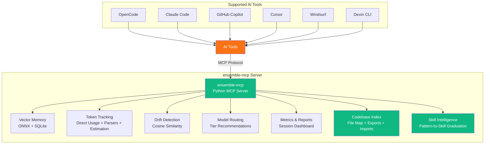
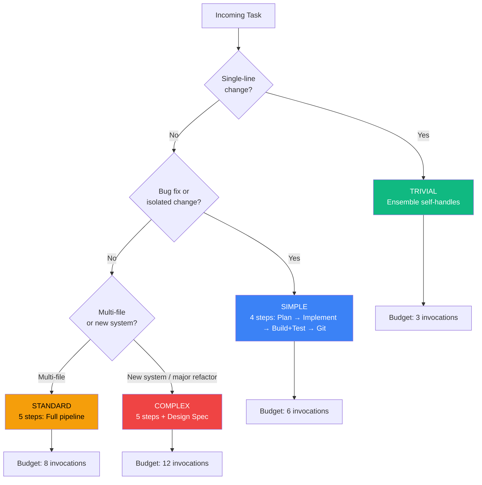
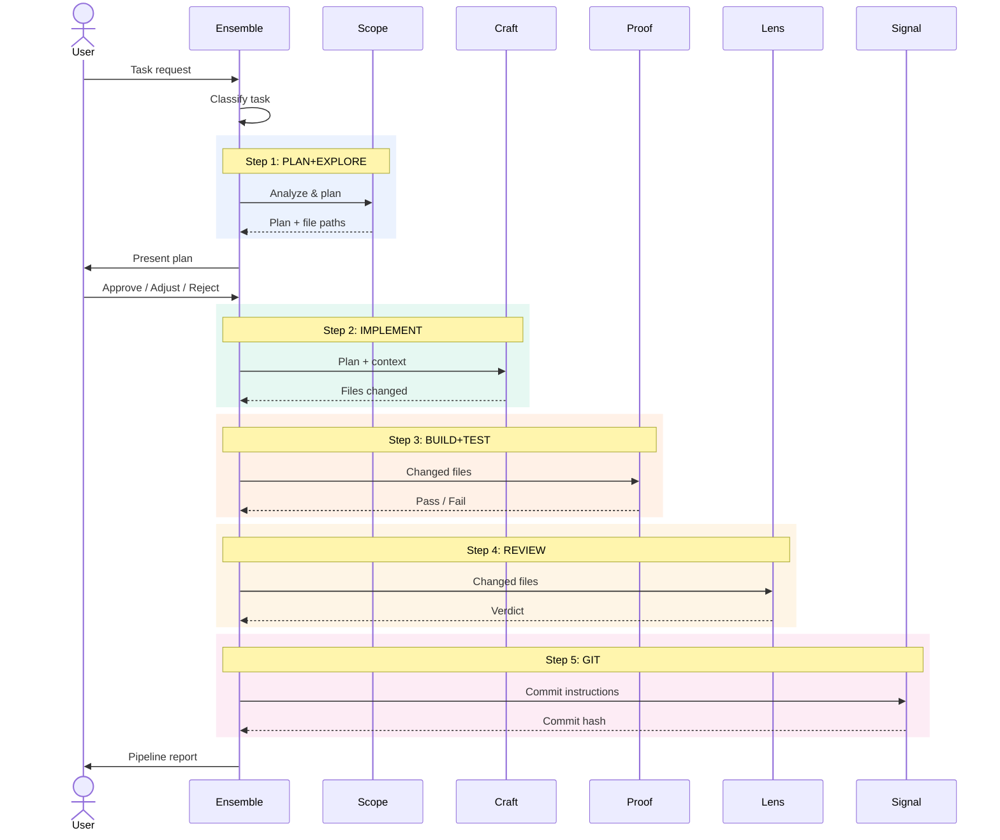

# Ensemble Design Specification

> Comprehensive system design for improving the Ensemble multi-agent orchestration system and building a companion Python MCP server.

**Status:** Design Complete, Implementation Pending  
**Version:** 1.0  
**Date:** 2026-03-30  
**Authors:** Collaborative design between user and AI assistant

---

## Table of Contents

1. [Executive Summary](#1-executive-summary)
2. [Current System Analysis](#2-current-system-analysis)
3. [Improvement Priorities](#3-improvement-priorities)
4. [Split Design Documents](#4-split-design-documents)

---

## 1. Executive Summary

### Problem

The current 7-agent orchestration system works well but lacks:
- **Memory** — no learning from past pipelines; same mistakes repeat
- **Cost visibility** — no unified cross-tool token/cost tracking with confidence metadata
- **Drift detection** — agents can silently deviate from the plan
- **Smart routing** — model assignment is static, not task-aware
- **Extensibility** — no skills/hooks system for project-specific behavior
- **Skill intelligence** — no automatic detection of recurring patterns that should become reusable skills
- **Codebase indexing** — Scope re-explores from scratch every run, wasting tokens on repeat visits
- **User configuration** — models and reasoning are hardcoded; users must edit agent files to customize

### Solution

`ensemble-mcp` -- a Python MCP server providing vector memory, hybrid token/cost tracking (direct usage + parsers + estimation), drift detection, model routing, codebase indexing, and metrics. Distributed via `uvx` for zero-hassle cross-platform installation. Works with OpenCode, Claude Code, GitHub Copilot, Cursor, Windsurf, and Devin CLI.

### Goals

- Reduce token usage per pipeline by ~15-25% (up to ~40% on repeat visits with indexing)
- Provide per-agent cost visibility with accuracy indicators
- Enable cross-session learning (pattern memory)
- Support any project type (Laravel, Vue, Python, PHP, mobile, etc.)
- Let users customize models, reasoning, and budgets without editing agent files
- Zero-hassle installation: `uvx ensemble-mcp`

### System Overview

---

## 2. Current System Analysis

### File Inventory

| File | Lines | Role | Model | Temperature |
|------|-------|------|-------|-------------|
| `team-captain.md` | 250 | Primary orchestrator (Ensemble) | Global (Opus) | 0.3 |
| `team-architect.md` | 159 | Read-only planner (Scope) | Global (Opus) | 0.5 |
| `team-engineer.md` | 67 | Code writer (Craft) | Global (Opus) | 0.3 |
| `team-forge.md` | 134 | Format/build/test (Proof) | Sonnet 4.6 | 0.1 |
| `team-hunter.md` | 228 | Bug hunter (isolated, standalone) (Trace) | Global (Opus) | 0.2 |
| `team-inspector.md` | 142 | Code reviewer (Lens) | Sonnet 4.6 | 0.1 |
| `team-shipper.md` | 88 | Git operations (Signal) | GPT-5-mini | 0.1 |

**Total:** 1,068 lines across 7 agents

### Task Classification & Pipeline Shape

### Strengths

- Clear separation of concerns — each agent has a well-defined role
- Context compression — Ensemble compresses each agent's output to 2-4 bullets
- Task classification — trivial/simple/standard/complex with pipeline shape adaptation
- Session persistence — `.opencode/resume.md` for resuming interrupted work
- Remediation loops — failing tests/reviews route back to Craft
- Pipeline budgets — per-classification invocation limits prevent runaway costs
- Model tiering — Opus for reasoning, Sonnet for execution, GPT-5-mini for Git
- Plan approval gate — user reviews the plan before implementation begins

### Weaknesses Found

1. **No pattern memory** — every pipeline starts from zero knowledge
2. **No token tracking** — no visibility into cost per agent or session
3. **No drift detection** — agents can drift from the plan without warning
4. **Static model routing** — model assignment doesn't adapt to task complexity
5. **No cross-tool skill discovery** — Craft, Proof, and Lens reference "skills" but each AI tool handles skill loading natively from its own locations (`.ai/skills/`, `.claude/skills/`, etc.); there's no unified way to discover skills across tools (MCP Phase 1 solves this with vector-based semantic search)
6. **Trace is isolated** — standalone agent at 228 lines, intentionally not part of the pipeline (invoked manually)
7. **No parallel execution** — Proof and Lens run sequentially but could overlap
8. **No hooks** — no extensibility points for project-specific behavior
9. **No `.gitignore`** — `.opencode/` directory not excluded from version control
10. **No codebase index** — Scope re-explores the project from scratch every pipeline run, wasting tokens on repeat visits
11. **No user configuration** — models, reasoning effort, and temperature are hardcoded in agent YAML frontmatter; users must edit agent files to customize
12. **No pattern-to-skill graduation** — recurring patterns in the pattern store are never automatically promoted to reusable skill files; users must manually notice repetition and create skills (Skill Intelligence feature addresses this)

### Permission Model

| Agent | Edit | Bash | Task | Webfetch |
|-------|------|------|------|----------|
| Ensemble | allow | allow | team-* only | - |
| Scope | deny | deny | - | allow |
| Craft | allow | allow | - | allow |
| Proof | allow | allow | - | allow |
| Trace | allow | allow | - | allow |
| Lens | deny | deny | - | allow |
| Signal | deny | git/gh/ls only | - | deny |

### Current Pipeline Flow

---

## 3. Improvement Priorities

Ordered by impact-to-effort ratio:

| Priority | Feature | Impact | Effort |
|----------|---------|--------|--------|
| A | Session learning & pattern memory | High | Low -> Medium |
| B | Parallel execution (Proof + Lens) | Medium | Low |
| C | Anti-drift mechanisms | High | Low -> Medium |
| D | Smarter model routing | Medium | Medium |
| E | Skills/hooks system | Medium | Medium |
| F | User-configurable models & reasoning | High | Low |
| G | Codebase indexing | High | Medium |
| H | Skill Intelligence (auto-detect recurring patterns & stale skill removal) | Medium | Medium |

---

## 4. Split Design Documents

To keep this file concise, the detailed design sections were split into dedicated files:

- [MCP Server Design and Implementation Details](DESIGN-SPEC-PHASE-01.md)
- [Prompt-Level Improvements (Archival Reference)](referances/DESIGN-SPEC-PHASE-01.md)

Both files are canonical and should be used for implementation planning and execution.
