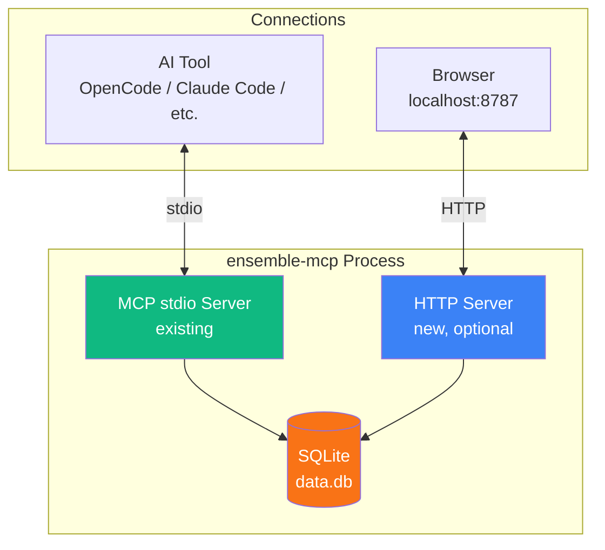
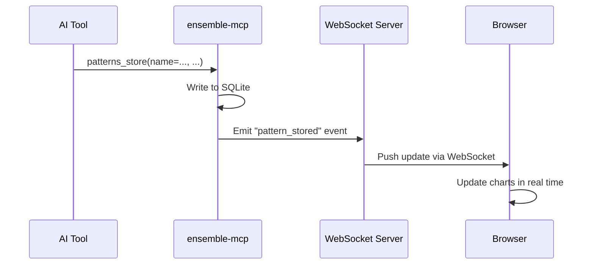
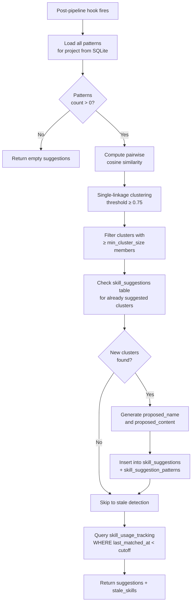
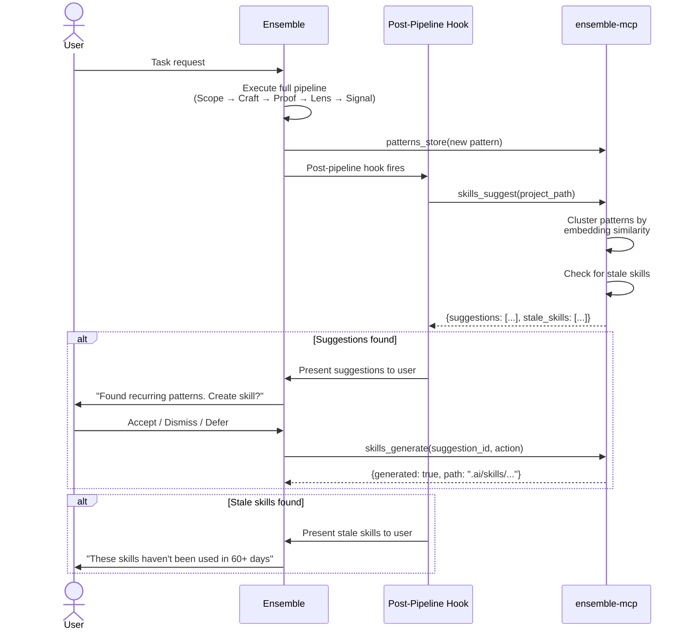
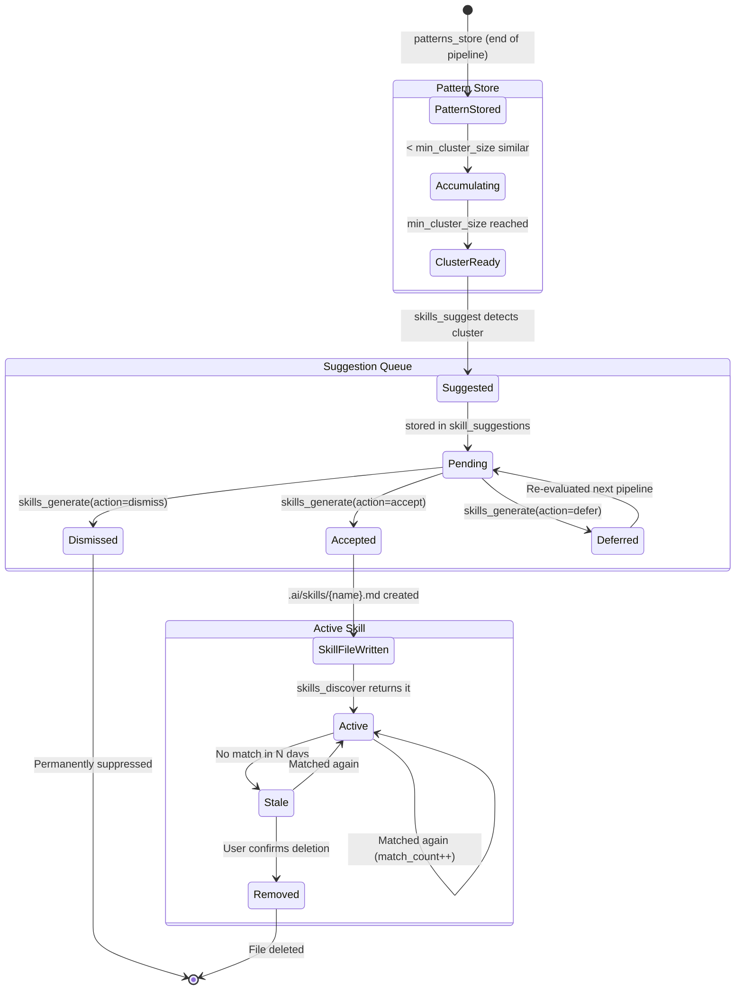
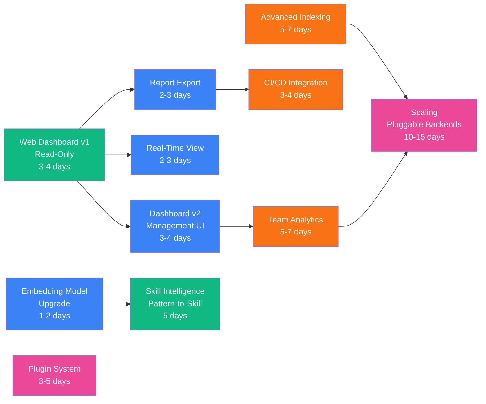
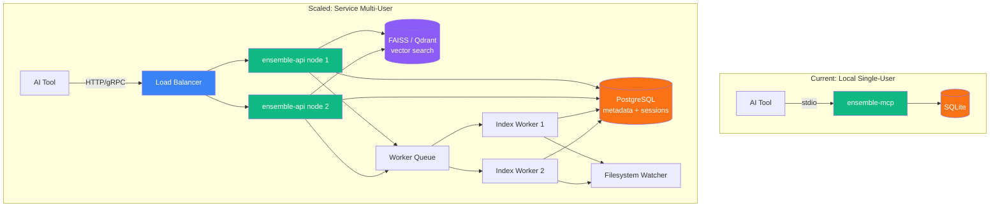

# Ensemble — Future Plans

> Features planned for post-Phase 6 development. These are documented for visibility and to guide architectural decisions in the current implementation so we don't paint ourselves into a corner.

**Last updated:** 2026-04-10

---

## 1. Web Dashboard ✅ Completed

### 1.1 Overview

> **Status:** Fully implemented. The dashboard is available via `ensemble-mcp web` and serves a read-only SPA at `localhost:8787` with pages for Overview, Patterns, Skills, Projects, Drift, and Sessions. A `drift_history` table was added (schema v6) to persist drift check results for trend visualization.

The web dashboard provides a **local-only browser interface** served on `localhost` for richer data visualization and deeper analysis of patterns, projects, and skills.

### 1.2 Architecture



The HTTP server runs as a **separate thread** within the existing `ensemble-mcp` process. Starting it is opt-in via a CLI subcommand:

```bash
ensemble-mcp web              # starts server, opens browser to localhost:8787
ensemble-mcp web --port 9000  # custom port
ensemble-mcp web --no-open    # start server without auto-opening browser
```

The MCP stdio server is completely unaffected — the dashboard is an additional interface to the same SQLite database.

### 1.3 Hosting Model

**Local only.** The dashboard binds to `localhost` (127.0.0.1) by default. No authentication is required because it is not network-accessible.

This stays consistent with the project's zero-external-dependency philosophy and the Zero-LLM-Call Principle — no data leaves the machine.

### 1.4 Tech Stack

| Layer | Choice | Rationale |
|-------|--------|-----------|
| HTTP Server | Python stdlib `http.server` or `aiohttp` | Already in the Python process. stdlib = zero new deps. `aiohttp` (~2MB) if async is needed |
| Frontend | Alpine.js + Chart.js (CDN or vendored) | No build step, ~30KB total, sufficient for read-only dashboards |
| Templating | Single HTML file with inline Alpine.js | No template engine dependency |
| Data | Direct SQLite reads (same `data.db`) | Zero additional infrastructure |
| Styling | Tailwind CSS (CDN) or minimal custom CSS | Clean look, no build step |

**Dependency impact:** If using stdlib — zero new dependencies. If using `aiohttp` — adds ~2MB to the existing ~90MB package. Either is acceptable.

**Future frontend migration:** The initial implementation uses Alpine.js for simplicity and zero build tooling. If the dashboard grows in complexity, migrating to React, Vue, or Svelte is straightforward since the backend is a clean JSON API. The API contract won't change — only the frontend would be swapped.

### 1.5 API Endpoints

All endpoints return the standard `ok/data/error/meta` envelope from Section 5.1.1 of the Phase 1 spec.

| Endpoint | Method | Query Params | Returns |
|----------|--------|-------------|---------|
| `/` | GET | — | Dashboard SPA (HTML) |
| `/api/summary` | GET | `project?` | Aggregate counts: patterns, skills, indexed projects, recent drift checks |
| `/api/patterns` | GET | `project?`, `limit?`, `offset?` | All stored patterns with match counts, last matched date |
| `/api/patterns/:id` | GET | — | Single pattern detail with embedding metadata |
| `/api/skills` | GET | `project?`, `status?` | Skill suggestions queue and active skills |
| `/api/skills/stale` | GET | `threshold_days?=60` | Skills not matched within threshold |
| `/api/projects` | GET | — | Indexed projects with file counts, languages, and export counts |
| `/api/projects/:path` | GET | — | Single project detail: files, language breakdown, exports |
| `/api/drift` | GET | `project?`, `from?`, `to?`, `limit?` | Drift check history with scores and flagged files |
| `/api/sessions` | GET | `project?`, `status?`, `limit?`, `offset?` | Paginated session list with lifecycle status |
| `/api/sessions/:id` | GET | — | Single session detail with steps and idempotency keys |
| `/api/health` | GET | — | Server health, version, DB size, counts |

### 1.6 Dashboard Pages (v1 — Read-Only)

#### Overview Page
- Summary cards: pattern count, skill count (active + pending suggestions), indexed projects, recent drift checks
- Drift score trend line chart (last 30 days)
- Recent activity feed: latest pattern stores, skill suggestions, project indexes
- Session lifecycle summary (pending / running / completed / failed)

#### Patterns Page
- All stored patterns with match count and last matched date
- Filter by project scope
- Usage heatmap: which patterns are actively being matched
- Search patterns by name or context (semantic and text)

#### Skills Page
- Pending skill suggestions queue with confidence scores and source patterns
- Active skills with match counts and last matched date
- Stale skill detection: skills not matched within the configurable threshold
- Accept / Dismiss / Defer actions for pending suggestions

#### Projects Page (from codebase indexer)
- List of indexed projects with file counts and last indexed time
- Per-project: language breakdown (pie chart), file role distribution (bar chart)
- Export counts: functions, classes, and other symbols per project

#### Sessions Page
- Filterable table: project, status (pending/running/completed/failed/killed)
- Click-through to session detail view
- Per-session detail: step-by-step breakdown, drift flags, idempotency keys

### 1.7 Project Structure Addition

```
ensemble-mcp/
  src/
    ensemble_mcp/
      ...existing...
      dashboard/
        __init__.py
        server.py          # HTTP server setup, route handlers
        api.py             # JSON API endpoints (reads from SQLite)
        static/
          index.html       # Single-page app (Alpine.js + Chart.js)
          app.js           # Dashboard logic
          style.css        # Minimal custom styles
```

### 1.8 Estimated Effort

| Task | Duration |
|------|----------|
| HTTP server + API routes | 1 day |
| Frontend (HTML + Alpine.js + Chart.js) | 1-2 days |
| Integration testing | 0.5 day |
| Documentation | 0.5 day |
| **Total** | **3-4 days** |

This fits within the original Phase 5 estimate (2-3 days for CLI + 3-4 days for web = 5-7 days total for Phase 5).

### 1.9 Risks

| Risk | Probability | Impact | Mitigation |
|------|------------|--------|------------|
| Port 8787 conflict with another service | Low | Low | `--port` flag for custom port |
| Accidental exposure on network interface | Low | Medium | Bind to `127.0.0.1` only, never `0.0.0.0` |
| Browser auto-open fails on headless/SSH sessions | Medium | Low | `--no-open` flag, print URL to stdout |
| SQLite read contention with MCP server writes | Low | Low | WAL mode already enabled; reads don't block writes |

---

## 2. Web Dashboard v2 — Full Management UI

Building on the read-only v1 dashboard, v2 adds write operations:

| Feature | Description |
|---------|-------------|
| Pattern management | Prune, delete, or edit patterns from the browser |
| Skill management | Accept, dismiss, or defer skill suggestions; delete stale skills |
| Settings editor | Edit `config.toml` with a form UI and validation |
| Data reset | Trigger `reset` tool from the dashboard with confirmation dialog |
| Index management | Force re-index a project, view index health, clear stale indexes |

**Prerequisite:** v1 dashboard must be stable and the API contract proven before adding mutations.

---

## 3. Real-Time Live View

WebSocket-based live updates showing activity as a pipeline runs in real time.



| Component | Choice |
|-----------|--------|
| Server | `websockets` library or `aiohttp` WebSocket support |
| Client | Native `WebSocket` API in browser |
| Protocol | JSON messages with event types: `pattern_stored`, `pattern_pruned`, `project_indexed`, `skill_suggested`, `drift_checked`, `session_started`, `session_completed` |

**Estimated effort:** 2-3 days on top of v1 dashboard.

---

## 4. Team Analytics

Aggregate data across multiple developers for team-level pattern sharing, skill adoption, and project coverage visibility.

### Approaches Under Consideration

| Approach | Pros | Cons |
|----------|------|------|
| **Shared SQLite on network drive** | Simplest | Locking issues, requires shared filesystem |
| **Central HTTP API** | Scalable, proper multi-user | Requires hosting, auth, and a separate service |
| **Export + aggregate** | Each dev exports reports, a script aggregates | Manual, batch only (not real-time) |

**Likely approach:** Export + aggregate for v1 (lowest friction), central API for v2 (if demand exists).

### What Team Analytics Would Show
- Shared patterns across developers: which patterns are useful across multiple team members
- Skill adoption rates: which generated skills are actively used vs. dismissed or stale
- Indexed project coverage: which team projects are indexed and how thoroughly
- Drift check frequency and score distribution across the team
- Model routing recommendations: which routing choices are most common

---

## 5. Report Export

Generate downloadable reports from the dashboard or CLI.

| Format | Use Case |
|--------|----------|
| **CSV** | Import into spreadsheets for custom analysis |
| **PDF** | Share with stakeholders who don't have terminal access |
| **JSON** | Machine-readable for CI/CD integration or custom tooling |

CLI integration:

```bash
ensemble-mcp export patterns --format csv --project /my/project --output patterns.csv
ensemble-mcp export skills --format json --output skills-report.json
ensemble-mcp export drift --format csv --days 30 --output drift-history.csv
ensemble-mcp export projects --format pdf --output index-summary.pdf
```

---

## 6. Advanced Codebase Indexing (v2)

### 6.1 Tree-sitter AST Parsing

Replace regex-based export extraction with tree-sitter for precise symbol extraction.

| Current (v1) | Future (v2) |
|--------------|-------------|
| Regex patterns per language | tree-sitter grammar per language |
| Top-level exports only | Nested classes, methods, type aliases |
| ~95% accuracy on common patterns | ~99% accuracy, handles edge cases |

**Trade-off:** tree-sitter adds ~50MB dependency and complexity. Only worth it if regex parsing proves insufficient.

### 6.2 Semantic Code Search

Embed function/class docstrings and signatures into the vector store for semantic code search.

```bash
# "Find where we validate user email addresses"
project_query(query="email validation logic", project_path="/my/project")
```

Currently, `project_query` only supports structural queries (file type, path pattern). Semantic search would enable natural language queries over the codebase.

**Trade-off:** Higher index build time and storage. Only valuable for large codebases (>5K files).

---

## 7. Embedding Model Upgrade Path

### 7.1 The 128-Token Limitation

MiniLM-L6-v2 has a hard limit of **128 input tokens** (~80-100 words). Text beyond this is silently truncated. This is acceptable for short queries and pattern names, but becomes a limitation for:

- Diff summaries in `drift_check` (routinely 200-300 words)
- Skill file content in `skills_discover` (100-500 words)
- Future semantic code search (function bodies, docstrings)

See Section 6.2.1 of [Phase 1 Design Spec](DESIGN-SPEC-PHASE-01.md) for the full impact analysis.

### 7.2 Short-Term: Chunking Strategy

Before swapping models, implement text chunking to work within the 128-token limit:

1. Split input text into overlapping 128-token chunks (stride of 64 tokens)
2. Embed each chunk separately
3. Store multiple vectors per entry (pattern, skill, diff)
4. During search, match against any chunk and return the parent entry
5. Use the highest similarity score across chunks

**Effort:** 1-2 days. Changes to `store.py` and `similarity.py`. No model change needed.

**Trade-off:** More vectors in the database (2-4x for long inputs), slightly slower search. At <10K patterns this is still <5ms.

### 7.3 Medium-Term: Drop-In Model Swap

If chunking proves insufficient or too complex, swap to a larger-context model with the same 384 dimensions:

| Model | Max Tokens | Dimensions | Size | Speed | Drop-in? |
|-------|-----------|------------|------|-------|----------|
| **MiniLM-L6-v2 (current)** | 128 | 384 | 22MB | ~5ms | — |
| **BGE-small-en-v1.5** | 512 | 384 | 33MB | ~8ms | Yes |
| **GTE-small** | 512 | 384 | 33MB | ~8ms | Yes |
| all-MiniLM-L12-v2 | 128 | 384 | 44MB | ~10ms | Yes (same limit) |
| all-mpnet-base-v2 | 384 | 768 | 109MB | ~20ms | No (dimension change) |

**BGE-small-en-v1.5 or GTE-small** are the recommended upgrades:
- 4x the context window (512 tokens)
- Same 384 dimensions — no schema migration needed
- Only ~11MB larger
- ~3ms slower per embedding (still fast)

**Migration process:**
1. Update model URL and name in `embeddings.py`
2. On first run, download the new model (~33MB)
3. Re-embed all stored patterns (one-time operation, ~5 seconds for 1K patterns)
4. Old model file can be deleted from cache

**Effort:** 0.5 day for the swap + re-embed migration script.

### 7.4 Long-Term: Configurable Model

Make the embedding model a configuration option:

```toml
# ~/.config/ensemble-mcp/config.toml
[embeddings]
model = "bge-small-en-v1.5"    # or "minilm-l6-v2", "gte-small"
max_tokens = 512
dimensions = 384
```

This allows users to choose their trade-off between speed, quality, and package size. The server validates that stored embeddings match the configured dimensions and triggers a re-embed if they don't.

### 7.5 Decision Criteria for Upgrading

| Signal | Action |
|--------|--------|
| `drift_check` accuracy complaints (missed drift on long diffs) | Implement chunking first, then consider model swap |
| `skills_discover` returning irrelevant results for long skill files | Implement chunking |
| Semantic code search feature requested (Section 6.2) | Swap to BGE-small or GTE-small (needs longer context) |
| Users requesting higher quality embeddings | Add configurable model option |

---

## 8. Plugin System

Allow third-party extensions to add custom MCP tools to `ensemble-mcp`.

### Concept

```python
# ~/.config/ensemble-mcp/plugins/my_plugin.py

from ensemble_mcp.plugins import register_tool

@register_tool("my_custom_check")
async def my_custom_check(project_path: str) -> dict:
    """Run a custom code quality check."""
    # Custom logic here
    return {"score": 0.85, "issues": [...]}
```

**Discovery:** Scan `~/.config/ensemble-mcp/plugins/` on startup. Each `.py` file with `@register_tool` decorators is loaded.

**Safety:** Plugins run in the same process (no sandboxing). Users are responsible for what they install. Document security implications clearly.

---

## 9. CI/CD Integration

Export session and drift data in formats compatible with CI pipelines.

| Feature | Description |
|---------|-------------|
| **JUnit XML export** | Session results as test suite results for CI dashboards |
| **GitHub Actions annotations** | Drift warnings as PR annotations |
| **Drift threshold enforcement** | Fail CI if drift score exceeds a configurable threshold |
| **Pattern coverage check** | Warn if a project has no stored patterns (no institutional knowledge captured) |
| **Metrics webhook** | POST session/drift report to a URL on completion |

### Example: Drift Threshold in CI

```yaml
# .github/workflows/ensemble.yml
- name: Check drift score
  run: |
    DRIFT=$(ensemble-mcp export drift --format json --last 1 | jq '.drift_score')
    if (( $(echo "$DRIFT > 0.7" | bc -l) )); then
      echo "::error::Drift score $DRIFT exceeds 0.7 threshold — changes may be off-task"
      exit 1
    fi

- name: Export drift annotations
  run: |
    ensemble-mcp export drift --format annotations --output annotations.json
```

---

## 10. Frontend Migration Path

The initial web dashboard uses **Alpine.js + Chart.js** for zero build tooling. If the dashboard grows beyond read-only data browsing, a migration to a more capable framework may be warranted.

### Decision Criteria for Migration

| Signal | Threshold |
|--------|-----------|
| Number of interactive forms | > 3 forms with validation |
| Component reuse | > 10 shared components |
| State management complexity | Cross-page state, optimistic updates |
| Build tooling already present | Project already uses Node.js |

### Migration Options

| Framework | Bundle Size | Build Required | Best For |
|-----------|------------|----------------|----------|
| Alpine.js (current) | ~15KB | No | Read-only, < 5 pages |
| Vue 3 + Vite | ~30KB | Yes | Medium complexity, good DX |
| React + Next.js | ~80KB+ | Yes | Full SPA, large teams |
| Svelte + SvelteKit | ~5KB+ | Yes | Performance-critical, small bundle |

**Recommendation:** Stay with Alpine.js unless 2+ decision criteria are met. The JSON API contract is frontend-agnostic, so migration is a frontend-only change with zero backend impact.

---

## 11. Skill Intelligence -- Auto-Detection & Pattern-to-Skill Graduation ✅ Completed

> **Status:** Fully implemented in Phase 1. The three MCP tools (`skills_discover`, `skills_suggest`, `skills_generate`) are available, along with the `skill_suggestions`, `skill_suggestion_patterns`, `skill_usage_tracking`, and `skill_file_cache` SQLite tables. Clustering, stale detection, and zero-LLM skill file generation all work as designed below.

### 11.1 Overview

Skill Intelligence bridges the gap between Ensemble's **pattern memory** (retrospective -- stores what happened) and the **skills system** (proactive -- stores how to do things). It automatically detects recurring work patterns and suggests converting them into reusable skill files. It also detects stale/unused skills and suggests removal.

**Problem:** Valuable institutional knowledge stays trapped in the pattern store. Users must manually notice recurring patterns across pipelines and manually create skill files. Nobody does this.

**Solution:** After every successful pipeline, automatically cluster similar patterns using embedding cosine similarity. When a cluster reaches 3+ patterns (configurable), propose it as a reusable skill. Also track skill usage and flag skills that haven't been matched in N days.

### 11.2 Architecture

```mermaid
graph TB
    subgraph "Post-Pipeline Hook"
        HOOK[Post-Pipeline Hook<br/>fires after successful pipeline]
    end

    HOOK --> SS[skills_suggest<br/>MCP Tool]

    subgraph "Detection Engine"
        SS --> LOAD[Load patterns<br/>for project]
        LOAD --> CLUSTER[Pairwise cosine<br/>similarity clustering]
        CLUSTER --> FILTER[Filter clusters<br/>≥ min_cluster_size]
        FILTER --> DEDUP[Exclude already<br/>suggested clusters]
        DEDUP --> PERSIST[Save to<br/>skill_suggestions table]
    end

    subgraph "Stale Detection"
        SS --> STALE[Check skill_usage_tracking<br/>for last_matched_at]
        STALE --> FLAG[Flag skills unused<br/>> stale_threshold_days]
    end

    PERSIST --> PRESENT[Present suggestions<br/>to user]
    FLAG --> PRESENT

    PRESENT --> APPROVE{User Decision}
    APPROVE -->|Accept| GEN[skills_generate<br/>MCP Tool]
    APPROVE -->|Dismiss| DISMISS[Mark dismissed<br/>in DB]
    APPROVE -->|Defer| DEFER[Leave pending<br/>for next pipeline]

    GEN --> WRITE[Write .ai/skills/<br/>{name}.md]
    WRITE --> TRACK[Register in<br/>skill_usage_tracking]

    style HOOK fill:#10B981,color:#fff
    style SS fill:#3B82F6,color:#fff
    style GEN fill:#3B82F6,color:#fff
    style WRITE fill:#F97316,color:#fff
```

### 11.3 Detection Algorithm

The detection algorithm uses **single-linkage agglomerative clustering** on pattern embeddings:



**Algorithm details:**

1. **Pattern loading:** `SELECT id, name, context, approach, outcome, embedding FROM patterns WHERE project = ? OR project IS NULL`
2. **Clustering:** For each pattern, check cosine similarity against all existing cluster members. Join the cluster with the highest match above 0.75 threshold. If no cluster matches, start a new one.
3. **Confidence score:** Average pairwise similarity within the cluster. Higher means more tightly related patterns.
4. **Name derivation:** Extract the most common words from pattern names in the cluster, join with hyphens (e.g., `laravel-pest-testing`)
5. **Content generation:** Zero-LLM — structured combination of pattern fields into a Markdown template

### 11.4 Post-Pipeline Integration



### 11.5 Skill File Format

Generated skill files follow a standardized Markdown template that works across all supported AI tools:

```markdown
# laravel-pest-testing

> Auto-generated by Ensemble Skill Intelligence from 4 similar patterns.

## When to Apply

- Laravel project with Pest tests taking >2min
- Laravel project adding new test coverage for API endpoints
- Laravel project migrating from PHPUnit to Pest syntax
- Laravel CI pipeline with flaky database tests

## Approach

- Use `pest --parallel` with `RefreshDatabase` trait, not `DatabaseTransactions`
- Use `actingAs()` for authenticated endpoint tests instead of manual token generation
- Group related tests with `describe()` blocks for better output readability
- Use `LazilyRefreshDatabase` for faster parallel execution

## Learned Outcomes

- **laravel-pest-parallel:** Success — test time reduced from 2min to 35sec
- **laravel-pest-auth-tests:** Success — cleaner auth test setup, fewer token-related failures
- **laravel-pest-describe-blocks:** Success — test output grouped logically, easier to debug
- **laravel-pest-lazy-refresh:** Success — parallel test time reduced further to 22sec

---
*Source patterns: 12, 17, 23, 31*
*Generated: 2026-04-04*
```

**File location:** `.ai/skills/` directory (cross-tool compatible). This location is discovered by `skills_discover` alongside tool-native locations (`.claude/skills/`, `.cursor/rules/`, etc.).

### 11.6 Skill Lifecycle



### 11.7 User Approval Flow

Skill Intelligence never creates files without user consent. The approval flow:

| Step | Actor | Action |
|------|-------|--------|
| 1 | System | Post-pipeline hook calls `skills_suggest` |
| 2 | System | Returns suggestions with proposed name, content preview, and confidence score |
| 3 | Ensemble | Presents suggestions to user in a compact summary |
| 4 | User | Chooses per suggestion: **Accept** (creates file), **Dismiss** (suppresses permanently), or **Defer** (ask again later) |
| 5 | System | On accept: `skills_generate(suggestion_id, action="accept")` writes the file and registers it in `skill_usage_tracking` |

**Example Ensemble output:**

```
╔══════════════════════════════════════════════════════════╗
║  SKILL SUGGESTIONS                                       ║
╠══════════════════════════════════════════════════════════╣
║                                                          ║
║  1. laravel-pest-testing (confidence: 0.87)              ║
║     Based on 4 similar patterns about Pest test setup    ║
║     → Accept / Dismiss / Defer                           ║
║                                                          ║
║  2. vue-composables-setup (confidence: 0.79)             ║
║     Based on 3 similar patterns about Vue composables    ║
║     → Accept / Dismiss / Defer                           ║
║                                                          ║
╠══════════════════════════════════════════════════════════╣
║  STALE SKILLS                                            ║
║                                                          ║
║  ⚠ .ai/skills/php-cs-fixer.md — unused for 72 days      ║
║  ⚠ .cursor/rules/old-api-format.md — unused for 95 days ║
║                                                          ║
╚══════════════════════════════════════════════════════════╝
```

### 11.8 Stale Skill Detection

Stale detection works by tracking when `skills_discover` last matched each skill file:

1. **Tracking:** Every time `skills_discover` returns a skill as relevant, it updates `skill_usage_tracking.last_matched_at` and increments `match_count`
2. **Detection:** When `skills_suggest` runs, it queries `skill_usage_tracking` for skills where `last_matched_at` is older than `stale_threshold_days` (default: 60)
3. **Advisory only:** Stale detection never auto-deletes files. It only flags them for user review
4. **Cross-tool:** Tracks skills from all discovered locations, not just `.ai/skills/`

### 11.9 Configuration

All thresholds are configurable via `team-config.json`:

```json
{
  "skill_intelligence": {
    "enabled": true,
    "min_cluster_size": 3,
    "cluster_similarity_threshold": 0.75,
    "stale_threshold_days": 60,
    "output_dir": ".ai/skills/",
    "auto_suggest_after_pipeline": true
  }
}
```

| Parameter | Default | Description |
|-----------|---------|-------------|
| `enabled` | `true` | Enable/disable skill intelligence entirely |
| `min_cluster_size` | `3` | Minimum patterns in a cluster before suggesting |
| `cluster_similarity_threshold` | `0.75` | Cosine similarity threshold for clustering |
| `stale_threshold_days` | `60` | Days before a skill is flagged as stale |
| `output_dir` | `.ai/skills/` | Directory for generated skill files |
| `auto_suggest_after_pipeline` | `true` | Automatically run `skills_suggest` in post-pipeline hook |

### 11.10 Effort Estimate

| Task | Effort |
|------|--------|
| SQLite schema additions (3 tables) | 0.5 days |
| Pattern clustering algorithm | 1 day |
| `skills_suggest` tool implementation | 1 day |
| `skills_generate` tool implementation | 0.5 days |
| `skills_discover` usage tracking integration | 0.5 days |
| Post-pipeline hook integration | 0.5 days |
| Tests | 1 day |
| **Total** | **5 days** |

### 11.11 Risks

| Risk | Probability | Impact | Mitigation |
|------|------------|--------|------------|
| Suggestion fatigue — too many suggestions annoy users | Medium | Medium | Conservative defaults (3+ patterns, 0.75 threshold); dismiss permanently suppresses; defer respects user pace |
| Generated content too generic | Medium | Low | Users review and can edit files after generation; this is a starting point, not a final product |
| MiniLM-L6-v2 128-token limit affects clustering accuracy | Medium | Medium | Pattern names/contexts are typically short enough; embedding model upgrade path documented in Section 7 |
| Stale detection false positives for seasonal skills | Low | Low | Users can simply ignore stale warnings; no auto-deletion |
| Cluster algorithm O(n^2) too slow for large pattern stores | Low | Low | <1K patterns per project is the expected range; FAISS upgrade path exists for larger scale |

---

## Priority and Sequencing



| Priority | Feature | Est. Effort | Depends On | Status |
|----------|---------|-------------|------------|--------|
| **Done** | Web Dashboard v1 (read-only: patterns, skills, projects, drift) | 3-4 days | Core MCP tools stable | ✅ Complete |
| **Done** | Skill Intelligence (auto-detect & pattern-to-skill graduation) | 5 days | Phase 1 patterns + skills tools stable | ✅ Complete |
| **Medium** | Embedding Model Upgrade (chunking or model swap) | 1-2 days | Drift/skills accuracy feedback | Not started |
| **Medium** | Report Export (patterns, skills, drift, projects as CSV/PDF/JSON) | 2-3 days | Dashboard v1 | Not started |
| **Medium** | Real-Time Live View | 2-3 days | Dashboard v1 | Not started |
| **Medium** | Dashboard v2 (pattern/skill/index management UI) | 3-4 days | Dashboard v1 | Not started |
| **Low** | Team Analytics (shared patterns, skill adoption, project coverage) | 5-7 days | Dashboard v2 + Export | Not started |
| **Low** | CI/CD Integration (drift thresholds, JUnit XML, annotations) | 3-4 days | Report Export | Not started |
| **Low** | Advanced Codebase Indexing | 5-7 days | Phase 1 indexer stable | Not started |
| **Low** | Plugin System | 3-5 days | Core MCP tools stable | Not started |
| **Future** | Scaling (pluggable backends, enterprise support) | 10-20 days | Advanced indexing + team analytics | Not started |

---

## 12. Scaling Considerations

### 12.1 Current Design Ceiling

The current architecture is optimized for **individual developers working on small-to-medium projects** (<100K files). Here's where each component hits its limit and what breaks at scale:

#### Scale Tiers

| Scale | Files | Current Design | Status |
|-------|-------|----------------|--------|
| Small project | <10K | Everything works optimally | Supported |
| Medium project | 10K-100K | Works with minor tuning (batch indexing, query optimization) | Supported |
| Large monorepo | 100K-1M | Strained — needs FAISS for vectors, parallel indexing, SQLite tuning | Needs work |
| Enterprise monorepo | 1M-10M | Breaks — needs PostgreSQL, ANN search, worker-based indexing | Not supported |
| Hyperscale | 100M+ | Completely breaks — needs distributed architecture | Not supported |

For reference on what "hyperscale" means:

| Codebase | Files | Lines of Code |
|----------|-------|---------------|
| Linux kernel | ~80,000 | ~35M |
| Chromium | ~400,000 | ~40M |
| Google monorepo (estimated) | ~2B | ~2B |

### 12.2 Component Breakdown at Scale

#### Codebase Indexing (`project_index`)

| Metric | <10K files (current) | 100K files | 1M files | 100M files |
|--------|---------------------|------------|----------|------------|
| Initial scan | 200-500ms | 2-5s | 20-50s | **28-56 hours** |
| Incremental refresh | 20-50ms | 200-500ms | 2-5s | **Minutes** (stat 100M files) |
| SQLite index size | ~100KB | ~1MB | ~10MB | **~10GB** |
| Query response | <5ms | <5ms | 10-50ms | **Seconds** |

**Bottleneck:** `os.stat()` on every file to check mtime. At 100M files, this is I/O bound for hours. SQLite `INSERT` transactions for millions of rows lock the database.

#### Vector Search (`patterns_search`)

| Metric | <10K vectors (current) | 100K vectors | 1M vectors | 100M vectors |
|--------|----------------------|-------------|------------|-------------|
| Memory for embeddings | ~15MB | ~150MB | ~1.5GB | **~150GB** |
| Brute-force search time | <1ms | ~10ms | ~100ms | **Minutes** |
| SQLite BLOB read | Instant | Fast | Slow | **Disk-bound** |

**Bottleneck:** Brute-force cosine similarity is O(n). Cannot load 150GB of embeddings into RAM.

#### Embedding Generation

| Metric | <10K items | 100K items | 1M items | 100M items |
|--------|-----------|------------|----------|------------|
| Time (5ms each) | <50s | ~8 min | ~83 min | **~139 hours** |
| Parallelizable | Yes (batch) | Yes | Yes (GPU helps) | Needs distributed workers |

#### SQLite

| Metric | <10K rows | 100K rows | 1M rows | 100M rows |
|--------|----------|-----------|---------|-----------|
| Write throughput | Fine | Fine | Slows without batching | **Single-writer bottleneck** |
| Analytical queries | <5ms | <50ms | Seconds | **Minutes** (full table scans) |
| DB file size | <1MB | ~10MB | ~100MB | **~10GB+** |

SQLite can technically hold 100M rows, but it's designed for transactional workloads, not analytical queries over massive datasets.

### 12.3 What Would Need to Change

#### Tier 1: Indexing Architecture (for 100K-1M files)

| Current | Required |
|---------|----------|
| Full file tree scan via `os.walk` | **Filesystem event watching** (inotify on Linux, fsevents on macOS) + incremental crawl |
| Single-process scanning | **Parallel workers** — distribute file scanning across CPU cores |
| Single `INSERT` transaction | **Batch inserts** with chunked transactions (1,000 rows per commit) |
| All files in one table | **Partitioned tables** — by project path prefix or language |

#### Tier 2: Vector Search (for 100K-1M vectors)

| Current | Required |
|---------|----------|
| Brute-force numpy cosine similarity | **Approximate Nearest Neighbor (ANN)** index |
| All embeddings loaded into RAM | **Disk-backed vector index** with memory-mapped access |
| SQLite BLOBs | **Dedicated vector index files** (FAISS, Annoy, or ScaNN) |

ANN libraries and their performance at scale:

| Library | 100M vector search time | Memory mode | Accuracy |
|---------|------------------------|-------------|----------|
| FAISS (IVF-PQ) | ~1-10ms | Disk + mmap | ~95-99% recall |
| ScaNN | ~1-5ms | In-memory (partitioned) | ~95-99% recall |
| Annoy | ~5-15ms | Disk-backed (mmap) | ~90-95% recall |
| Qdrant | ~5-20ms | Disk-backed, distributed | ~95-99% recall |
| Milvus | ~5-20ms | Distributed, cloud-native | ~95-99% recall |

#### Tier 3: Database (for 1M-10M+ rows)

| Current | Required |
|---------|----------|
| Single SQLite file | **PostgreSQL** for metadata + analytical queries |
| WAL mode for concurrency | **Proper MVCC** with connection pooling |
| No partitioning | **Table partitioning** by date range or project |
| No query optimization | **Materialized views** for dashboard aggregations |

For analytics-heavy workloads (trends, pattern usage reports across millions of sessions), **ClickHouse** or **TimescaleDB** would outperform PostgreSQL.

#### Tier 4: Architecture Shift (for 10M+ files)

At this scale, the system is no longer a local CLI tool — it's a **service**:



### 12.4 Pluggable Backend Strategy

To support future scaling without breaking the current design, key backends should be **pluggable** behind interfaces:

```
Interface                  Local (v1)              Scaled (future)
─────────────────────────  ──────────────────────  ──────────────────────
VectorStore                SQLite + numpy          FAISS / Qdrant
MetadataStore              SQLite                  PostgreSQL / ClickHouse
IndexScanner               os.walk + stat          inotify / fsevents + workers
EmbeddingEngine            ONNX local              ONNX local (or remote API)
SearchAlgorithm            Brute-force cosine      ANN (IVF-PQ)
```

The current `ok/data/error/meta` tool API envelope is already backend-agnostic — clients don't know or care whether the vector search is numpy or FAISS. The swap is internal plumbing, not a protocol change.

**Implementation approach:**
1. Define abstract interfaces for storage, search, and indexing in v1
2. Implement SQLite/numpy backends (current plan, no change)
3. When scaling is needed, add PostgreSQL/FAISS backends that implement the same interfaces
4. Configuration determines which backend is active:

```toml
# ~/.config/ensemble-mcp/config.toml

# Local (default, current)
[storage]
backend = "sqlite"

# Scaled (future)
[storage]
backend = "postgresql"
connection = "postgresql://localhost:5432/ensemble"

[vectors]
backend = "faiss"       # or "qdrant"
index_path = "~/.cache/ensemble-mcp/faiss/"
```

### 12.5 Recommended Scaling Milestones

| Trigger | Action | Effort |
|---------|--------|--------|
| Projects with >50K files report slow indexing | Add parallel file scanning + batch SQLite inserts | 2-3 days |
| Pattern store exceeds 50K entries | Integrate FAISS for ANN search, keep SQLite for metadata | 3-5 days |
| Dashboard queries slow on >100K sessions | Add SQLite indexes, consider materialized aggregation tables | 1-2 days |
| Enterprise users request monorepo support (>1M files) | Implement pluggable storage interfaces + PostgreSQL backend | 10-15 days |
| Multi-user team deployment requested | Add HTTP server mode alongside stdio, shared database | 15-20 days |

### 12.6 What NOT to Do Now

These are explicitly deferred to avoid premature optimization:

1. **Don't add FAISS/Qdrant to v1** — brute-force numpy is perfect for <10K vectors and adds zero dependencies
2. **Don't add PostgreSQL to v1** — SQLite is the right choice for single-user local storage
3. **Don't add filesystem watchers to v1** — mtime checking is reliable and simple for <100K files
4. **Don't build distributed architecture** — the local MCP server model is correct for the target user base
5. **Don't over-abstract storage interfaces in v1** — define clean module boundaries (which the project structure already has: `memory/store.py`, `memory/similarity.py`), but don't add interface abstraction until a second backend exists

The current design is **not wrong** — it's correctly scoped. The architecture decisions (SQLite, numpy, ONNX, single-process) are optimal for the target scale. This section documents the upgrade path for when scale demands change, so future work can be planned without redesigning the core.

---

## Appendix: Design Constraints

All future features must respect these constraints from the core design:

1. **Zero-LLM-Call Principle** — The MCP server never calls external LLM APIs
2. **Local-first** — All data stays on the developer's machine unless explicitly exported
3. **Zero-config operation** — Everything works with defaults; configuration is additive
4. **Contract-first API** — All tools and endpoints use the `ok/data/error/meta` envelope
5. **Cross-tool compatibility** — Features must work with any MCP-compatible AI tool, not just one
