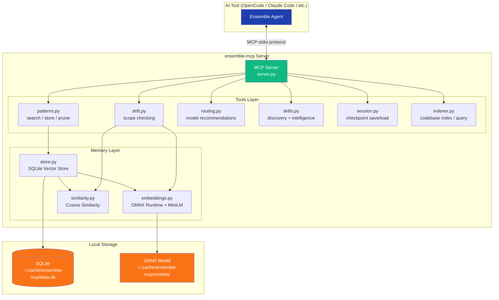
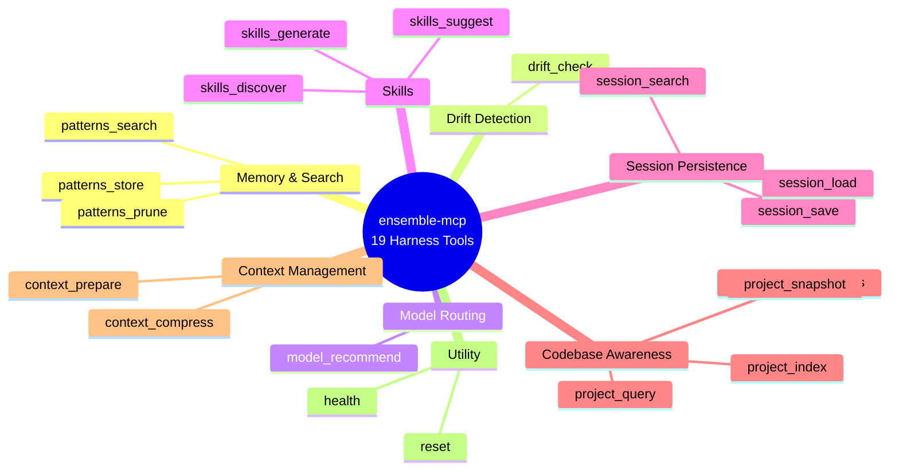

# Ensemble

> **Harness infrastructure layer** for AI agent pipelines — a companion Python MCP server providing vector memory, drift detection, model routing, skills discovery, and codebase indexing.

**Status:** Phase 1.0 (Contract Foundation), Phase 1 (MCP Core), and Phase 4 (Auto-Installer) complete.  
**Version:** 0.1.0a4  
**Package:** `ensemble-mcp` -- 19 MCP tools across 11 subpackages

---

## What is an Agent Harness?

**Agent = Model + Harness.** A harness is every piece of code, configuration, and execution logic that isn't the model itself. A raw model is not an agent — it becomes one when a harness gives it state, tool execution, feedback loops, and constraints.

```
┌─────────────────────────────────────────┐
│              AGENT                      │
│                                         │
│   ┌─────────────────────────────────┐   │
│   │           HARNESS               │   │
│   │                                 │   │
│   │  System Prompts                 │   │
│   │  Tools, Skills & MCPs           │   │
│   │  Execution Environment          │   │
│   │  Orchestration Logic            │   │
│   │  Memory & Context Management    │   │
│   │  Hooks & Middleware             │   │
│   │                                 │   │
│   │         ┌───────────┐           │   │
│   │         │   MODEL   │           │   │
│   │         └───────────┘           │   │
│   └─────────────────────────────────┘   │
└─────────────────────────────────────────┘
```

> *For a deeper dive, see [The Anatomy of an Agent Harness](https://www.langchain.com/blog/the-anatomy-of-an-agent-harness) by LangChain.*

---

## What is Ensemble?

Ensemble is a **7-agent pipeline** for AI-assisted software engineering. Each agent has a dedicated role -- planning, implementation, formatting, review, and git operations -- orchestrated by a central captain agent.

**`ensemble-mcp`** is the companion **harness infrastructure layer** — a Python MCP server that enhances any agent harness with persistent memory, drift detection, smart model routing, skills discovery, and codebase indexing. It works with any MCP-compatible AI tool.

---

## The Problem

Agent harnesses like Claude Code, Codex, and Cursor provide the **execution layer** (filesystem, bash, sandbox) but lack:

- **Memory** -- no learning from past pipelines; same mistakes repeat
- **Drift detection** -- agents can silently deviate from the plan
- **Smart routing** -- model assignment is static, not task-aware
- **Context management** -- context windows fill up, degrading performance (context rot)
- **Codebase awareness** -- agents re-explore from scratch every run, wasting tokens
- **Skills system** -- no progressive disclosure of capabilities based on task needs

---

## The Solution

`ensemble-mcp` -- a harness infrastructure layer delivered via MCP. It provides the intelligence primitives that any agent harness needs but that the execution layer alone can't offer:

```
┌──────────────────────────────────────────────────────────┐
│              COMPLETE AGENT HARNESS                      │
│                                                          │
│  ┌─────────────────────────────────────────────────────┐ │
│  │  Execution Layer (Claude Code / Codex / Cursor)     │ │
│  │  Filesystem, Bash, Sandbox, Browser, Git            │ │
│  └─────────────────────────────────────────────────────┘ │
│                         +                                │
│  ┌─────────────────────────────────────────────────────┐ │
│  │  Intelligence Infrastructure (ensemble-mcp via MCP) │ │
│  │  Memory, Skills, Drift, Routing, Compression,       │ │
│  │  Sessions, Codebase Indexing, Project Snapshots      │ │
│  └─────────────────────────────────────────────────────┘ │
│                         +                                │
│  ┌─────────────────────────────────────────────────────┐ │
│  │  Orchestration (Ensemble 7-agent pipeline)          │ │
│  │  Captain, Scope, Craft, Forge, Lens, Signal, Trace  │ │
│  └─────────────────────────────────────────────────────┘ │
└──────────────────────────────────────────────────────────┘
```

---

## Harness Primitives We Provide

### Memory & Search (Continual Learning)
Semantic pattern search using ONNX Runtime + MiniLM-L6-v2 embeddings. Stores learned patterns from past pipelines in SQLite. Returns top-K matches by cosine similarity — enabling agents to learn from past work and inject that knowledge into future sessions.

### Drift Detection (Keeping Agents on Track)
Cosine similarity between task description embeddings and diff content embeddings. Returns a 0-1 drift score with specific flags for unexpected file changes, unrelated modifications, and scope creep. Part of the self-verification loop that keeps agents aligned with the plan.

### Model Routing (Orchestration)
Recommends abstract model tiers (`best`, `mid`, `cheapest`) based on agent role and task classification. Each AI tool maps tiers to its own available models via `team-config.json`.

### Context Rot Prevention (Compaction & Prompt Caching)
**Context compression** removes filler words and condenses prose while preserving all technical content — code, URLs, paths, headings. **Prompt caching** orders prompt sections (static → project → task) to maximize the stable prefix that LLM providers can cache across calls. Both fight context rot — the degradation of model performance as the context window fills up.

### Codebase Awareness (Indexing & Snapshots)
File-level project index stored in SQLite -- paths, exports, imports, file roles. Incremental refresh via mtime checks. **Project snapshots** generate compact baseline summaries (language, framework, conventions, structure). Gives agents workspace-level awareness without re-exploring from scratch.

### Skills (Progressive Disclosure)
Scans all tool-native skill locations (`.ai/skills/`, `.claude/skills/`, `.cursor/rules/`, etc.), embeds content into the vector store, and returns relevant skills via semantic search. Skills are a harness primitive that prevents context rot by loading only task-relevant capabilities instead of dumping everything into context on start. **Skill Intelligence** automatically detects recurring patterns and suggests converting them into reusable skills.

### Long Horizon Execution (Session Persistence)
Pipeline checkpoint save/load with optimistic versioning. Explicit lifecycle state machine: `pending -> running -> completed | failed | killed`. Enables agents to maintain durable state across context windows and resume interrupted work.

---

## Architecture



---

## Quick Start

### Installation

```bash
uvx ensemble-mcp
```

Zero-hassle: `uvx` auto-downloads Python if not installed. Works on Mac, Linux, and Windows.

### MCP Registration

**OpenCode** (`~/.config/opencode/config.json` or project `config.json`):
```json
{
  "$schema": "https://opencode.ai/config.json",
  "mcp": {
    "ensemble": {
      "type": "local",
      "command": ["uvx", "ensemble-mcp"]
    }
  }
}
```

**Claude Code** (`~/.claude.json`):
```json
{
  "mcpServers": {
    "ensemble": {
      "command": "uvx",
      "args": ["ensemble-mcp"]
    }
  }
}
```

**GitHub Copilot** (`.vscode/mcp.json`):
```json
{
  "servers": {
    "ensemble": {
      "command": "uvx",
      "args": ["ensemble-mcp"]
    }
  }
}
```

**Cursor** (`~/.cursor/mcp.json`):
```json
{
  "mcpServers": {
    "ensemble": {
      "command": "uvx",
      "args": ["ensemble-mcp"]
    }
  }
}
```

---

## MCP Tools (19 total)

All tools return a standardized envelope: `{ ok, data, error, meta: { duration_ms, source, confidence } }`.



| Harness Primitive | Tools | Description |
|-------------------|-------|-------------|
| **Memory & Search** | `patterns_search`, `patterns_store`, `patterns_prune` | Semantic pattern memory -- store, search, and prune learned patterns |
| **Drift Detection** | `drift_check` | Cosine similarity between task and changes, returns 0-1 score |
| **Model Routing** | `model_recommend` | Recommend model tier based on agent + task classification |
| **Skills** | `skills_discover`, `skills_suggest`, `skills_generate` | Progressive disclosure, auto-suggestion from recurring patterns, stale skill detection |
| **Session Persistence** | `session_save`, `session_load`, `session_search` | Pipeline checkpoint persistence with optimistic versioning |
| **Codebase Awareness** | `project_index`, `project_query`, `project_dependencies`, `project_snapshot` | File index, query, dependency graph, and baseline snapshots |
| **Context Management** | `context_compress`, `context_prepare` | Context rot prevention via compression and prompt cache optimization |
| **Utility** | `health`, `reset` | Server health check and data reset |

---

## Supported AI Tools

| AI Tool | MCP Config Location | Config Format |
|---------|---------------------|---------------|
| OpenCode | `~/.config/opencode/config.json` or project `config.json` | JSON |
| Claude Code | `~/.claude.json` | JSON |
| GitHub Copilot (VS Code) | `.vscode/mcp.json` | JSON |
| Cursor | `~/.cursor/mcp.json` | JSON |
| Windsurf | `~/.windsurf/mcp.json` | JSON |
| Devin CLI | `~/.devin/mcp.json` | JSON |

---

## Technology Stack

| Component | Choice | Rationale |
|-----------|--------|-----------|
| Language | Python 3.11+ | Best ML ecosystem, user familiarity |
| Distribution | `uvx` (by Astral) | Auto-installs Python, cross-platform, zero-hassle |
| MCP Framework | `mcp` (official SDK) | Standard MCP protocol implementation |
| Embeddings | ONNX Runtime + MiniLM-L6-v2 | ~22MB model, no PyTorch (~2.4GB saved) |
| Vector Storage | SQLite + numpy | Zero external deps, <1ms search over <10K vectors |
| Package Size | ~90MB total | Including ONNX runtime + model |

---

## Design Principles

### Zero-LLM-Call
The MCP server makes **zero LLM/API calls**. All intelligence is local: ONNX embeddings (~5ms), numpy cosine similarity, SQLite storage. No API keys required, no additional cost, works offline.

### Contract-First API
All tools return a normalized envelope with `ok`, `data`, `error`, and `meta` (including `confidence` and `source`). Error responses use a structured taxonomy (`VALIDATION_*`, `NOT_FOUND_*`, `CONFLICT_*`, `TIMEOUT_*`) with retry guidance.

### Idempotent Operations
Mutating tool calls support `idempotency_key`. Replayed keys within a session return the previously committed result instead of applying changes twice.

---

## Implementation Phases

| Phase | Duration | Deliverables | Status |
|-------|----------|-------------|--------|
| **1.0: Contract Foundation** | 1-2 days | Response envelope, error taxonomy, lifecycle state machine, idempotency | ✅ Complete |
| **1: MCP Core** | 4-5 days | Patterns, drift, routing, skills, codebase indexer tools | ✅ Complete |
| **4: Auto-Installer** | 2-3 days | AI tool detection, agent copying, MCP registration | ✅ Complete |
| **6: Package & Publish** | 2-3 days | PyPI publishing, Docker image, documentation | ⚠️ Partially complete |

---

## Further Reading

### Getting Started
- [Setup Guide](SETUP.md) -- Install from source or via uvx
- [Architecture](ARCHITECTURE.md) -- System design overview

### Development
- [Contributing](CONTRIBUTING.md) -- How to contribute
- [Business Case](BUSINESS-CASE.md) -- Why ensemble-mcp exists

### Publishing & Releases
- **[Automated Release Workflow](AUTOMATED-RELEASE.md)** ⭐ -- New! Publish to PyPI with a single button click
- [Manual Release Guide](RELEASING.md) -- Original step-by-step release process

### Reference
- [API Reference](API-REFERENCE.md) -- All MCP tools documented
- [Design Specification](DESIGN-SPEC.md) -- Executive summary, current system analysis, improvement priorities
- [Phase 1: Prompt-Level Improvements](references/DESIGN-SPEC-PHASE-01.md) -- Archival reference for prompt-only enhancements (pattern memory protocol, parallel execution, drift detection, hooks, user config)
- [Phase 1: MCP Server Design](DESIGN-SPEC-PHASE-01.md) -- Design spec (tool APIs, schemas, architecture decisions, risk assessment)
- [Dashboard Design](DASHBOARD-DESIGN.md) -- Web dashboard architecture
- [Future Plans](FUTURE-PLANS.md) -- Web dashboard, real-time live view, team analytics, report export, CI/CD integration, plugin system, and advanced indexing
