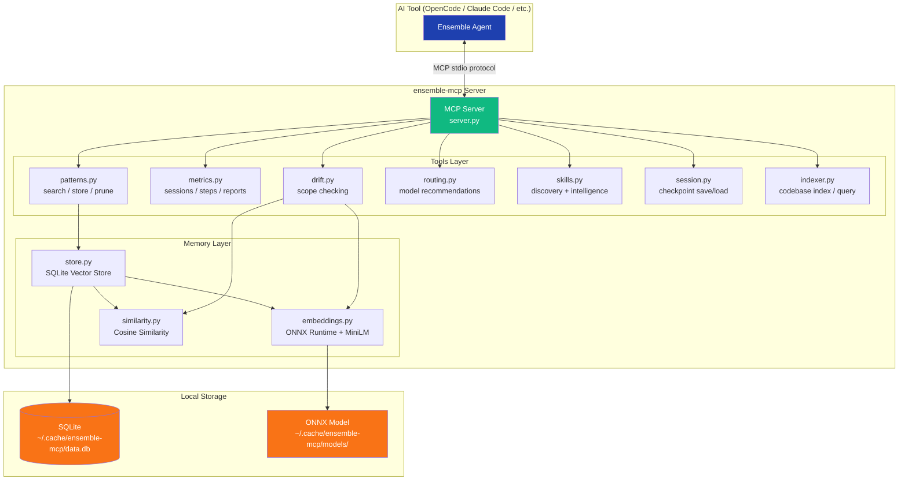
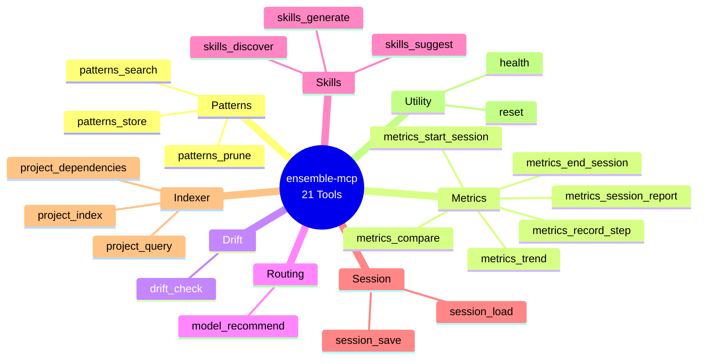

# Ensemble

> Multi-agent orchestration system with a companion Python MCP server for vector memory, cost tracking, drift detection, and codebase indexing.

**Status:** Implementation Complete (Phases 1.0 through 5)
**Version:** 1.0
**Package:** `ensemble-mcp` -- 21 MCP tools across 9 subpackages

---

## What is Ensemble?

Ensemble is a **7-agent pipeline** for AI-assisted software engineering. Each agent has a dedicated role -- planning, implementation, formatting, review, and git operations -- orchestrated by a central captain agent.

**`ensemble-mcp`** is the companion **Python MCP server** that enhances the pipeline with persistent memory, cost visibility, drift detection, smart model routing, and codebase indexing. It works with any MCP-compatible AI tool.

---

## The Problem

The current orchestration system works well but lacks:

- **Memory** -- no learning from past pipelines; same mistakes repeat
- **Cost visibility** -- no unified cross-tool token/cost tracking with confidence metadata
- **Drift detection** -- agents can silently deviate from the plan
- **Smart routing** -- model assignment is static, not task-aware
- **Codebase indexing** -- Scope re-explores from scratch every run, wasting tokens on repeat visits
- **Extensibility** -- no skills/hooks system for project-specific behavior

---

## The Solution

`ensemble-mcp` -- a Python MCP server providing vector memory, hybrid token/cost tracking, drift detection, model routing, codebase indexing, and metrics. Distributed via `uvx` for zero-hassle cross-platform installation. Works with any MCP-compatible AI tool.

---

## Key Features

### Vector Memory
Semantic pattern search using ONNX Runtime + MiniLM-L6-v2 embeddings. Stores learned patterns from past pipelines in SQLite. Returns top-K matches by cosine similarity instead of dumping the full patterns file into context.

### Token & Cost Tracking
Hybrid approach with source-precedence: direct runtime usage (exact) > session file parsers (exact/partial) > tiktoken estimation (fallback). Every metric carries a confidence indicator: `exact`, `partial`, or `estimated`.

### Drift Detection
Cosine similarity between task description embeddings and diff content embeddings. Returns a 0-1 drift score with specific flags for unexpected file changes, unrelated modifications, and scope creep.

### Model Routing
Recommends abstract model tiers (`best`, `mid`, `cheapest`) based on agent role and task classification. Each AI tool maps tiers to its own available models via `team-config.json`.

### Codebase Indexing
File-level project index stored in SQLite -- paths, exports, imports, file roles. Incremental refresh via mtime checks. Scope queries the index instead of manually globbing/grepping, saving ~40-60% exploration tokens on repeat visits.

### Skills Discovery & Intelligence
Scans all tool-native skill locations (`.ai/skills/`, `.claude/skills/`, `.cursor/rules/`, etc.), embeds content into the vector store, and returns relevant skills via semantic search. Cross-tool skill discovery without tools knowing about each other's formats. **Skill Intelligence** automatically detects recurring work patterns and suggests converting them into reusable skill files. Also detects stale/unused skills and suggests removal.

### Session Management
Pipeline checkpoint save/load with optimistic versioning. Explicit lifecycle state machine: `pending -> running -> completed | failed | killed`.

---

## Architecture



---

## Quick Start

### Installation

```bash
uvx ensemble-mcp
```

Zero-hassle: `uvx` auto-downloads Python if not installed. Works on Mac, Linux, and Windows.

### MCP Registration

**OpenCode** (`~/.config/opencode/config.json` or project `config.json`):
```json
{
  "$schema": "https://opencode.ai/config.json",
  "mcp": {
    "ensemble": {
      "type": "local",
      "command": ["uvx", "ensemble-mcp"]
    }
  }
}
```

**Claude Code** (`~/.claude/claude_desktop_config.json`):
```json
{
  "mcpServers": {
    "ensemble": {
      "command": "uvx",
      "args": ["ensemble-mcp"]
    }
  }
}
```

**GitHub Copilot** (`.vscode/mcp.json`):
```json
{
  "servers": {
    "ensemble": {
      "command": "uvx",
      "args": ["ensemble-mcp"]
    }
  }
}
```

**Cursor** (`~/.cursor/mcp.json`):
```json
{
  "mcpServers": {
    "ensemble": {
      "command": "uvx",
      "args": ["ensemble-mcp"]
    }
  }
}
```

---

## MCP Tools (21 total)

All tools return a standardized envelope: `{ ok, data, error, meta: { duration_ms, source, confidence } }`.



| Category | Tools | Description |
|----------|-------|-------------|
| **Patterns** | `patterns_search`, `patterns_store`, `patterns_prune` | Semantic pattern memory -- store, search, and prune learned patterns |
| **Metrics** | `metrics_start_session`, `metrics_record_step`, `metrics_end_session`, `metrics_session_report`, `metrics_trend`, `metrics_compare` | Per-agent token/cost tracking with confidence indicators |
| **Drift** | `drift_check` | Cosine similarity between task and changes, returns 0-1 score |
| **Routing** | `model_recommend` | Recommend model tier based on agent + task classification |
| **Skills** | `skills_discover`, `skills_suggest`, `skills_generate` | Cross-tool skill discovery, auto-suggestion from recurring patterns, stale skill detection |
| **Session** | `session_save`, `session_load` | Pipeline checkpoint persistence with optimistic versioning |
| **Indexer** | `project_index`, `project_query`, `project_dependencies` | Codebase file index, query, and dependency graph |
| **Utility** | `health`, `reset` | Server health check and data reset |

---

## Supported AI Tools

| AI Tool | MCP Config Location | Config Format |
|---------|---------------------|---------------|
| OpenCode | `~/.config/opencode/config.json` or project `config.json` | JSON |
| Claude Code | `~/.claude/claude_desktop_config.json` | JSON |
| GitHub Copilot (VS Code) | `.vscode/mcp.json` | JSON |
| Cursor | `~/.cursor/mcp.json` | JSON |
| Windsurf | `~/.windsurf/mcp.json` | JSON |
| Devin CLI | `~/.devin/mcp.json` | JSON |

---

## Technology Stack

| Component | Choice | Rationale |
|-----------|--------|-----------|
| Language | Python 3.11+ | Best ML ecosystem, user familiarity |
| Distribution | `uvx` (by Astral) | Auto-installs Python, cross-platform, zero-hassle |
| MCP Framework | `mcp` (official SDK) | Standard MCP protocol implementation |
| Embeddings | ONNX Runtime + MiniLM-L6-v2 | ~22MB model, no PyTorch (~2.4GB saved) |
| Vector Storage | SQLite + numpy | Zero external deps, <1ms search over <10K vectors |
| Token Counting | tiktoken | Local BPE tokenizer, ~85-95% accurate fallback |
| Package Size | ~90MB total | Including ONNX runtime + model |

---

## Design Principles

### Zero-LLM-Call
The MCP server makes **zero LLM/API calls**. All intelligence is local: ONNX embeddings (~5ms), numpy cosine similarity, tiktoken counting, SQLite storage. No API keys required, no additional cost, works offline.

### Contract-First API
All tools return a normalized envelope with `ok`, `data`, `error`, and `meta` (including `confidence` and `source`). Error responses use a structured taxonomy (`VALIDATION_*`, `NOT_FOUND_*`, `CONFLICT_*`, `TIMEOUT_*`) with retry guidance.

### Hybrid Token Tracking
Source-precedence model: direct runtime usage (exact) > session file parsers (exact/partial) > tiktoken estimation (fallback). Every metric carries accuracy indicators so users always know how trustworthy the numbers are.

### Idempotent Operations
Mutating tool calls support `idempotency_key`. Replayed keys within a session return the previously committed result instead of applying changes twice.

---

## Implementation Phases

| Phase | Duration | Deliverables |
|-------|----------|-------------|
| **1.0: Contract Foundation** | 1-2 days | Response envelope, error taxonomy, lifecycle state machine, idempotency |
| **1: MCP Core** | 4-5 days | Patterns, drift, routing, codebase indexer tools |
| **2: Metrics System** | 3-4 days | Token tracking, session reports, cost calculation |
| **3: Session Parsers** | 2-3 days | OpenCode + Claude Code session file parsers |
| **4: Auto-Installer** | 2-3 days | AI tool detection, agent copying, MCP registration |
| **5: CLI + Web Dashboard** | 5-7 days | Terminal dashboard + local web UI (Alpine.js + Chart.js) |
| **6: Package & Publish** | 2-3 days | PyPI publishing, Docker image, documentation |

**Total estimated: 22-30 days**

---

## Further Reading

- [Design Specification](DESIGN-SPEC.md) -- Executive summary, current system analysis, improvement priorities
- [Phase 1: Prompt-Level Improvements](references/DESIGN-SPEC-PHASE-01.md) -- Archival reference for prompt-only enhancements (pattern memory protocol, parallel execution, drift detection, hooks, user config)
- [Phase 1: MCP Server Design](DESIGN-SPEC-PHASE-01.md) -- Full implementation spec (tool APIs, schemas, code examples, architecture decisions, risk assessment)
- [Future Plans](FUTURE-PLANS.md) -- Web dashboard, real-time live view, team analytics, report export, CI/CD integration, plugin system, and advanced indexing
