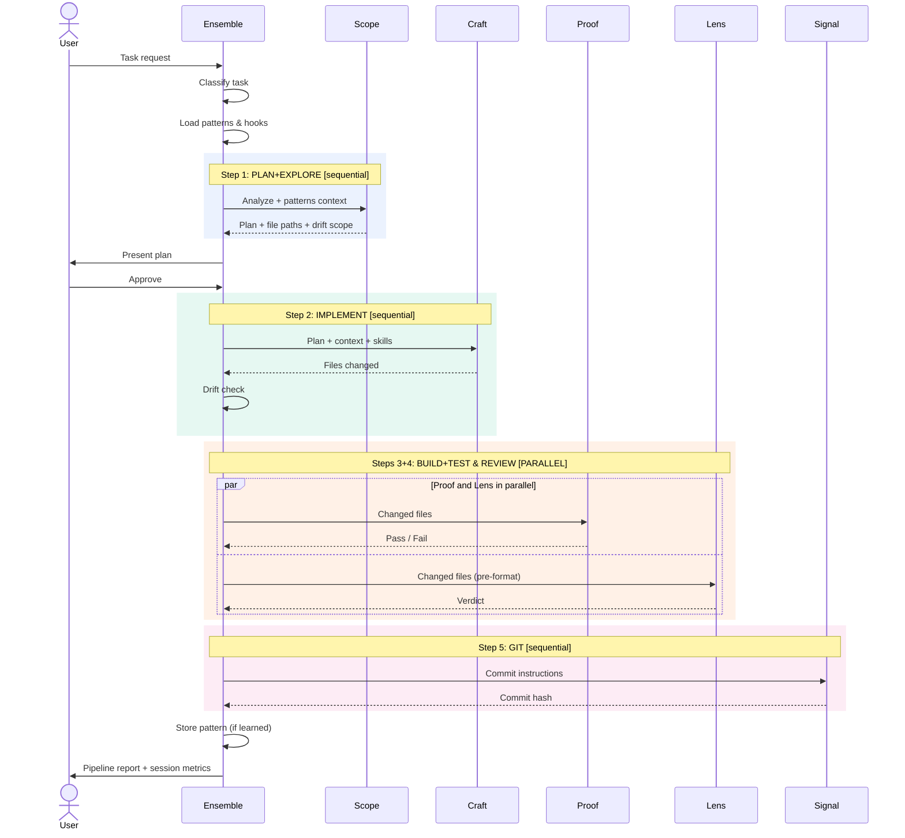
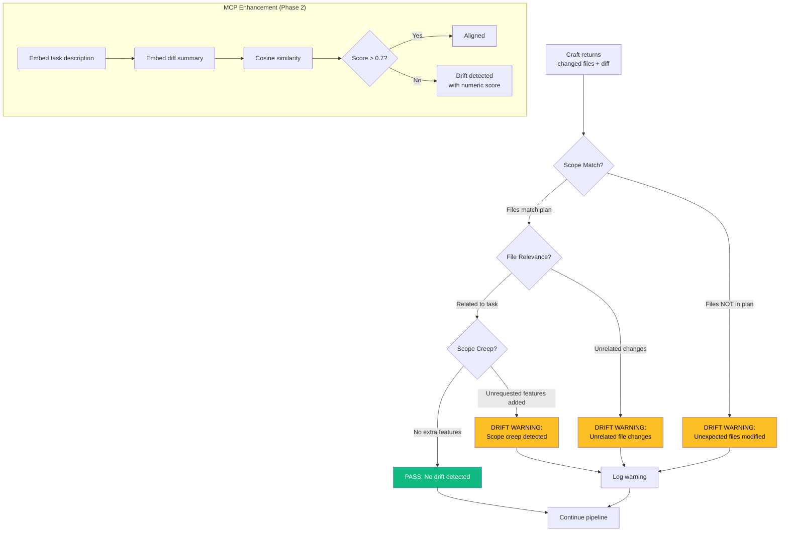
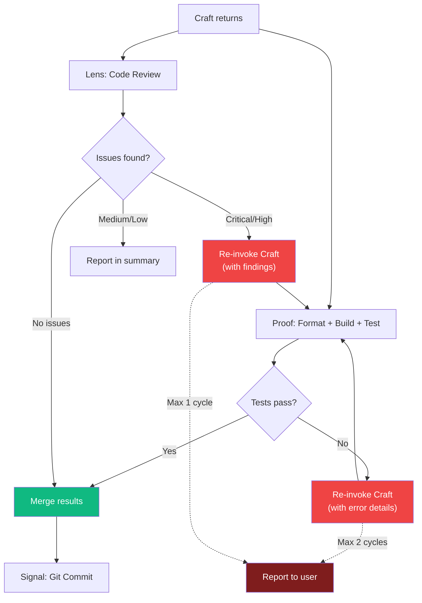
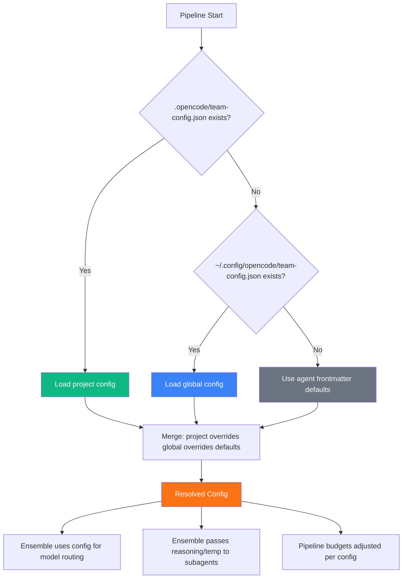

# Ensemble Design Specification - Phase 01

> Extracted from `DESIGN-SPEC.md` for focused implementation of prompt-level improvements.

---

## 4. Phase 1: Prompt-Level Improvements

All improvements in this phase modify only the 7 markdown files. No external dependencies. Works standalone.

### 4.1 Pattern Memory Protocol (Priority A)

**File-based approach (Phase 1):**

The Ensemble reads/writes a flat file at `.opencode/patterns.md` containing learned patterns from past pipelines. Maximum 30 entries to control token cost.

**Pattern format:**

```markdown
## Patterns

### [pattern-name]
- **Context:** [when this pattern applies]
- **Approach:** [what worked / what to do]
- **Outcome:** [result — success, failure, or caveat]
- **Date:** [YYYY-MM-DD]
```

**Ensemble protocol additions:**

```markdown
## Pattern Memory

Before starting the pipeline, check if `.opencode/patterns.md` exists:
1. If it exists, read it and identify patterns relevant to the current task
2. Pass relevant patterns (max 3) as context to Scope
3. After pipeline completes successfully, extract any new pattern learned
4. Append to `.opencode/patterns.md` (max 30 entries; prune oldest if over limit)

**What qualifies as a pattern:**
- A non-obvious solution that worked (e.g. "Vue 2 projects need X config")
- A pitfall that was encountered and resolved
- A project-specific convention discovered during exploration

**What does NOT qualify:**
- Generic coding standards (these are in the agent prompts)
- One-time fixes unlikely to recur
```

**Token cost:** ~3,500 tokens/pipeline to read the full patterns file. Acceptable for Phase 1; MCP vector search reduces this to ~500 tokens in Phase 2.

### 4.2 Parallel Execution (Priority B)

**Decision:** Proof and Lens run in parallel. Lens reviews the logical changes (diffs), not the formatted output. This is safe because Lens is read-only.

#### Improved Pipeline Flow (with Parallel Execution)



**Ensemble prompt changes:**

```markdown
## Parallel Execution

For standard and complex tasks, steps 3 (BUILD+TEST) and 4 (REVIEW) run in parallel:

1. PLAN+EXPLORE → @team-architect [sequential]
2. IMPLEMENT → @team-engineer [sequential]
3+4. BUILD+TEST + REVIEW → @team-forge + @team-inspector [PARALLEL]
5. GIT → @team-shipper [sequential, after both 3+4 complete]

**Parallel rules:**
- Lens reviews the code BEFORE formatting (reviews logical changes, not style)
- If Proof fails, Lens results are still valid (they reviewed the pre-format code)
- If Lens finds critical issues, remediation loop runs after Proof completes
- Both must complete before proceeding to GIT
```

**Note:** Multi-file Craft parallelism (splitting work across multiple Craft invocations) is deferred to v2 due to complexity of merge conflicts and dependency ordering.

### 4.3 Anti-Drift Detection (Priority C)

**Prompt-based approach (Phase 1):**

Three-point verification added to Ensemble's post-agent checks. These are soft warnings, not hard blocks.

#### Drift Detection Flow



**Ensemble prompt additions:**

```markdown
## Drift Detection

After Craft returns, perform a 3-point drift check before proceeding:

1. **Scope match** — Do the files changed match the files Scope identified?
   - If Craft touched files NOT in Scope's plan, flag: "DRIFT WARNING: Craft modified [files] not in plan"
2. **File relevance** — Are the changes related to the task?
   - If a changed file has no clear connection to the task, flag it
3. **No scope creep** — Did Craft add unrequested features?
   - If new functionality beyond the plan was added, flag it

**On drift detection:**
- Log the warning in the pipeline report
- Continue the pipeline (soft warning, not a hard block)
- Include drift warnings in the final report to the user
```

**MCP version (Phase 2):** Uses cosine similarity between the task description embedding and the diff content embedding. Returns a 0-1 drift score. Ensemble can configure a threshold.

### 4.4 Model Routing (Priority D)

**Current state:** Static model assignment in YAML frontmatter.

**Phase 1 improvement:** Add routing hints to Ensemble that recommend model overrides based on task characteristics.

```markdown
## Model Routing Hints

When invoking agents, consider these routing overrides:

- **Simple tasks with straightforward implementation:** Craft can use a mid-tier model
  - Override: set model to mid-tier equivalent
- **Complex tasks requiring deep reasoning:** Scope should use the best available model
  - Default: already uses Opus (global model)
- **Boilerplate/scaffolding tasks:** Craft can use a cheaper model
  - Override: set model to cheapest tier

**Note:** These are hints. The actual model routing is controlled by OpenCode's model configuration.
In Phase 2, the MCP `model_recommend` tool returns abstract tiers (`best`, `mid`, `cheapest`)
that each AI tool maps to its own available models.
```

### 4.5 Skills & Hooks System (Priority E)

**Skills:** Each AI tool (OpenCode, Claude Code, Cursor, Windsurf, Copilot, Devin) has its own native skill/rules system and manages its own skill locations:

| AI Tool | Skill Location | Format |
|---------|---------------|--------|
| OpenCode | `.opencode/skills/` or global skills | Markdown |
| Claude Code | `.claude/skills/` | Markdown |
| Cursor | `.cursor/rules/` | Markdown |
| Windsurf | `.windsurfrules` | Text |
| GitHub Copilot | `.github/copilot-instructions.md` | Markdown |
| Devin | `.devin/` | Markdown |

**Phase 1 approach:** Agent prompts simply say "load skills when relevant" — the underlying AI tool resolves skill locations natively. We do NOT define a `.opencode/skills/` directory or add skill loading protocols to agent prompts. The existing skill references in Craft, Proof, and Lens are already correct and tool-agnostic.

**Phase 2 enhancement (MCP):** The `skills_discover` tool is enhanced to:
1. Scan all known tool-native skill locations in the project
2. Embed skill content into the vector store for semantic search
3. Return relevant skill snippets when agents ask "what skills apply to this task?"
4. Works across tools — a Claude skill about "Laravel testing" is discoverable even from OpenCode

This gives cross-tool skill discovery without requiring tools to know about each other's formats.

**Hooks:** Extensibility points in the pipeline for project-specific behavior.

#### Hooks Design

Four hook points in the pipeline:

| Hook | When | Use Case |
|------|------|----------|
| `pre-pipeline` | Before Step 1 | Load project config, set environment |
| `pre-step` | Before each agent invocation | Inject step-specific context |
| `post-step` | After each agent returns | Custom validation, logging |
| `post-pipeline` | After final step | Cleanup, notifications, pattern extraction |

#### Hook Lifecycle

```mermaid
flowchart LR
    subgraph Pipeline
        direction TB
        PP[pre-pipeline] --> PS1[pre-step]
        PS1 --> S1[Step 1: Scope]
        S1 --> POS1[post-step]
        POS1 --> PS2[pre-step]
        PS2 --> S2[Step 2: Craft]
        S2 --> POS2[post-step]
        POS2 --> PS3[pre-step]
        PS3 --> S3["Steps 3+4: Proof + Lens"]
        S3 --> POS3[post-step]
        POS3 --> PS4[pre-step]
        PS4 --> S4[Step 5: Signal]
        S4 --> POS4[post-step]
        POS4 --> PPO[post-pipeline]
    end

    HC[".opencode/hooks.md"] -.->|reads| PP
    HC -.->|reads| PS1
    HC -.->|reads| POS1
    HC -.->|reads| PPO

    style PP fill:#8B5CF6,color:#fff
    style PPO fill:#8B5CF6,color:#fff
    style PS1 fill:#A78BFA,color:#fff
    style PS2 fill:#A78BFA,color:#fff
    style PS3 fill:#A78BFA,color:#fff
    style PS4 fill:#A78BFA,color:#fff
    style POS1 fill:#C4B5FD,color:#000
    style POS2 fill:#C4B5FD,color:#000
    style POS3 fill:#C4B5FD,color:#000
    style POS4 fill:#C4B5FD,color:#000
```



**Implementation:** Hooks are defined in `.opencode/hooks.md` as instructions Ensemble follows:

```markdown
# .opencode/hooks.md

## pre-pipeline
- Check if Docker containers are running with `docker ps`
- If not running, start them with `docker compose up -d`

## post-pipeline
- Run `php artisan cache:clear` after any config changes
```

### 4.6 Trace (Isolated Agent)

`team-hunter.md` is a **standalone, isolated agent**. It is NOT part of Ensemble's pipeline and is never invoked automatically during the standard flow. Users invoke it manually when they want a dedicated bug scan or code health audit on demand.

**Rationale:** Trace's broad scope (bug detection, code smells, health scoring, architecture analysis) doesn't fit cleanly into the pipeline's step-by-step flow. Keeping it isolated avoids adding complexity and token cost to every pipeline run. Users who want a health check can invoke `@team-hunter` directly.

#### Remediation Loop (Pipeline Only)



### 4.7 User-Configurable Models & Reasoning (Priority F)

**Problem:** Models, reasoning effort, and temperature are hardcoded in agent YAML frontmatter. Users who want different models must edit the agent files directly — error-prone and lost on updates.

**Solution:** A single JSON config file that users customize per-project or globally. Ensemble reads this at pipeline start and applies overrides when invoking subagents.

#### Config File Location

Lookup order (first found wins):
1. **Project-level:** `.opencode/team-config.json` — per-project overrides
2. **Global:** `~/.config/opencode/team-config.json` — user defaults
3. **Fallback:** Agent YAML frontmatter values — zero-config still works

#### Config Schema

```json
{
  "$schema": "https://json-schema.org/draft/2020-12/schema",
  "type": "object",
  "properties": {
    "models": {
      "description": "Map abstract tiers to your available models",
      "type": "object",
      "properties": {
        "best": { "type": "string" },
        "mid": { "type": "string" },
        "cheapest": { "type": "string" }
      }
    },
    "agents": {
      "description": "Per-agent overrides for model tier, reasoning, and temperature",
      "type": "object",
      "patternProperties": {
        "^(ensemble|scope|craft|proof|lens|signal|trace)$": {
          "type": "object",
          "properties": {
            "tier": { "enum": ["best", "mid", "cheapest"] },
            "reasoning": { "enum": ["high", "medium", "low", "none"] },
            "temperature": { "type": "number", "minimum": 0, "maximum": 1 }
          }
        }
      }
    },
    "pipeline": {
      "description": "Pipeline behavior overrides",
      "type": "object",
      "properties": {
        "budgets": {
          "type": "object",
          "properties": {
            "trivial": { "type": "integer" },
            "simple": { "type": "integer" },
            "standard": { "type": "integer" },
            "complex": { "type": "integer" }
          }
        }
      }
    }
  }
}
```

#### Example Configurations

**Cost-conscious setup (use cheaper models where possible):**

```json
{
  "models": {
    "best": "claude-sonnet-4",
    "mid": "claude-haiku-3.5",
    "cheapest": "gpt-5-mini"
  },
  "agents": {
    "scope": { "tier": "best", "reasoning": "high" },
    "craft": { "tier": "best", "reasoning": "medium" },
    "proof": { "tier": "mid", "reasoning": "low" },
    "lens": { "tier": "mid", "reasoning": "medium" },
    "signal": { "tier": "cheapest", "reasoning": "low" }
  }
}
```

**Maximum quality setup:**

```json
{
  "models": {
    "best": "claude-opus-4",
    "mid": "claude-sonnet-4",
    "cheapest": "claude-haiku-3.5"
  },
  "agents": {
    "scope": { "tier": "best", "reasoning": "high", "temperature": 0.6 },
    "craft": { "tier": "best", "reasoning": "high" },
    "proof": { "tier": "mid" },
    "lens": { "tier": "best", "reasoning": "high" },
    "signal": { "tier": "cheapest" }
  }
}
```

**Custom pipeline budgets:**

```json
{
  "pipeline": {
    "budgets": {
      "trivial": 3,
      "simple": 8,
      "standard": 12,
      "complex": 20
    }
  }
}
```

#### Ensemble Prompt Additions

```markdown
## User Configuration

At pipeline start, load the user's configuration:

1. Check for `.opencode/team-config.json` (project-level)
2. If not found, check `~/.config/opencode/team-config.json` (global)
3. If neither exists, use default agent frontmatter values

**Config applies to:**
- `models` → resolves tier names to actual model IDs for model routing
- `agents.<name>.tier` → overrides which model tier an agent uses
- `agents.<name>.reasoning` → overrides reasoning effort for the agent
- `agents.<name>.temperature` → overrides temperature for the agent
- `pipeline.budgets` → overrides invocation limits per classification

**Note:** Config is read once at pipeline start and cached for the session.
If no config exists, everything works with current defaults — zero breaking change.
```

#### How It Integrates



### 4.8 Token Impact Summary (Phase 1)

| Change | Tokens Added | Tokens Saved | Net |
|--------|-------------|-------------|-----|
| Pattern Memory protocol | +120 (Ensemble) | 0 | +120 |
| Parallel Execution rules | +80 (Ensemble) | 0 | +80 |
| Drift Detection | +100 (Ensemble) | 0 | +100 |
| Model Routing hints | +80 (Ensemble) | 0 | +80 |
| Hooks references | +30 (Ensemble) | 0 | +30 |
| User Configuration protocol | +50 (Ensemble) | 0 | +50 |
| **Total** | **+460** | **0** | **+460** |

**Net result:** +460 tokens per pipeline from prompt changes. Acceptable trade-off for the capabilities gained (pattern memory, drift detection, parallel execution, user-configurable models). The user config read itself adds ~200-400 tokens per pipeline depending on config file size, but avoids the need for users to edit agent files.

---
