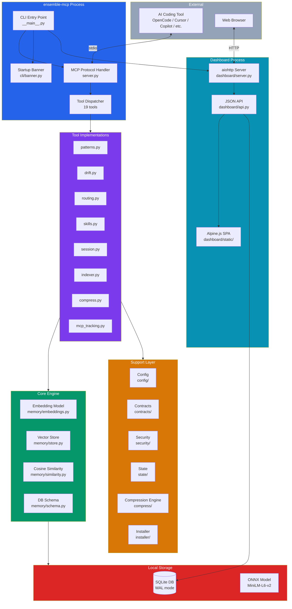

# Architecture Overview

Technical architecture of the `ensemble-mcp` server for contributors and advanced users.

## High-Level Design

`ensemble-mcp` is a Python MCP server that runs locally as a stdio process. It provides 19 tools across 8 categories, all backed by local ONNX embeddings and SQLite storage.



## Package Layout

The project uses a `src` layout with the package at `src/ensemble_mcp/`:

```
src/ensemble_mcp/
├── __init__.py
├── __main__.py          # CLI entry point (argparse, 6 subcommands)
├── server.py            # MCP server setup, tool registration, dispatch
│
├── config/              # Configuration management
│   ├── defaults.py      # Constants, thresholds, paths
│   └── settings.py      # Layered config loader (TOML + env vars)
│
├── contracts/           # Response envelope and error taxonomy
│   ├── envelope.py      # {ok, data, error, meta} wrapper + @tool_handler
│   └── errors.py        # ErrorCode enum, ToolError, retry guidance
│
├── memory/              # Embedding and vector storage
│   ├── embeddings.py    # ONNX Runtime model loading and inference
│   ├── similarity.py    # Cosine similarity, top-K search
│   ├── store.py         # VectorStore class (SQLite + embeddings)
│   └── schema.py        # DDL: CREATE TABLE statements
│
├── security/            # Input/output safety
│   ├── redaction.py     # Secret/PII redaction
│   └── trust.py         # Confirmation requirement enforcement
│
├── state/               # Session and lifecycle management
│   ├── idempotency.py   # Idempotency key check/store
│   ├── lifecycle.py     # SessionState/StepState enums, transitions
│   └── locks.py         # SQLite connection management (WAL, threading)
│
├── tools/               # MCP tool implementations (19 tools)
│   ├── patterns.py      # patterns_search, patterns_store, patterns_prune
│   ├── drift.py         # drift_check
│   ├── routing.py       # model_recommend
│   ├── skills.py        # skills_discover, skills_suggest, skills_generate
│   ├── session.py       # session_save, session_load, session_search
│   ├── indexer.py       # project_index, project_query, project_dependencies, project_snapshot
│   ├── compress.py      # context_compress, context_prepare
│   └── mcp_tracking.py  # Record MCP call history
│
├── compress/            # Context compression engine
│   ├── __init__.py      # Package init, re-exports compress + CompressResult
│   ├── engine.py        # Rule-based text compression pipeline
│   ├── preservers.py    # Regex patterns for preserving technical content
│   └── tokens.py        # Token counting via HuggingFace tokenizer
│
├── installer/           # Auto-installer for AI tools
│   ├── __init__.py      # ToolDefinition, InstallPlan, result types
│   ├── setup.py         # detect → plan → confirm → execute flow
│   ├── registry.py      # Config file read/write (JSON, TOML)
│   └── agents.py        # Agent/skill file discovery and copying
│
├── dashboard/           # Web dashboard
│   ├── __init__.py      # start_dashboard() export
│   ├── server.py        # aiohttp app creation, static file serving
│   ├── api.py           # 25+ JSON API endpoints
│   └── static/          # SPA frontend
│       ├── index.html
│       ├── app.js
│       └── style.css
│
├── cli/                 # Terminal UI
│   └── banner.py        # Startup banner (Rich)
│
└── data/                # Bundled files
    ├── agents/          # 7 agent markdown files
    └── skills/          # Workflow skill file
```

## Subpackage Responsibilities

### `config/`

**Layered settings resolution.** Loads defaults from `defaults.py`, merges global config (`~/.config/ensemble-mcp/config.toml`), project config (`.ensemble-mcp.toml`), and environment variables (`ENSEMBLE_MCP_*`). Scalar values override; maps merge shallowly; lists replace.

### `contracts/`

**Response standardization and error taxonomy.** Every tool returns `{ok, data, error, meta}` via the `@tool_handler` decorator, which handles timing, error wrapping, and the envelope format. Error codes follow a prefix-based taxonomy (`VALIDATION_*`, `NOT_FOUND_*`, `CONFLICT_*`, `TIMEOUT_*`, `IO_*`, `INTERNAL_*`) with built-in retry guidance.

### `memory/`

**ONNX embeddings and vector storage.** Loads the MiniLM-L6-v2 model via ONNX Runtime (~5ms per embedding, 384 dimensions). `VectorStore` manages the SQLite database with schema migrations. Cosine similarity is computed via numpy — brute-force is sufficient for <10K vectors.

### `security/`

**Input safety.** `redaction.py` strips secrets and PII before storage or embedding. `trust.py` enforces confirmation requirements for destructive operations (e.g., `reset` requires `confirm=true`).

### `state/`

**Session lifecycle and idempotency.** Defines state machines for sessions (`pending → running → completed | failed | killed`) and steps (`pending → running → completed | failed | skipped`). Invalid transitions are rejected with `CONFLICT_INVALID_STATE_TRANSITION`. Idempotency keys prevent duplicate execution of mutating tools — keys expire after 24 hours.

### `tools/`

**19 MCP tool implementations.** Each tool is an async function decorated with `@tool_handler`. Tool functions receive the `VectorStore`, `EmbeddingModel`, or `sqlite3.Connection` from the dispatcher in `server.py`. The `mcp_tracking.py` module records every MCP call with tool name, arguments, result, and duration.

### `compress/`

**Rule-based text compression engine.** Removes filler words, articles, hedging phrases, and pleasantries from prose sections while preserving all technical content (code blocks, URLs, file paths, headings, tables). Zero LLM calls.

### `installer/`

**Auto-detection and registration of AI tools.** Defines `ToolDefinition` for 6 supported tools (OpenCode, Claude Code, Copilot, Cursor, Windsurf, Devin CLI) with their config paths, MCP section paths, and server entry formats. The `setup.py` module orchestrates the detect → plan → confirm → execute flow with backup creation.

### `dashboard/`

**Local web dashboard.** An aiohttp server serving an Alpine.js SPA. The API layer (25+ endpoints) opens its own SQLite connections to avoid blocking the MCP server. Read endpoints use `PRAGMA query_only = ON` for safety.

### `cli/`

**Terminal UI.** Currently contains only the startup banner, which uses Rich to display server version, config paths, and database location on stderr.

### `data/`

**Bundled agent and skill files.** The 7-agent orchestration pipeline (`team-ensemble`, `team-scope`, `team-craft`, `team-forge`, `team-trace`, `team-lens`, `team-signal`) and the `ensemble-mcp-workflow` skill file.

## Data Flow

### Tool Call Flow

1. AI tool sends MCP request over stdin
2. `server.py` deserializes the request and routes to `_dispatch_tool()`
3. `_dispatch_tool()` matches the tool name and calls the handler
4. Handler function executes (embedding, DB queries, etc.)
5. `@tool_handler` wraps the result in `{ok, data, error, meta}`
6. `mcp_tracking.py` records the call in `mcp_calls` table
7. Response is serialized to JSON and written to stdout

### Embedding Flow

1. Text input → tokenizer (HuggingFace `tokenizers` library)
2. Token IDs → ONNX Runtime inference (MiniLM-L6-v2)
3. Output → 384-dimensional float32 vector
4. Vector stored as raw bytes in SQLite BLOB column
5. Search: query vector compared against stored vectors via numpy cosine similarity

## Storage Layer

### SQLite Database

Location: `~/.cache/ensemble-mcp/data.db` (WAL mode for concurrent reads)

**Core tables:**
- `patterns` — stored patterns with embeddings and match counts
- `session_checkpoints` — pipeline checkpoints with state JSON and embeddings
- `drift_history` — drift check results with scores and verdicts
- `project_files` — indexed files with language, role, size, mtime
- `file_exports` — extracted exports (functions, classes, etc.)
- `file_imports` — extracted imports per file
- `skill_suggestions` — proposed skill suggestions from clustering
- `skill_suggestion_patterns` — junction table linking suggestions to patterns
- `skill_usage_tracking` — usage metrics for discovered skills
- `skill_file_cache` — cached skill file content and embeddings
- `mcp_calls` — MCP call history for dashboard
- `idempotency_keys` — idempotency key deduplication (24h TTL)
- `project_snapshots` — cached project baseline summaries

### ONNX Model

Location: `~/.cache/ensemble-mcp/models/`

Files:
- `model.onnx` — MiniLM-L6-v2 ONNX model (~22 MB)
- `tokenizer.json` — HuggingFace tokenizer config

Model: `sentence-transformers/all-MiniLM-L6-v2` — 384-dimensional embeddings, downloaded from Hugging Face on first use.

## Extension Points

### Adding a New Tool

1. Create or add to a file in `src/ensemble_mcp/tools/`
2. Implement an async function decorated with `@tool_handler`
3. Add a `Tool` definition in `server.py`'s `TOOL_DEFINITIONS` list
4. Add a case to `_dispatch_tool()` in `server.py`

### Adding a New AI Tool (Installer)

1. Add a `ToolDefinition` to `TOOL_DEFINITIONS` in `src/ensemble_mcp/installer/__init__.py`
2. Define: config format, config path, MCP section path, detection paths, server entry format
3. The installer automatically handles detection, registration, and backup

### Adding Configuration Options

1. Add a constant to `src/ensemble_mcp/config/defaults.py`
2. Add a field to the `Settings` dataclass in `src/ensemble_mcp/config/settings.py`
3. The field is automatically available via TOML config and `ENSEMBLE_MCP_*` env vars

## Design Principles

- **Local-only:** Zero LLM/API calls — all intelligence runs locally (ONNX embeddings, numpy similarity, rule-based compression)
- **Single-file storage:** One SQLite database per user, WAL mode for concurrency
- **Incremental indexing:** mtime-based invalidation avoids re-processing unchanged files
- **Standard envelope:** Every tool returns `{ok, data, error, meta}` with typed error codes
- **Idempotent mutations:** Optional idempotency keys prevent duplicate execution
- **Non-destructive installs:** Config backups are created before any modification

## Next Steps

- [Tool Reference](./tool-reference.md) — complete tool documentation
- [Integration Guide](./integration-guide.md) — using tools in pipelines
- [Configuration](./configuration.md) — all configurable options
