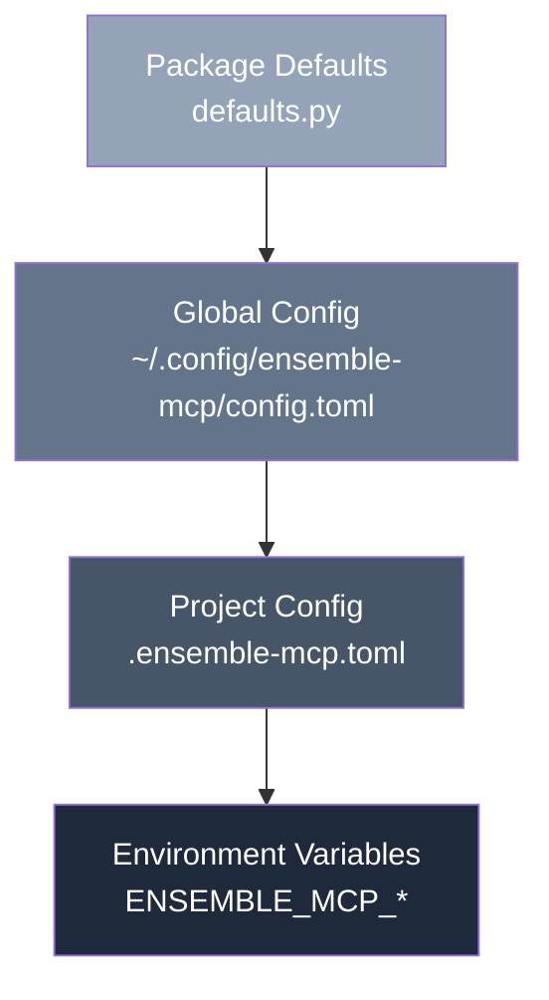

# Configuration

`ensemble-mcp` uses a layered configuration system. Every setting has a sensible default, so configuration is entirely optional.

## Config Layering

Settings are resolved from four sources, each overriding the previous:



| Layer | Source | Scope |
|-------|--------|-------|
| 1. Package defaults | Built into `ensemble_mcp.config.defaults` | Always active |
| 2. Global config | `~/.config/ensemble-mcp/config.toml` | Per-user |
| 3. Project config | `.ensemble-mcp.toml` in project root | Per-project |
| 4. Environment variables | `ENSEMBLE_MCP_*` prefix | Runtime override |

**Merge rules:** Scalar values override. Maps merge shallowly by key. Lists replace entirely.

## Config File Format

Both global and project config files use [TOML](https://toml.io/) format.

### Global Config

Location: `~/.config/ensemble-mcp/config.toml`

```toml
# ensemble-mcp global configuration

# Override database location
db_path = "/custom/path/data.db"

# Pattern memory
max_patterns = 20000
default_top_k = 5
default_min_score = 0.25

# Drift detection thresholds
drift_threshold_aligned = 0.3
drift_threshold_minor = 0.6

# Idempotency
idempotency_key_ttl_hours = 48
```

### Project Config

Location: `.ensemble-mcp.toml` in your project root.

```toml
# Project-specific ensemble-mcp configuration

# Use stricter drift detection for this project
drift_threshold_aligned = 0.2
drift_threshold_minor = 0.5

# Larger skill clusters
default_min_cluster_size = 5
```

## All Settings

| Setting | Type | Default | Description |
|---------|------|---------|-------------|
| `cache_dir` | path | `~/.cache/ensemble-mcp` | Directory for cache data (DB and models) |
| `db_path` | path | `~/.cache/ensemble-mcp/data.db` | Path to the SQLite database file |
| `model_dir` | path | `~/.cache/ensemble-mcp/models` | Directory for ONNX embedding model files |
| `max_patterns` | int | `10000` | Maximum number of stored patterns |
| `default_top_k` | int | `3` | Default number of results for pattern search |
| `default_min_score` | float | `0.3` | Minimum similarity score for pattern matches |
| `default_prune_max_age_days` | int | `90` | Default max age (days) for pruning stale patterns |
| `drift_threshold_aligned` | float | `0.3` | Score threshold below which drift is "aligned" |
| `drift_threshold_minor` | float | `0.6` | Score threshold below which drift is "minor" |
| `cluster_similarity_threshold` | float | `0.75` | Cosine similarity threshold for skill clustering |
| `default_min_cluster_size` | int | `3` | Minimum cluster size for skill suggestions |
| `default_stale_threshold_days` | int | `60` | Days before a skill is considered stale |
| `idempotency_key_ttl_hours` | int | `24` | Hours before idempotency keys expire |

## Environment Variables

Every setting can be overridden via environment variable using the `ENSEMBLE_MCP_` prefix. The field name is uppercased:

```bash
# Override database path
export ENSEMBLE_MCP_DB_PATH="/tmp/ensemble-test.db"

# Override drift threshold
export ENSEMBLE_MCP_DRIFT_THRESHOLD_ALIGNED=0.2

# Override max patterns
export ENSEMBLE_MCP_MAX_PATTERNS=50000
```

**Type coercion rules:**
- Boolean fields accept: `1`, `true`, `yes` (case-insensitive)
- Integer fields are parsed with `int()`
- Float fields are parsed with `float()`
- Path fields are parsed with `Path()`
- Invalid values are silently ignored

## Dashboard Settings Editor

The web dashboard includes a settings editor at the `/settings` page. Changes are written to the global config file (`~/.config/ensemble-mcp/config.toml`).

```bash
ensemble-mcp web
# Navigate to the Settings page in the dashboard
```

## Source Map

When debugging which config source a setting came from, the `Settings` object tracks a `source_map` dict. The dashboard's settings API (`GET /api/settings`) returns this map showing whether each value came from `default`, `global_config`, `project_config`, or `env`.

## Hard-Coded Constants

Some values are not configurable through the settings system:

| Constant | Value | Description |
|----------|-------|-------------|
| `SERVER_NAME` | `ensemble-mcp` | MCP server name |
| `EMBEDDING_DIMENSIONS` | `384` | MiniLM-L6-v2 vector dimensions |
| `DASHBOARD_DEFAULT_PORT` | `8787` | Default dashboard port |
| `DASHBOARD_HOST` | `127.0.0.1` | Dashboard bind address (local only) |
| `COMPRESS_MAX_INPUT_LENGTH` | `100000` | Max chars for context compression |
| `COMPRESS_MIN_INPUT_LENGTH` | `10` | Min chars for context compression |
| `SNAPSHOT_DEFAULT_EXPIRY_HOURS` | `24` | Cache TTL for project snapshots |
| `SNAPSHOT_MAX_FILES_IN_SUMMARY` | `50` | Max files listed in snapshot summary |

## Next Steps

- [CLI Reference](./cli-reference.md) — commands that accept config overrides
- [Tool Reference](./tool-reference.md) — see how config affects tool behavior
- [Troubleshooting](./troubleshooting.md) — debugging config issues
