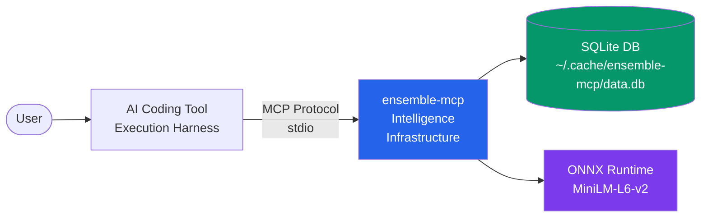

# Getting Started

Get `ensemble-mcp` up and running in under 5 minutes. This guide covers installation, registration with your AI tool, and a first-use walkthrough.

## What Does ensemble-mcp Do?

**Agent = Model + Harness.** Your AI coding tool (Claude Code, Cursor, Copilot, etc.) already provides a harness with filesystem access, bash execution, and a sandbox. ensemble-mcp **extends that harness** with intelligence infrastructure — memory, skills, drift detection, model routing, and context management — delivered seamlessly via MCP.

```
Your AI Tool (execution harness)  +  ensemble-mcp (intelligence layer)
         │                                      │
    Filesystem                             Memory & Search
    Bash / Code                            Skills Discovery
    Sandbox                                Drift Detection
    Browser                                Model Routing
    Git                                    Context Compression
                                           Session Persistence
                                           Codebase Indexing
```

## Prerequisites

- **Python 3.11+** (3.12 and 3.13 also supported)
- **pip** (or [uv](https://docs.astral.sh/uv/) / [pipx](https://pipx.pypa.io/) for isolated installs)
- An AI coding tool that supports MCP: [OpenCode](https://opencode.ai), [Claude Code](https://claude.ai), [GitHub Copilot](https://github.com/features/copilot), [Cursor](https://cursor.sh), [Windsurf](https://windsurf.com), or [Devin CLI](https://devin.ai)

## Quick Install

```bash
pip install ensemble-mcp
```

Or with `uvx` (no install needed — runs directly):

```bash
uvx ensemble-mcp
```

## Register with Your AI Tool

Auto-detect installed AI tools and register the MCP server in their configs:

```bash
ensemble-mcp install
```

This scans for installed tools (OpenCode, Claude Code, Copilot, Cursor, Windsurf, Devin CLI), shows a plan, and asks for confirmation before modifying any config files. Backups are created automatically.

> **Tip:** Use `--dry-run` to preview changes without applying them:
> ```bash
> ensemble-mcp install --dry-run
> ```

## Verify the Server

Run the server directly to confirm everything works:

```bash
ensemble-mcp
```

You should see a startup banner on stderr:

```
ensemble-mcp v0.1.0b7
  Config:   ~/.config/ensemble-mcp/config.toml
  Database: ~/.cache/ensemble-mcp/data.db
  Models:   ~/.cache/ensemble-mcp/models

Server started — listening on stdio
```

The first run downloads the ONNX embedding model (~22 MB) to `~/.cache/ensemble-mcp/models/`.

## How It Works

ensemble-mcp runs as a local MCP server that your AI tool connects to via stdio. It extends your agent's harness with intelligence primitives — all processing happens locally with zero API calls:



All processing is **local** — no API calls, no cloud services. The ONNX embedding model runs in ~5ms per embedding, and all data stays in a local SQLite database.

## First Use Example

Once registered, your AI tool can invoke ensemble-mcp's harness tools automatically. Here's a typical first interaction:

1. **Index your project** — the AI tool calls `project_index` to build codebase awareness
2. **Search for patterns** — `patterns_search` finds relevant past solutions (memory & search)
3. **Discover skills** — `skills_discover` loads task-relevant skills (progressive disclosure)
4. **Check drift** — during implementation, `drift_check` ensures changes stay on task (self-verification)
5. **Save progress** — `session_save` creates checkpoints for long horizon execution

You can also explore your data through the web dashboard:

```bash
ensemble-mcp web
```

This opens a browser at `http://127.0.0.1:8787` showing patterns, sessions, drift history, indexed projects, and more.

## Next Steps

- [Installation Guide](./installation.md) — detailed install options (Docker, from source)
- [CLI Reference](./cli-reference.md) — all commands and flags
- [Configuration](./configuration.md) — customize thresholds, paths, and behavior
- [MCP Client Setup](./mcp-clients.md) — per-tool registration details
- [Tool Reference](./tool-reference.md) — all 19 MCP tools documented
