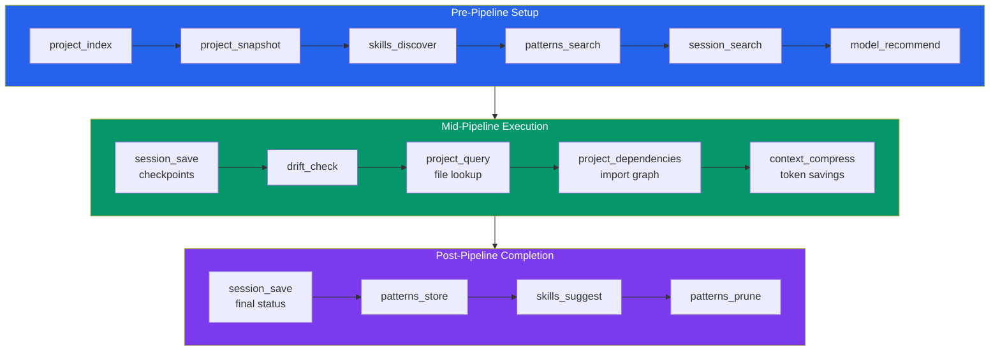

# Integration Guide

How to integrate `ensemble-mcp` into AI agent pipelines. This guide covers the recommended tool invocation patterns for each phase of a development pipeline.

## Overview

`ensemble-mcp` provides 19 tools that augment AI agent pipelines with memory, drift detection, model routing, and codebase intelligence. All processing is local — no external API calls.



---

## Pre-Pipeline Phase

Before starting the main implementation work, set up context and gather intelligence.

### 1. Index the Project

Build or refresh the codebase index so `project_query` and `project_dependencies` work:

```json
{
  "tool": "project_index",
  "arguments": {
    "project_path": "/path/to/project"
  }
}
```

The index is incremental — only changed files are re-processed. Use `force: true` for a full rebuild.

### 2. Get Project Snapshot

Generate a compact baseline summary of the project:

```json
{
  "tool": "project_snapshot",
  "arguments": {
    "project_path": "/path/to/project"
  }
}
```

Returns language, framework, conventions, directory structure, test setup, build tools, and key files. Cached for 24 hours with mtime-based invalidation.

### 3. Discover Skills

Find relevant skill files that provide domain-specific instructions:

```json
{
  "tool": "skills_discover",
  "arguments": {
    "project_path": "/path/to/project",
    "query": "testing patterns for REST APIs"
  }
}
```

### 4. Search for Past Patterns

Find similar past solutions before starting new work:

```json
{
  "tool": "patterns_search",
  "arguments": {
    "query": "add user authentication with JWT",
    "top_k": 5,
    "project": "/path/to/project",
    "detail_level": "index"
  }
}
```

Use `detail_level: "index"` for a compact scan (~10x fewer tokens), then fetch full details for relevant matches with `detail_level: "full"` (the default). You can also filter by `category` (e.g., `"gotcha"`, `"problem-solution"`).

### 5. Search Past Sessions

Find relevant previous pipeline sessions:

```json
{
  "tool": "session_search",
  "arguments": {
    "query": "authentication implementation",
    "project": "/path/to/project",
    "status": "completed"
  }
}
```

### 6. Choose Model Tier

Get a model recommendation for the current agent and task:

```json
{
  "tool": "model_recommend",
  "arguments": {
    "agent": "craft",
    "task_classification": "standard",
    "task_description": "Add JWT authentication to the API"
  }
}
```

---

## Mid-Pipeline Phase

During implementation, use checkpoints, drift detection, and code intelligence.

### Session Checkpoints

Save progress regularly so work can be resumed if interrupted:

```json
{
  "tool": "session_save",
  "arguments": {
    "session_id": "session-abc-123",
    "state": {
      "current_step": "implementing auth middleware"
    },
    "original_request": "Add JWT authentication to the API",
    "completed_steps": ["created user model", "added login endpoint"],
    "remaining_steps": ["add middleware", "write tests"],
    "files_changed": ["src/auth/middleware.py", "src/models/user.py"],
    "task_classification": "standard",
    "status": "running",
    "project": "/path/to/project"
  }
}
```

The `version` field enables optimistic locking — pass the current version to detect concurrent modifications:

```json
{
  "tool": "session_save",
  "arguments": {
    "session_id": "session-abc-123",
    "state": { ... },
    "version": 2
  }
}
```

### Drift Detection

After making changes, check if the implementation drifted from the original task:

```json
{
  "tool": "drift_check",
  "arguments": {
    "task_description": "Add JWT authentication to the API",
    "changed_files": [
      "src/auth/middleware.py",
      "src/models/user.py",
      "migrations/001_add_users.sql",
      "src/config/database.py"
    ],
    "diff_summary": "Added user model, login endpoint, JWT middleware, and database config changes"
  }
}
```

Act on the verdict:
- **`aligned`** (score < 0.3) — continue normally
- **`minor_drift`** (score < 0.6) — review the flagged files
- **`significant_drift`** (score ≥ 0.6) — stop and reassess scope

### File Lookup

Query the index to find relevant files:

```json
{
  "tool": "project_query",
  "arguments": {
    "project_path": "/path/to/project",
    "query": "authentication middleware",
    "file_types": ["python"]
  }
}
```

### Dependency Analysis

Check what a file imports and what imports it:

```json
{
  "tool": "project_dependencies",
  "arguments": {
    "project_path": "/path/to/project",
    "file_path": "src/auth/middleware.py"
  }
}
```

### Context Compression

Reduce token usage when passing large context to LLMs:

```json
{
  "tool": "context_compress",
  "arguments": {
    "text": "Long verbose text that needs to be compressed..."
  }
}
```

### Context Preparation

Order prompt sections for optimal LLM cache hit rates:

```json
{
  "tool": "context_prepare",
  "arguments": {
    "sections": [
      {
        "name": "system-prompt",
        "content": "You are a senior engineer...",
        "priority": "static"
      },
      {
        "name": "project-conventions",
        "content": "This project uses FastAPI...",
        "priority": "project"
      },
      {
        "name": "current-task",
        "content": "Add JWT authentication...",
        "priority": "task"
      }
    ],
    "compress_sections": true
  }
}
```

---

## Post-Pipeline Phase

After completing the task, store lessons learned and maintain the pattern database.

### Final Session Save

Mark the session as completed with final state:

```json
{
  "tool": "session_save",
  "arguments": {
    "session_id": "session-abc-123",
    "state": {
      "result": "success",
      "summary": "Added JWT authentication with middleware and tests"
    },
    "status": "completed",
    "completed_steps": ["created user model", "added login endpoint", "added middleware", "wrote tests"],
    "remaining_steps": [],
    "files_changed": [
      "src/auth/middleware.py",
      "src/models/user.py",
      "tests/test_auth.py"
    ]
  }
}
```

### Store Pattern

Record the successful approach for future reference:

```json
{
  "tool": "patterns_store",
  "arguments": {
    "name": "jwt-auth-fastapi",
    "context": "Adding JWT authentication to a FastAPI application",
    "approach": "Created User model, login endpoint with token generation, and middleware for route protection",
    "outcome": "Successfully added auth with 95% test coverage",
    "project": "/path/to/project",
    "category": "how-it-works"
  }
}
```

### Suggest Skills

Detect recurring patterns that could become reusable skills:

```json
{
  "tool": "skills_suggest",
  "arguments": {
    "project_path": "/path/to/project",
    "min_cluster_size": 3
  }
}
```

### Prune Old Patterns

Clean up stale, unused patterns:

```json
{
  "tool": "patterns_prune",
  "arguments": {
    "max_age_days": 90
  }
}
```

---

## Pipeline Resumption

When a pipeline is interrupted and needs to resume:

1. **Load the checkpoint:**
   ```json
   {
     "tool": "session_load",
     "arguments": {
       "session_id": "session-abc-123"
     }
   }
   ```

2. **Read the resume context** from the loaded state's `resume` key (includes `context_for_resume`, `remaining_steps`, `decisions`, etc.)

3. **Continue from the last completed step** without re-deriving context

---

## Idempotency in Pipelines

For pipeline steps that might be retried (e.g., after a crash), use idempotency keys:

```json
{
  "tool": "patterns_store",
  "arguments": {
    "name": "jwt-auth-fastapi",
    "context": "...",
    "approach": "...",
    "outcome": "...",
    "idempotency_key": "pipeline-abc-123-store-pattern"
  }
}
```

Replayed calls with the same key return the original result without re-executing.

---

## Multi-Agent Pipeline Example

In a multi-agent orchestration (e.g., the 7-agent ensemble pipeline):

| Phase | Agent | Tools Used |
|-------|-------|-----------|
| Planning | Ensemble (orchestrator) | `model_recommend`, `session_search`, `patterns_search` |
| Exploration | Scope (planner) | `project_index`, `project_snapshot`, `project_query`, `skills_discover` |
| Implementation | Craft (code writer) | `project_dependencies`, `context_compress`, `session_save` |
| Verification | Forge (test runner) | `drift_check`, `session_save` |
| Review | Lens (code review) | `context_prepare`, `drift_check` |
| Debugging | Trace (bug hunter) | `project_query`, `patterns_search` |
| Completion | Signal (git ops) | `session_save` (final), `patterns_store` |

## Next Steps

- [Tool Reference](./tool-reference.md) — detailed parameter docs for every tool
- [Architecture Overview](./architecture-overview.md) — how the system is built
- [Configuration](./configuration.md) — tune thresholds for your workflow
