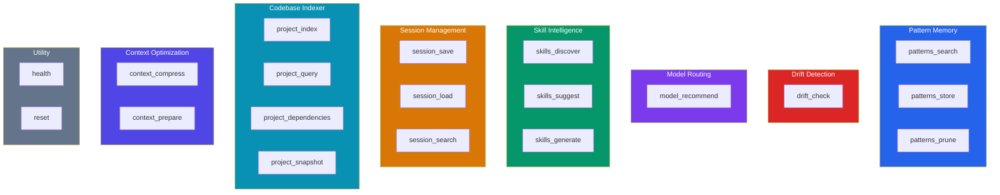

# Tool Reference

Complete reference for all 19 MCP tools provided by `ensemble-mcp`, grouped by category. Every tool returns the standard response envelope.

## Response Envelope

All tools return a JSON object with this structure:

```json
{
  "ok": true,
  "data": { ... },
  "error": null,
  "meta": {
    "duration_ms": 5,
    "source": "sqlite",
    "confidence": "exact"
  }
}
```

On error:

```json
{
  "ok": false,
  "data": null,
  "error": {
    "code": "VALIDATION_MISSING_FIELD",
    "message": "...",
    "retryable": false,
    "details": { ... }
  },
  "meta": { ... }
}
```

## Response Meta Fields

Every response includes a `meta` object with three fields:

| Field | Type | Description |
|-------|------|-------------|
| `duration_ms` | integer | Processing time in milliseconds |
| `source` | string | Where the data came from. Values: `"local"`, `"sqlite"` |
| `confidence` | string | Result quality indicator. Values: `"exact"`, `"partial"`, `"estimated"` |

A `confidence` of `"partial"` typically means a scan or index operation encountered non-fatal errors and returned incomplete results. `"estimated"` indicates the result is based on heuristics rather than precise computation.

## Tool Categories



---

## Pattern Memory (3 tools)

### `patterns_search`

Search stored patterns by semantic similarity. Returns top-K matches above the minimum score threshold. Increments `match_count` and updates `last_matched_at` on returned patterns (used by `patterns_prune` to identify unused patterns).

Supports **progressive disclosure** via `detail_level` and **category filtering** via `category`. Results include `token_count` metadata (approximate token cost of the pattern text).

| Parameter | Type | Required | Default | Description |
|-----------|------|----------|---------|-------------|
| `query` | string | **yes** | — | Semantic search query |
| `top_k` | integer | no | `3` | Max results (1–100) |
| `project` | string | no | — | Optional project scope |
| `detail_level` | string | no | `"full"` | `"index"` for compact metadata only; `"full"` for complete pattern text |
| `category` | string | no | — | Filter by category: `gotcha`, `problem-solution`, `how-it-works`, `what-changed`, `discovery`, `decision`, `trade-off`, `general` |
| `idempotency_key` | string | no | — | Optional idempotency key |

**Response data (detail_level="full"):**

```json
{
  "matches": [
    {
      "id": 1,
      "name": "pattern-name",
      "context": "when this applies",
      "approach": "what was done",
      "outcome": "what happened",
      "category": "problem-solution",
      "score": 0.85,
      "token_count": 42
    }
  ]
}
```

**Response data (detail_level="index"):**

```json
{
  "matches": [
    {
      "id": 1,
      "name": "pattern-name",
      "category": "problem-solution",
      "score": 0.85,
      "token_count": 42
    }
  ]
}
```

#### Possible Errors

| Error Code | Cause |
|------------|-------|
| `VALIDATION_INVALID_VALUE` | `top_k` out of range (1–100) or invalid `detail_level` value |

---

### `patterns_store`

Store a new pattern from a successful pipeline for future semantic search. The pattern text is embedded using the ONNX model and stored in SQLite.

Text fields are redacted for secrets before persistence (common secret patterns like API keys, tokens, and passwords are automatically stripped).

| Parameter | Type | Required | Default | Description |
|-----------|------|----------|---------|-------------|
| `name` | string | **yes** | — | Short pattern name |
| `context` | string | **yes** | — | When this pattern applies |
| `approach` | string | **yes** | — | What approach was used |
| `outcome` | string | **yes** | — | What happened (success/failure) |
| `project` | string | no | — | Optional project scope |
| `category` | string | no | `"general"` | Pattern category: `gotcha`, `problem-solution`, `how-it-works`, `what-changed`, `discovery`, `decision`, `trade-off`, `general` |
| `idempotency_key` | string | no | — | Optional idempotency key |

**Response data:**

```json
{
  "id": 42,
  "stored": true,
  "category": "problem-solution"
}
```

#### Possible Errors

| Error Code | Cause |
|------------|-------|
| `VALIDATION_MISSING_FIELD` | A required field (`name`, `context`, `approach`, or `outcome`) is empty |
| `VALIDATION_INVALID_VALUE` | Invalid `category` value |

---

### `patterns_prune`

Remove old/unused patterns (zero `match_count`, older than `max_age_days`).

| Parameter | Type | Required | Default | Description |
|-----------|------|----------|---------|-------------|
| `max_age_days` | integer | no | `90` | Max age in days (1–3650) |
| `idempotency_key` | string | no | — | Optional idempotency key |

**Response data:**

```json
{
  "pruned": 5,
  "remaining": 42
}
```

#### Possible Errors

None — this tool always succeeds.

---

## Drift Detection (1 tool)

### `drift_check`

Check if code changes drift from the original task. Embeds both the task description and the diff summary, then computes cosine similarity. Returns a 0–1 score (0 = no drift, 1 = complete drift) with specific flags and a verdict.

Also flags suspicious file changes (migrations, configs, etc.) that don't match the task description.

| Parameter | Type | Required | Default | Description |
|-----------|------|----------|---------|-------------|
| `task_description` | string | **yes** | — | The original task being worked on |
| `changed_files` | array[string] | **yes** | — | List of changed file paths |
| `diff_summary` | string | **yes** | — | Summary of the code changes |
| `idempotency_key` | string | no | — | Optional idempotency key |

**Response data:**

```json
{
  "score": 0.25,
  "similarity": 0.75,
  "flags": ["Unexpected file change: migrations/001.sql"],
  "verdict": "aligned"
}
```

**Verdicts:**
- `aligned` — score < 0.3 (configurable via `drift_threshold_aligned`)
- `minor_drift` — score < 0.6 (configurable via `drift_threshold_minor`)
- `significant_drift` — score ≥ 0.6

**Suspicious file detection:** Files matching patterns like `migration`, `schema`, `config`, `.env`, `package.json`, `composer.json` are flagged if their path has low similarity (< 0.3) to the task description.

Results are persisted to the `drift_history` table for dashboard viewing.

#### Possible Errors

None — this tool always succeeds.

---

## Model Routing (1 tool)

### `model_recommend`

Recommend a model tier (best/mid/cheapest) for an agent and task. Uses a rule-based routing table mapping `(agent, classification)` pairs to tiers.

| Parameter | Type | Required | Default | Description |
|-----------|------|----------|---------|-------------|
| `agent` | string | **yes** | — | Agent name (e.g., `craft`, `scope`, `signal`) |
| `task_classification` | string | **yes** | — | `trivial`, `simple`, `standard`, or `complex` |
| `task_description` | string | no | — | Reserved for future routing logic |
| `idempotency_key` | string | no | — | Optional idempotency key |

**Response data:**

```json
{
  "tier": "best",
  "reason": "Complex task requiring strongest reasoning capability",
  "agent": "craft",
  "classification": "complex"
}
```

**Tier meanings:**

| Tier | Meaning | Example Models |
|------|---------|----------------|
| `best` | Use the most capable model | claude-opus-4, o1 |
| `mid` | Balanced cost/quality | claude-sonnet-4, gpt-4o |
| `cheapest` | Minimize cost | claude-haiku-3.5, gpt-4o-mini |

**Routing table (built-in agents):**

| Agent | trivial | simple | standard | complex |
|-------|---------|--------|----------|---------|
| signal | cheapest | cheapest | cheapest | cheapest |
| proof | cheapest | cheapest | mid | mid |
| lens | cheapest | cheapest | mid | mid |
| craft | mid | mid | best | best |
| scope | mid | mid | best | best |
| ensemble | mid | mid | best | best |
| trace | mid | best | best | best |

Unknown agents default to `mid` tier.

#### Possible Errors

None — unknown classification values default to `mid` tier.

---

## Skill Intelligence (3 tools)

### `skills_discover`

Scan tool-native skill locations and return relevant skills via semantic search. Scans these directories:

- `.ai/skills/`
- `.claude/skills/`
- `.cursor/rules/`
- `.github/copilot-instructions/`
- `.opencode/skills/`

Uses mtime-based caching — file reads and embedding computation are skipped for unchanged files.

**Caching behavior:** The first call indexes skill files and computes embeddings (slower). Subsequent calls reuse cached data from SQLite and only re-process files that have changed on disk. Deleted files are automatically cleaned up from the cache.

| Parameter | Type | Required | Default | Description |
|-----------|------|----------|---------|-------------|
| `project_path` | string | **yes** | — | Absolute path to the project |
| `query` | string | no | — | Optional semantic search query |
| `idempotency_key` | string | no | — | Optional idempotency key |

**Response data:**

```json
{
  "detected": [
    {
      "name": "my-skill",
      "source_tool": "opencode",
      "path": ".opencode/skills/my-skill/SKILL.md",
      "confidence": 0.85
    }
  ],
  "snippets": [
    {
      "content": "First 500 chars of skill content...",
      "relevance": 0.85
    }
  ]
}
```

> **Note:** The `snippets` field is only present when a `query` parameter is provided. Without a query, only `detected` is returned.

#### Possible Errors

| Error Code | Cause |
|------------|-------|
| `NOT_FOUND_PROJECT` | `project_path` directory does not exist |

---

### `skills_suggest`

Detect recurring patterns and suggest them as reusable skills. Clusters patterns by embedding similarity (≥ 0.75 threshold) and proposes clusters with ≥ `min_cluster_size` members as skill suggestions.

| Parameter | Type | Required | Default | Description |
|-----------|------|----------|---------|-------------|
| `project_path` | string | **yes** | — | Absolute path to the project |
| `min_cluster_size` | integer | no | `3` | Minimum cluster size (2–50) |
| `stale_threshold_days` | integer | no | `60` | Days before a skill is stale (1–3650) |
| `idempotency_key` | string | no | — | Optional idempotency key |

**Response data:**

```json
{
  "suggestions": [
    {
      "id": 1,
      "pattern_ids": [5, 12, 18],
      "theme": "Cluster of 3 similar patterns",
      "confidence": 0.82,
      "proposed_name": "testing-patterns-api",
      "proposed_content": "# testing-patterns-api\n..."
    }
  ],
  "stale_skills": [
    {
      "path": ".ai/skills/old-skill.md",
      "last_matched_at": "2025-01-15T10:00:00",
      "days_unused": 90
    }
  ]
}
```

#### Possible Errors

| Error Code | Cause |
|------------|-------|
| `NOT_FOUND_PROJECT` | `project_path` directory does not exist |

---

### `skills_generate`

Accept, dismiss, or defer a skill suggestion.

| Parameter | Type | Required | Default | Description |
|-----------|------|----------|---------|-------------|
| `suggestion_id` | integer | **yes** | — | Suggestion ID (≥ 1) |
| `action` | string | no | `accept` | `accept`, `dismiss`, or `defer` |
| `output_dir` | string | no | `.ai/skills/` | Directory for generated skill file |
| `idempotency_key` | string | no | — | Optional idempotency key |

**Response data (accept):**

```json
{
  "generated": true,
  "path": ".ai/skills/testing-patterns-api.md",
  "content": "# testing-patterns-api\n...",
  "status": "accepted"
}
```

**Response data (dismiss/defer):**

```json
{
  "generated": false,
  "status": "dismissed"
}
```

#### Possible Errors

| Error Code | Cause |
|------------|-------|
| `NOT_FOUND_SKILL_SUGGESTION` | `suggestion_id` does not exist |
| `CONFLICT_ALREADY_RESOLVED` | Suggestion was already accepted or dismissed |
| `VALIDATION_INVALID_VALUE` | `action` is not one of `accept`, `dismiss`, or `defer` |

---

## Session Management (3 tools)

### `session_save`

Save pipeline checkpoint state with optimistic versioning. When `original_request` is provided, an embedding is generated for semantic search via `session_search`.

| Parameter | Type | Required | Default | Description |
|-----------|------|----------|---------|-------------|
| `session_id` | string | **yes** | — | Unique session identifier |
| `state` | object | **yes** | — | Pipeline state to checkpoint |
| `version` | integer | no | — | Expected version for optimistic lock |
| `original_request` | string | no | — | User's original request (enables semantic search) |
| `decisions` | array[string] | no | — | Key decisions made during the pipeline |
| `completed_steps` | array[string] | no | — | Steps completed so far |
| `remaining_steps` | array[string] | no | — | Steps remaining to complete |
| `files_changed` | array[string] | no | — | Files modified during the pipeline |
| `errors` | array[string] | no | — | Errors encountered during the pipeline |
| `context_for_resume` | string | no | — | Key context needed to resume without re-deriving |
| `task_classification` | string | no | — | `trivial`, `simple`, `standard`, or `complex` |
| `status` | string | no | `running` | Pipeline status (`pending`, `running`, `completed`, `failed`, `killed`) |
| `project` | string | no | — | Project path for scoped search |
| `idempotency_key` | string | no | — | Optional idempotency key |

#### Version Behavior

- **First save:** version starts at 1
- **Without `version` param:** auto-increments from the current version
- **With `version` param:** must match the current version in the database, otherwise `CONFLICT_VERSION_MISMATCH` is returned

**Response data:**

```json
{
  "saved": true,
  "version": 3
}
```

#### Possible Errors

| Error Code | Cause |
|------------|-------|
| `CONFLICT_VERSION_MISMATCH` | Provided `version` does not match the current version in the database |
| `VALIDATION_MISSING_FIELD` | A required field (`session_id` or `state`) is missing |

---

### `session_load`

Load latest or specific pipeline checkpoint.

| Parameter | Type | Required | Default | Description |
|-----------|------|----------|---------|-------------|
| `session_id` | string | no | — | Load specific session. Omit for latest. |

**Response data (found):**

```json
{
  "found": true,
  "session_id": "abc-123",
  "state": { ... },
  "version": 3,
  "original_request": "Add user authentication",
  "task_classification": "standard",
  "status": "running",
  "project": "/path/to/project"
}
```

**Response data (not found):**

```json
{
  "found": false
}
```

#### Possible Errors

None — returns `found: false` if session does not exist.

---

### `session_search`

Search sessions by semantic similarity. Embeds the query and compares against stored session embeddings using cosine similarity.

> **Note:** Only sessions saved with an `original_request` (which generates an embedding) are searchable. Sessions without embeddings are excluded from search results.

| Parameter | Type | Required | Default | Description |
|-----------|------|----------|---------|-------------|
| `query` | string | **yes** | — | Semantic search query |
| `top_k` | integer | no | `5` | Max results (1–100) |
| `project` | string | no | — | Filter by project |
| `status` | string | no | — | Filter by status (e.g., `running`, `completed`) |
| `idempotency_key` | string | no | — | Optional idempotency key |

**Response data:**

```json
{
  "matches": [
    {
      "session_id": "abc-123",
      "score": 0.82,
      "version": 3,
      "created_at": "2025-03-15T10:00:00",
      "original_request": "Add user authentication",
      "task_classification": "standard",
      "status": "completed",
      "project": "/path/to/project"
    }
  ]
}
```

#### Possible Errors

None — returns empty matches if no results found.

---

## Codebase Indexer (4 tools)

### `project_index`

Build or refresh the codebase index. Scans the filesystem, extracts language, role, exports, and imports for each file. Uses mtime-based incremental indexing.

| Parameter | Type | Required | Default | Description |
|-----------|------|----------|---------|-------------|
| `project_path` | string | **yes** | — | Absolute path to the project |
| `force` | boolean | no | `false` | Force full re-index |
| `idempotency_key` | string | no | — | Optional idempotency key |

**Supported languages (28):** Python, TypeScript, JavaScript, PHP, Go, Rust, Ruby, Java, Kotlin, Swift, C, C++, C#, Vue, Svelte, HTML, CSS, SCSS, LESS, JSON, YAML, TOML, XML, Markdown, SQL, Shell, Dockerfile, Terraform

**Ignored directories:** `node_modules`, `vendor`, `.git`, `__pycache__`, `.mypy_cache`, `.ruff_cache`, `.pytest_cache`, `dist`, `build`, `.next`, `.nuxt`, `target`, `.tox`, `.venv`, `venv`, `env`, `.env`

**Ignored extensions:** `.pyc`, `.pyo`, `.so`, `.dylib`, `.dll`, `.exe`, `.bin`, `.wasm`, `.jpg`, `.jpeg`, `.png`, `.gif`, `.svg`, `.ico`, `.woff`, `.woff2`, `.ttf`, `.eot`, `.mp3`, `.mp4`, `.avi`, `.mov`, `.zip`, `.tar`, `.gz`, `.lock`

#### Possible Errors

| Error Code | Cause |
|------------|-------|
| `NOT_FOUND_PROJECT` | `project_path` directory does not exist |
| `TIMEOUT_INDEX` | Indexing operation timed out |

---

### `project_query`

Query the project index — find files by type, path pattern, or semantic query.

| Parameter | Type | Required | Default | Description |
|-----------|------|----------|---------|-------------|
| `project_path` | string | **yes** | — | Absolute path to the project |
| `query` | string | no | — | Semantic search query |
| `file_types` | array[string] | no | — | Filter by file types (e.g., `["python", "typescript"]`) |
| `path_pattern` | string | no | — | Glob pattern for file paths |

#### Possible Errors

None — returns empty `files` array if project not found or not indexed.

---

### `project_dependencies`

Get the import/dependency graph for a specific file.

| Parameter | Type | Required | Default | Description |
|-----------|------|----------|---------|-------------|
| `project_path` | string | **yes** | — | Absolute path to the project |
| `file_path` | string | **yes** | — | Relative path to the file |

#### Possible Errors

| Error Code | Cause |
|------------|-------|
| `NOT_FOUND_PROJECT` | `project_path` directory does not exist or has not been indexed |
| `NOT_FOUND_FILE` | File not found in the index (run `project_index` first) |

---

### `project_snapshot`

Generate a compact project baseline summary from the codebase index. Returns language, framework, conventions, directory structure, test setup, build tools, and key files. Results are cached with mtime-based invalidation (24-hour expiry).

| Parameter | Type | Required | Default | Description |
|-----------|------|----------|---------|-------------|
| `project_path` | string | **yes** | — | Absolute path to the project |
| `force` | boolean | no | `false` | Force regeneration even if cached |
| `idempotency_key` | string | no | — | Optional idempotency key |

#### Possible Errors

| Error Code | Cause |
|------------|-------|
| `NOT_FOUND_PROJECT` | Project not indexed (run `project_index` first) |

---

## Context Optimization (2 tools)

### `context_compress`

Compress verbose natural language text into terse, token-efficient form while preserving all technical content (code blocks, URLs, file paths, headings, tables). Rule-based, zero LLM calls.

Typical savings are **~30–40% token reduction** on natural language text.

| Parameter | Type | Required | Default | Description |
|-----------|------|----------|---------|-------------|
| `text` | string | **yes** | — | Text to compress (10–100,000 chars) |
| `idempotency_key` | string | no | — | Optional idempotency key |

**Response data:**

```json
{
  "compressed_text": "Compressed version...",
  "original_tokens": 500,
  "compressed_tokens": 320,
  "savings_pct": 36.0,
  "preserved_count": 15
}
```

The `preserved_count` field indicates how many technical content blocks (code blocks, inline code, URLs, file paths, etc.) were detected and preserved verbatim during compression.

#### Possible Errors

| Error Code | Cause |
|------------|-------|
| `VALIDATION_MISSING_FIELD` | `text` is empty |
| `VALIDATION_CONSTRAINT` | `text` is too long (>100,000 chars) or too short (<10 chars) |

---

### `context_prepare`

Prepare and order prompt sections for optimal LLM cache hit rates. Sorts sections by priority (`static` → `project` → `task`) to maximize the stable prefix that LLM providers can cache across calls.

| Parameter | Type | Required | Default | Description |
|-----------|------|----------|---------|-------------|
| `sections` | array[object] | **yes** | — | Sections with `name`, `content`, and `priority` |
| `compress_sections` | boolean | no | `false` | Compress each section via the compression engine |
| `idempotency_key` | string | no | — | Optional idempotency key |

Each section object:

| Field | Type | Required | Description |
|-------|------|----------|-------------|
| `name` | string | **yes** | Section name |
| `content` | string | **yes** | Section content |
| `priority` | string | **yes** | `static`, `project`, or `task` |

#### Priority Tiers

| Tier | Cacheability | Placement | Examples |
|------|-------------|-----------|----------|
| `static` | Most cacheable | First in output | System prompts, tool definitions, rules |
| `project` | Medium | Middle | Project conventions, file structure |
| `task` | Least cacheable | Last in output | Current task details, user input, diffs |

**Response data:**

```json
{
  "prepared_text": "Combined ordered text...",
  "section_count": 3,
  "prefix_stable_bytes": 1024,
  "sections": [
    {
      "name": "system-prompt",
      "priority": "static",
      "original_bytes": 500,
      "prepared_bytes": 480
    }
  ]
}
```

The `prefix_stable_bytes` field estimates how many bytes at the start of the prepared prompt are stable across calls (the combined size of `static` and `project` sections). LLM providers can cache this prefix, reducing costs on repeated calls.

#### Possible Errors

| Error Code | Cause |
|------------|-------|
| `VALIDATION_MISSING_FIELD` | `sections` list is empty |
| `VALIDATION_INVALID_VALUE` | Section missing required keys or invalid `priority` value |

---

## Utility (2 tools)

### `health`

Server health check — returns status, version, database size, and pattern count.

| Parameter | Type | Required | Default | Description |
|-----------|------|----------|---------|-------------|
| *(none)* | — | — | — | No parameters |

**Response data:**

```json
{
  "status": "ok",
  "version": "0.1.0b7",
  "db_size_bytes": 524288,
  "pattern_count": 42,
  "server_name": "ensemble-mcp"
}
```

#### Possible Errors

None — this tool always succeeds.

---

### `reset`

Reset all stored data. **Destructive** — deletes all patterns, sessions, project indexes, drift history, skill suggestions, and idempotency keys.

| Parameter | Type | Required | Default | Description |
|-----------|------|----------|---------|-------------|
| `confirm` | boolean | **yes** | — | Must be `true` to proceed |
| `idempotency_key` | string | no | — | Optional idempotency key |

**Response data:**

```json
{
  "reset": true
}
```

#### Possible Errors

| Error Code | Cause |
|------------|-------|
| `VALIDATION_CONSTRAINT` | `confirm` is not `true` |

---

## Idempotency

All mutating tools accept an optional `idempotency_key` parameter. When provided:
- The first call executes normally and stores the result keyed by the idempotency key
- Subsequent calls with the same key return the previously stored result without re-executing
- Keys expire after 24 hours (configurable via `idempotency_key_ttl_hours`)

---

## Error Code Reference

All errors include a `code`, `message`, `retryable` flag, and optional `details` object. Errors are grouped by category with consistent retry guidance.

### VALIDATION — Never Retry

Client input errors. Fix the input and retry with corrected values.

| Code | Meaning |
|------|---------|
| `VALIDATION_MISSING_FIELD` | Required field is empty or missing |
| `VALIDATION_INVALID_VALUE` | Value is not in the allowed set |
| `VALIDATION_INVALID_TYPE` | Wrong type (e.g., string where integer expected) |
| `VALIDATION_CONSTRAINT` | Value violates a constraint (e.g., too long, confirmation required) |

### NOT_FOUND — Never Retry

The requested resource does not exist. Create or index the resource first.

| Code | Meaning |
|------|---------|
| `NOT_FOUND_SESSION` | Session ID does not exist |
| `NOT_FOUND_PATTERN` | Pattern ID does not exist |
| `NOT_FOUND_STEP` | Step ID does not exist |
| `NOT_FOUND_PROJECT` | Project directory does not exist or has not been indexed |
| `NOT_FOUND_FILE` | File not found in the codebase index |
| `NOT_FOUND_SKILL_SUGGESTION` | Skill suggestion ID does not exist |
| `NOT_FOUND_CHECKPOINT` | Session checkpoint not found |

### CONFLICT — Retry After Refresh

Stale state or concurrent modification. Reload the current state and retry.

| Code | Meaning |
|------|---------|
| `CONFLICT_VERSION_MISMATCH` | Optimistic lock failure — provided version doesn't match current version in `session_save` |
| `CONFLICT_ALREADY_RESOLVED` | Skill suggestion was already accepted or dismissed |
| `CONFLICT_INVALID_STATE_TRANSITION` | Invalid session/step state machine transition |
| `CONFLICT_DUPLICATE` | Duplicate resource creation attempt |

### TIMEOUT — Retry with Backoff

Local operation took too long. Retry with exponential backoff.

| Code | Meaning |
|------|---------|
| `TIMEOUT_EMBEDDING` | Embedding computation timed out |
| `TIMEOUT_INDEX` | Indexing operation timed out |
| `TIMEOUT_QUERY` | Query execution timed out |

### IO — Retry with Backoff

Transient I/O errors. Retry with exponential backoff.

| Code | Meaning |
|------|---------|
| `IO_DATABASE` | SQLite read/write error |
| `IO_FILESYSTEM` | File system access error |
| `IO_MODEL_DOWNLOAD` | ONNX model download failure |

### INTERNAL — Retryable Only If Marked

Unexpected server errors. Check the `retryable` field in the error response.

| Code | Meaning |
|------|---------|
| `INTERNAL_ERROR` | Unexpected server error |
| `INTERNAL_SCHEMA_MIGRATION` | Database migration failure |

---

## Next Steps

- [Integration Guide](./integration-guide.md) — how to use these tools in AI pipelines
- [Configuration](./configuration.md) — customize thresholds and defaults
- [Troubleshooting](./troubleshooting.md) — understanding error codes
